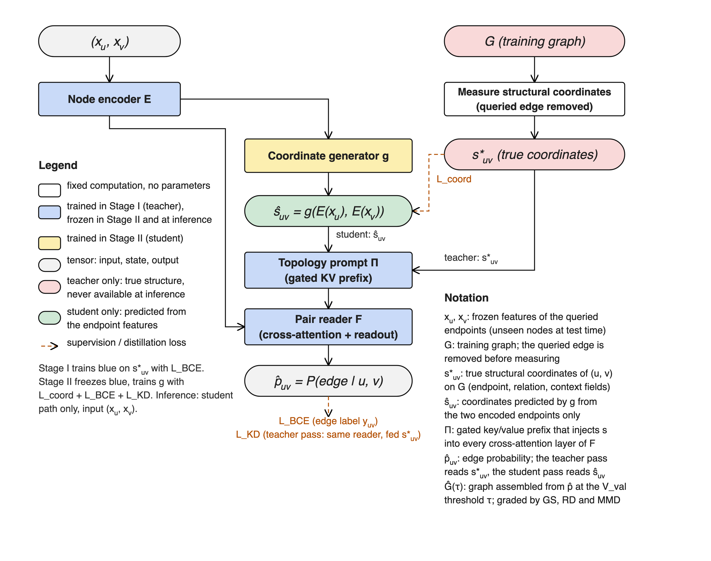

<div align="center">

<h1 style="margin-top: 10px;">Topology-Conditioned Inductive Edge Prediction</h1>

<h2>Decide <code>edge(u,v)</code> for two <i>unseen</i> nodes from <code>(x_u, x_v)</code> alone — and grade the graph those decisions assemble into, not just the pairs.</h2>

<p>
  
  
  
  
  
  
</p>

<p>
  <a href="#why-this-project">Why This Project?</a>
  ◆ <a href="#quick-start">Quick Start</a>
  ◆ <a href="#results">Results</a>
  ◆ <a href="#method">Method</a>
  ◆ <a href="#repository-map">Repository Map</a>
  ◆ <a href="#running-on-gpus">Running on GPUs</a>
  ◆ <a href="#reading-order">Reading Order</a>
</p>

</div>

---

## TL;DR

Research code for an ICLR 2027 paper. The task is **fully inductive binary edge
prediction**: the model sees exactly two frozen endpoint feature vectors
`(x_u, x_v)` from *node-disjoint* held-out nodes and returns a symmetric
probability for `edge(u,v)`. Thresholding every queried pair assembles a graph,
and that assembled graph is graded alongside the pairwise decisions.

The thesis: **independent pair scoring is topology-blind.** A scorer can rank
pairs well and still assemble a graph whose density, degree profile, clustering
and spectrum are implausible. The repository builds and measures methods that
condition each pair decision on *inferred* topology — never on the test graph.

**Current headline (single seed, seed-42 node-held-out split).** Feeding a
generated structural condition through a gated prompt interface moves relative
density from **0.56 → 0.91** and the degree / clustering / spectral MMD ratios
from **9.7 / 8.1 / 14.5 → 4.2 / 3.6 / 6.7** against the same backbone, at equal
graph similarity — while *losing* edge AUROC (0.701 → 0.677). Source of truth:
[`docs/03-experiments.md` §3.4](docs/03-experiments.md).

> **New here?** Read [`CLAUDE.md`](CLAUDE.md) (or its Codex copy
> [`AGENTS.md`](AGENTS.md)) before touching anything — it holds the binding
> constraints: the strict task contract, the active method set, the claim rules,
> and the data-contract traps that corrupt results silently.

## *Latest News* 🔥

- **[2026/09]** **Motif-graph GRIT prompt** selected as the intended deployable topology arm — a fixed 26-slot, 96-edge motif template read by a small GRIT reader and a closed-form count head into gated KV prefixes ([spec](docs/superpowers/specs/2026-09-16-motif-graph-grit-prompt-design.md), [plan](docs/superpowers/plans/2026-09-16-motif-graph-grit-prompt.md)). Stage I lanes are in flight on H20; no bundle published yet.
- **[2026/09]** **Topology prompt Stage II (`coord_gen_full`)** becomes the best deployable topology row, and an independent audit decomposes the gain: it is carried by the *predicted* coordinates — mostly the relation field — not by the retrained trunk ([verdict](docs/results/topo_prompt_stage2_verdict/), [notes](docs/results/topo_prompt_stage2.md)).
- **[2026/09]** **Geometric-RD reselection** — every arm re-selected under `geometric_rd_five_rank_v1` and re-scored under `test_protocol_v8` ([reports](docs/results/split_seed42_geometric_20260910/)).
- **[2026/09]** **Headline split fixed to seed 42** (random BFS root, no test information). The earlier test-informed density-matched split is retired to a labeled secondary upper bound ([selection record](docs/results/validation_density_selection/README.md)).
- **[2026/09]** **Feature-controlled external baselines** — TUnA and PPITrans vendored and trained on the same frozen features, split, negative stream and selection protocol.

## Why This Project?

Inductive edge prediction is usually framed as scoring pairs in isolation. That
framing hides a failure mode this repository is built to measure.

- **🕳️ The pair-to-topology gap is real and large.** The endpoint-only backbone reaches AUPRC 0.736 while its assembled graph sits at RD 0.56 with degree/clustering/spectral MMD ratios near 9.7 / 8.1 / 14.5 (floor = 1).
- **🔒 A strict inference contract.** Input is exactly `(x_u, x_v)`. No test edge, neighbour, degree or graph statistic is ever an inference input. Runs that read true structure are published as **ceiling diagnostics**, never as arms.
- **📐 Two metric families, always together.** Every claim reports the assembled graph (GS, RD, three MMD ratios) *and* the edge group (AUROC/AUPRC/F1/MCC, ECE/Brier). A method that only moves the edge group does not count.
- **🧊 Selection never sees test.** One threshold, frozen on a node-held-out validation region by closest geometric RD, is replayed on every test subgraph. Checkpoints and Optuna trials are chosen by a five-metric mean rank on validation alone.
- **🧪 Negative results are kept, not buried.** Retired arms keep their result notes with their original verdicts (`docs/results/`), so dead routes stay dead.
- **🚫 No formalism gates.** Experiments run directly. Provenance is recorded; nothing blocks a run. Model-quality signals are telemetry, not gates.

## Quick Start

```bash
# 1. Clone and install (Python 3.11, uv)
git clone <this repo> topology-conditioned-inductive-edge-prediction
cd topology-conditioned-inductive-edge-prediction
uv sync

# 2. Fast local checks (macOS/CPU: MPS lacks float64, so force CPU)
ACCELERATE_USE_CPU=1 .venv/bin/python -m pytest -m "not slow and not integration"

# 3. Lint, format and type-check exactly as CI expects
.venv/bin/python -m ruff check src tests && .venv/bin/python -m ruff format src tests
.venv/bin/python -m mypy src tests
```

> **Prerequisites.** Python 3.11, [uv](https://docs.astral.sh/uv/), and — for any
> training or scoring — the H20 GPU container described in
> [`hpc/README.md`](hpc/README.md). Local macOS runs are CPU-only and are for
> tests and analysis, not experiments.
>
> **Data.** Real-artifact tests read `TCIEP_DATA_ROOT` (default `data/`) and skip
> when it is absent. The benchmark package is ~26 GB and is not in Git; see
> [`data/README.md`](data/README.md).

Useful variations:

```bash
.venv/bin/python -m pytest                                        # full suite
.venv/bin/python -m pytest tests/test_score_universe.py -n0 -k density   # one test, no xdist
```

> `-n0` when debugging — xdist swallows breakpoints. Tests in one file share
> state, so `--dist loadfile` is required and `--dist load` is not.

## Results

All numbers: seed-42 node-held-out split, `geometric_rd_five_rank_v1` selection,
`test_protocol_v8`, training seed 0, **single-seed point estimates with no
bootstrap intervals** — differences inside ±0.01 GS and ±0.5 MMD ratio are
descriptive only.

**Assembled graph is primary** (GS ↑, RD → 1, MMD ratios ↓ against a
real-vs-real floor of 1); the edge group is reported beside it, never alone.

| Arm (test, V_val-frozen threshold) | GS ↑ | RD → 1 | Deg MMD ↓ | Clu MMD ↓ | Spec MMD ↓ | AUROC ↑ | AUPRC ↑ |
|---|---:|---:|---:|---:|---:|---:|---:|
| B0 (backbone, task BCE only) | 0.4296 | 0.5574 | 9.667 | 8.118 | 14.549 | 0.7006 | 0.7363 |
| + Logit KD (`kd_logit`) | 0.4157 | 0.5325 | 8.485 | 7.490 | 12.815 | 0.7024 | 0.7357 |
| + Rank KD (`kd_rank`) | 0.4037 | 0.3829 | 19.597 | 16.234 | 28.092 | **0.7290** | **0.7543** |
| + Representation KD (`kd_rep`) | 0.4293 | 0.4863 | 13.818 | 11.569 | 20.370 | 0.7037 | 0.7365 |
| + Rank + rep KD (`kd_rank_rep`) | 0.4217 | 0.4609 | 15.068 | 12.726 | 22.382 | 0.7050 | 0.7364 |
| + Gram KD (`kd_gram`) | 0.4304 | 0.5524 | 11.631 | 9.516 | 16.227 | 0.7175 | 0.7428 |
| + Objectives (BCE + RD + degree + motif) | 0.4279 | 0.7172 | 5.885 | 4.955 | 9.145 | 0.7153 | 0.7386 |
| **+ Topology prompt (`coord_gen_full`)** | **0.4304** | **0.9068** | **4.216** | **3.601** | **6.723** | 0.6771 | 0.7251 |
| TUnA (feature-controlled) | 0.3990 | 0.5690 | 9.433 | 8.200 | 14.741 | 0.7132 | 0.7283 |
| PPITrans (feature-controlled) | 0.3953 | 0.5220 | 10.326 | 9.901 | 17.869 | 0.7238 | 0.7452 |
| *Ceiling — Full-Ego oracle (PMA1)* | *0.6019* | *0.7079* | *6.962* | *6.430* | *11.472* | *0.9498* | *0.9547* |
| *Ceiling — Stage I reader, true coordinates* | *0.4608* | *0.3442* | *33.345* | *25.267* | *44.234* | *0.9295* | *0.9392* |

Accuracy/F1/MCC (at a separate max-F1 threshold frozen on `val_cls`), ECE/Brier
on raw probabilities, per-size RD curves and every checkpoint ID are in
[`docs/03-experiments.md` §3.4–§4](docs/03-experiments.md); raw reports live under
[`docs/results/split_seed42_geometric_20260910/`](docs/results/split_seed42_geometric_20260910/).

**Reading.** Among deployable arms the topology prompt buys density and shape
(RD 0.91, MMD 4.2 / 3.6 / 6.7) at equal GS, and pays for it in edge ranking
(AUROC 0.677 vs B0's 0.701). The structural-objective combination sits between
the two. Rank KD has the best edge AUPRC and the worst topology. The oracle
teacher is a **ceiling row, never a comparator**; the Stage I reader shows the
interface's headroom on validation (AUPRC 0.81 → 0.96) *and* that reading truth
transfers density badly to the test region.

**The gain is attributable.** Removing one component at a time from
`coord_gen_full` at scoring time walks RD back 0.91 → 0.71 (no relation field) →
0.52 (no predicted coordinates) → 0.57 (prompt gated off), with MMD ratios
doubling or tripling along the way — so the predicted coordinates carry it, not
the retrained trunk ([§3.5](docs/03-experiments.md)).

### The split

| Partition | Nodes | Loopless positives | Role |
|---|---:|---:|---|
| Training substrate | 8,072 | 47,762 | Original train + validation positives |
| Effective training | 7,203 | 31,623 | Every pair touching V_val removed |
| V_val | 869 | 4,703 | Node-held-out selection and validation |
| Test | 2,018 | 30,128 | Disjoint held-out nodes |

V_val is one sorted-neighbour FIFO BFS from root `node_007630` (a five-neighbour
root drawn uniformly with pre-registered split seed 42), stopped before exceeding
10% of substrate positives. It mirrors the train/test boundary: V_val leaves the
training universe and all 11,436 boundary positives are held out. **This is the
only split** — no config key or CLI flag selects another.

## Method

<div align="center">
  
</div>

All deployable arms share one **endpoint-only V3.1 backbone**: a three-layer,
512-wide, eight-head transformer over each endpoint's token sequence (≤1,024
tokens of dimension 1,536), a pair module, and a pair-context-gated readout with
symmetric `abba_max` order aggregation. Training is AdamW (1e-4, wd 0.05,
one-cycle, 25 epochs, BF16 DDP) on a dynamic 1:5 positive/negative stream.

Four families sit on top of it:

| Family | Idea | Configs |
|---|---|---|
| **Topology prompt** (headline) | Stage I teaches a reader on 34 fixed-semantics structural coordinates through a zero-init gated KV prefix; Stage II trains a generator to *predict* those coordinates from the endpoints, and the frozen reader scores the prediction. Deployable: `(x_u,x_v)` only. | `configs/split_seed42/{topo_prompt_*,coord_gen_*}.yaml` |
| **Knowledge distillation** | A Full-Ego oracle teacher reads the true training ego graph through GRIT + PMA; four losses transfer it into the endpoint-only student — soft logits (GLNN), strict-LLP rank, cosine-Gram (SPKD), per-row representation. | `configs/split_seed42/kd_*.yaml` |
| **Structural objectives** | A second stream scores every legal pair of one sampled 40-node training subgraph per optimizer step, so a loss can see the *output adjacency*: BCE, ported soft-GS + RD, or neighbour rank + degree + motif. | `configs/split_seed42/struct_*.yaml` |
| **Motif-graph GRIT prompt** (in flight) | A fixed 26-slot, 96-edge motif template (shared-neighbour wedges + degree-normalised bridges) read by a small GRIT reader and a closed-form count head into four gated prefix fields on the frozen trunk. Intended deployable topology arm. | `configs/split_seed42/motif_prompt_*.yaml` |

**Guardrail that must not drift:** inferred topology is *intermediate context*
for deciding the queried edge — never graph generation, never the output.
Grounding, retrieval and prototypes are optional arm-specific support, never task
input. Every write-up must say how its context helps decide `edge(u,v)`.

## Repository Map

```text
CLAUDE.md / AGENTS.md            binding constraints for agents — read first
docs/
  01-project-definition.md       task, thesis, hypotheses, related work
  02-methodology.md              method-selection constraints (design stays open)
  03-experiments.md              SOURCE OF TRUTH: protocol, results, provenance
  results/                       per-arm result notes + raw test reports
  superpowers/{specs,plans}/     design records and implementation plans
  iclr2027/                      the LaTeX paper (main.tex + sections/, latexmk)
  tmp/                           working plans and probes
src/
  data/          artifacts.py (verified loader) · partition.py (the only legal
                 structural graph) · val_region.py · packed_features.py ·
                 pairs.py · struct_coords.py · motif_template.py
  model/egostitch/   generator / encoder / classifier slots behind registry.py,
                 composed by composite.py — a new component is one registry entry
  distill/       KD weight patterns, losses, strict bank loaders, motif losses
  eval/          edge + assembled-graph metrics, calibration, checkpoint
                 selection, test_protocol.py
  experiments/   KD audits, Optuna drivers, legacy G1–G3 gates
  autoresearch/  KD-campaign judge, ledger, curves
  train_{b0,egostitch,cazi_mbn,l3ppi}.py   DDP workers
  e2_pipeline.py                 pack → train → publish → test
  score_universe.py / score_fanout.py      score-once artifacts + multi-GPU fan-out
configs/split_seed42/            every active arm on the headline split
hpc/run.sh                       the only GPU execution layer
tests/                           pytest suite (strict mypy, Google docstrings)
figures/                         method overview + positioning figures
data/                            benchmark artifacts (gitignored, ~26 GB)
```

**Flow.** Benchmark artifacts → partition → packed BF16 features → DDP training →
publish → held-out test protocol. For KD arms, the teacher additionally dumps row
and context banks under `outputs/distill/`; **students never see graph structure
— only the banks carry it.**

**Names are deliberately neutral** (`Benchmark-A/B/C`, `B0`, `B1`, …, `Oracle`)
so the protocol reads as a general graph-ML benchmark. `Ours` stays unassigned
until method selection. Don't substitute real dataset names unless asked.

## Running on GPUs

GPU work runs **only** in the H20 container through `hpc/run.sh` — never a
hand-launched grid, never the debug CLI. World size and score shards are
auto-detected from visible GPUs; there is no scheduler.

```bash
hpc/run.sh check                                     # environment + data validation

# Baselines and structural arms
hpc/run.sh train configs/split_seed42/b0_v31.yaml
hpc/run.sh train configs/split_seed42/struct_bce.yaml

# Oracle teacher (reads true structure → diagnostic, never an arm)
hpc/run.sh train configs/egostitch_e2e_v3_full_ego_teacher_pma1_breadth_first.yaml \
  --worker-module src.train_egostitch --run-kind diagnostic

# Distillation banks, then a KD student
hpc/run.sh kd-targets --config <student.yaml> --checkpoint <teacher best.pt> \
  --output outputs/distill/<row bank>
hpc/run.sh train configs/split_seed42/kd_logit.yaml
```

`train` runs `pack → train → publish → test` unless `--max-steps` (debug) or
`--skip-test` (sweep points) is passed. Optuna studies go through
`src.experiments.struct_hpo` / `src/experiments/kd_rank_*_hpo.py` or
`hpc/sweep_kd_hpo.sh`. Config keys change meaning per `model.family`.

> `complete.json` means **published, not evaluated**. Held-out evidence is
> `test_report.json` / `test_complete.json`, or the `diagnostic_*` pair for
> true-structure runs.

Full runbook, SSH targets, pinned versions and the `nohup` form:
[`hpc/README.md`](hpc/README.md).

## Reading Order

| # | Document | Role |
|---|---|---|
| 1 | [`CLAUDE.md`](CLAUDE.md) | Binding constraints, active method set, traps |
| 2 | [`docs/01-project-definition.md`](docs/01-project-definition.md) | Task, thesis, hypotheses, related work |
| 3 | [`docs/03-experiments.md`](docs/03-experiments.md) | **Source of truth** for method, protocol and results |
| 4 | [`docs/02-methodology.md`](docs/02-methodology.md) | What a formal method selection still requires |
| 5 | [`docs/results/topo_prompt_stage1.md`](docs/results/topo_prompt_stage1.md) · [`stage2`](docs/results/topo_prompt_stage2.md) · [`verdict`](docs/results/topo_prompt_stage2_verdict/) | The headline arm, end to end |
| 6 | [`docs/results/b1_kd_arms.md`](docs/results/b1_kd_arms.md) | KD arm index and definitions |
| 7 | [`docs/results/s_series.md`](docs/results/s_series.md) | Retired routes and why they closed |
| 8 | [`hpc/README.md`](hpc/README.md) | Target environment and exact runbook |
| 9 | [`docs/iclr2027/main.tex`](docs/iclr2027/main.tex) | The paper in progress |

## Working in This Repo

Contributions follow the project rules in [`CLAUDE.md`](CLAUDE.md). The ones that
bite hardest:

- **Keep docs in step.** When a change alters behavior a doc describes, update
  that doc in the same change — otherwise leave docs alone.
- **Sync machines with Git only.** Commit → push → pull on the H20 checkout.
  Never rsync/scp/tar a working tree.
- **Finish local work before the GPU.** Config, tests, commit and push land
  first; a task that reaches GPU work ends with the exact launch command.
- **One independent Codex review per implementation wave** that changes `src/`
  (none for docs or config edits).
- **Hands off** `autoresearch/program.md` (human-owned), `src/autoresearch/`,
  `configs/sweep/`, and `src/vendor/` (official GRIT and Set Transformer code).
- **Claim rules.** Report edge-level and assembled-graph metrics together; the
  five topology numbers travel as a set; compare KD arms against
  `b1_kd_control`, never against the teacher.

Before opening a change:

```bash
ACCELERATE_USE_CPU=1 .venv/bin/python -m pytest -m "not slow and not integration"
.venv/bin/python -m ruff check src tests && .venv/bin/python -m mypy src tests
```

## License

No license file is present. Treat this as private research code: not licensed
for redistribution or reuse.

## Acknowledgments

`src/vendor/` contains the official GRIT and Set Transformer implementations,
used unmodified. `src/baselines/` vendors the external TUnA, PPITrans and
CAZI-MBN reproductions, adapted only to this protocol's frozen features, split
and selection rules. `literature/` is a hand-curated reference collection
(gitignored, not a dependency).

---

<div align="center">
  <p>
    <strong>Topology-Conditioned Inductive Edge Prediction</strong><br>
    <sub>Infer the neighbourhood you cannot see — then be judged on the graph you build.</sub>
  </p>
</div>
