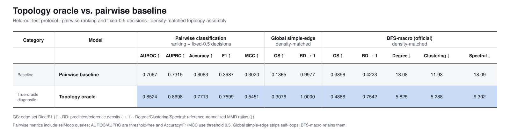

# Research Project: Topology-Conditioned Inductive Edge Prediction

**Venue:** ICLR 2027  
**Paper type:** Empirical ML method  
**Method:** Not yet selected; grounding/retrieval is one optional comparison arm.

**Working titles:** *Topology-Conditioned Inductive Edge Prediction from Frozen Node Features*;
*Local Graphs as Context for Inductive Edge Classification*; *Beyond Independent Pair Scores for Unseen Nodes*.

The paper studies topology-conditioned binary edge prediction, not generic graph
generation. Inferred topology is intermediate context for deciding
$\operatorname{edge}(u,v)$; the representation method remains open.

## Project Configuration

| Field | Value |
|---|---|
| Primary task | Fully inductive edge prediction between two unseen nodes |
| Input | Only frozen intrinsic endpoint features $(x_u,x_v)$ |
| Intermediate object | Inferred query-local topology representation |
| Output | Symmetric $\widehat A_{uv}$; $\widehat G_\tau$ assembled only for evaluation |
| Main comparison | Independent pair scoring vs. topology-conditioned scoring |
| Success criterion | Strong edge metrics without implausible assembled-graph topology |

## Thesis

Fully inductive edge prediction should be topology-conditioned binary classification,
not independent pair scoring. Training topology may teach transferable structural
regularities, but inference receives only two unseen nodes' intrinsic features.
Endpoint-only pair accuracy does not guarantee a plausible assembled graph; topology
transfer must improve the queried-edge decision and the assembled graph together.

## Problem Definition

Edge prediction is formulated as fully inductive attributed link prediction. Let the observed training graph be

$$
G_{\mathrm{train}}=(V_{\mathrm{train}},E_{\mathrm{train}}),
$$

with a node-disjoint test set

$$
V_{\mathrm{train}}\cap V_{\mathrm{test}}=\varnothing.
$$

For each node $i$, an intrinsic encoder produces

$$
x_i=E_{\eta}(a_i)\in\mathbb R^d,
$$

where $a_i$ contains its node attributes. For a queried pair $u,v\in V_{\mathrm{test}}$, the model receives only $x_u$ and $x_v$. A symmetric predictor outputs

$$
\widehat A_{uv}
=P_{\theta}(Y_{uv}=1\mid x_u,x_v)
=P_{\theta}(Y_{uv}=1\mid x_v,x_u).
$$

No observed edge incident to $u$ or $v$ is available at inference. After scoring all queried pairs $\mathcal Q_{\mathrm{test}}$, their predictions are assembled into a graph:

$$
\widehat E_{\tau}=\bigl\{\{u,v\}\in\mathcal Q_{\mathrm{test}}:\widehat A_{uv}\geq\tau\bigr\},
\qquad
\widehat G_{\tau}=(V_{\mathrm{test}},\widehat E_{\tau}).
$$

The predicted graph $\widehat G_{\tau}$ is compared with the hidden reference graph $G_{\mathrm{test}}=(V_{\mathrm{test}},E_{\mathrm{test}})$ using both pairwise edge metrics and assembled-graph topology metrics.

## Hypotheses

The problem definition above leaves the predictor with $x_u,x_v$ alone, yet grades it on a graph
$\widehat G_{\tau}$. The representation method remains open; grounding/retrieval is an optional arm,
not task input or a selected method.

**H1 — pair-to-topology gap.** $\widehat A$ decomposed into independent pair decisions cannot control
the joint statistics of $\widehat E_{\tau}$. Pair scores that are individually accurate can therefore
assemble into a network whose degree, clustering, and spectral profile are implausible under
$G_{\mathrm{test}}$, so edge-level accuracy alone does not bound topology-level error.

**H2 — topology transfer.** $G_{\mathrm{train}}$ and $G_{\mathrm{test}}$ are node-disjoint but are
draws from the same edge domain, so the structural regularities of $E_{\mathrm{train}}$ —
degree profile, neighborhood density, motif and community organization, and their dependence on
$x$ — are properties of the domain rather than of $V_{\mathrm{train}}$. They are consequently
estimable from $G_{\mathrm{train}}$ at training time and remain valid over $V_{\mathrm{test}}$ at
inference, where no edge is observed.

**Non-goals:** transductive graph completion, generic graph generation, post-hoc
denoising after independent scoring, and threshold tuning as the main contribution.

## Research Questions and Contributions

| RQ | Question | Contribution |
|---|---|---|
| RQ1 | Does the pair-to-topology gap hold in fully inductive edge prediction? | Joint pair/assembled-graph diagnosis |
| RQ2 | Can $G_{\mathrm{train}}$ topology transfer through endpoint features alone? | Zero-observed-edge topology conditioning |
| RQ3 | Which topology representation helps $\operatorname{edge}(u,v)$? | Matched latent, deterministic, and generative comparison |
| RQ4 | Does extra retrieval support explain an explicit-scaffold gain? | Separately labeled retrieval-grounded arm |
| RQ5 | Does the selected method improve both prediction levels? | Joint edge/topology result |

RQ2 and RQ3 are the load-bearing contributions. RQ1 motivates the problem; RQ4
separates topology learning from gains caused by extra inference support.

## Method Status

No architecture, intermediate representation, or training objective has been selected.
The task requires only a symmetric mapping from $(x_u,x_v)$ to an edge probability;
topology conditioning remains a hypothesis to test rather than a formal design.
Method-selection constraints and the requirements for a future formal design are recorded in
[02-methodology.md](02-methodology.md). The binding evaluation and reporting contract
is [03-experiment-protocol.md](03-experiment-protocol.md).

## Determine the Method Ceiling with Oracle Topology



## Paper Structure

1. **Introduction:** task, pair-to-topology gap, and topology-conditioned formulation.
2. **Related Work:** observed-topology, endpoint-only, topology-transfer, and synthetic-attachment methods.
3. **Problem Formulation:** frozen features, node-disjoint queries, binary labels, and assembled-output evaluation.
4. **Method:** selected topology representation, edge classifier, losses, inference, and family-selection evidence.
5. **Experiments:** matched baselines, joint edge/topology results, and mechanism ablations.
6. **Discussion:** identifiability, stochasticity, retrieval support, calibration, compute, and frozen-feature limits.

## Risks and Mitigations

| Risk | Mitigation |
|---|---|
| Topology generation appears to be the task | Anchor every section to $\operatorname{edge}(u,v)$ |
| Generated topology does not improve edge metrics | Report edge and graph metrics jointly and diagnose with ablations |
| Graph metrics improve only through threshold changes | Freeze one V_val-selected threshold and replay it unchanged on test |
| Retrieval leaks target information or looks like task input | Separate the arm, freeze its support universe, and audit inference inputs |
| A scaffold contains the queried-edge answer | Mask or standardize the queried edge |
| Negative labels or graph truth are biased | Disclose uncertain negatives and observation limits |

## Locked Decisions

1. The task is fully inductive, node-disjoint, and zero-observed-edge.
2. The inference input/output is exactly $(x_u,x_v)\mapsto\widehat A_{uv}$, symmetrically.
3. $G_{\mathrm{train}}$ may supervise intermediate topology context only.
4. $\mathcal Q_{\mathrm{test}}$ is scored before assembling $\widehat G_\tau$.
5. Pairwise metrics and GS, RD, and three MMD ratios are reported together.
6. Method selection remains open; grounding/retrieval is optional support, never task input.

## Curated Related Work

### Taxonomy

The first split is the **prediction protocol**, not whether a model architecture is described as inductive:

```text
link prediction
├── transductive: seen–seen; both endpoints belong to the training graph
└── inductive: at least one endpoint is unseen during training
    ├── semi-inductive: unseen–seen
    └── fully inductive: unseen–unseen
        ├── an inference graph or observed neighbors are available
        └── no observed inference topology; context inferred from endpoints or distilled (this project)
```

This project is therefore **fully-inductive, zero-observed-edge, attributed link prediction with inferred query-local topology**. The task retains undirected edges, uncertain negatives, observation-biased graph truth, and assembled-graph evaluation.

### Transductive Link Prediction

| Family | Representative work | Relevance and boundary |
|---|---|---|
| Autoencoding and message passing | [VGAE](https://arxiv.org/abs/1611.07308); [GraphSAGE](https://arxiv.org/abs/1706.02216) | Learn node embeddings from an observed graph and decode links. GraphSAGE has inductive parameters, but a seen–seen edge split is still a transductive experiment. |
| Query-subgraph models | [SEAL](https://arxiv.org/abs/1802.09691); [Distance Encoding](https://arxiv.org/abs/2009.00142); [Labeling Trick](https://arxiv.org/abs/2010.16103) | Establish that target-conditioned enclosing structure is more expressive than independently computed endpoint embeddings, but require the query nodes to exist in an observed graph. |
| Scalable neighborhood-overlap models | [Neo-GNN](https://arxiv.org/abs/2206.04216); [BUDDY](https://arxiv.org/abs/2209.15486); [NCN/NCNC](https://arxiv.org/abs/2302.00890); [LPFormer](https://arxiv.org/abs/2310.11009) | Encode common-neighbor or subgraph signals efficiently. They provide the strongest evidence that topology matters for link prediction, while their topology is observed rather than inferred for isolated nodes. |
| Evaluation critiques | [HeaRT](https://arxiv.org/abs/2306.10453); [Implicit Degree Bias](https://arxiv.org/abs/2405.14985) | Show that easy negatives and degree-biased sampling can inflate link-prediction results; they motivate hard, topology-stratified evaluation rather than a model component. |

### Inductive Link Prediction

| Category | High-level idea | What the model does at inference | Topology source | Representative work | Relevance and boundary |
|---|---|---|---|---|---|
| **Observed topology available at inference** | Transfer learned graph operators to unseen nodes or a new graph. | Encodes observed neighbors, paths, or query subgraphs and then scores the candidate link. | An inference graph containing incident edges, paths, few-shot links, or an observed disjoint graph. | [GraphSAGE](https://arxiv.org/abs/1706.02216); [New Node Prediction](https://arxiv.org/abs/2401.05468); [GraIL](https://proceedings.mlr.press/v119/teru20a.html); [NBFNet](https://arxiv.org/abs/2106.06935); [ULTRA](https://arxiv.org/abs/2310.04562); [GEN](https://papers.nips.cc/paper/2020/hash/0663a4ddceacb40b095eda264a85f15c-Abstract.html); [DEKG-ILP](https://arxiv.org/abs/2209.01397) | These protocols are inductive because the endpoints or inference graph were unseen during training, but they are not equivalent to two unseen nodes with no observed incident edges. |
| **Endpoint features only** | Generalize through transferable node attributes rather than graph neighborhoods. | Encodes the two endpoint features and directly scores the pair. | None at inference. | [UPNA](https://arxiv.org/abs/2307.08877) | UPNA directly studies mutually unseen endpoints. Feature-based models naturally accept unseen nodes, but generally score pairs independently and do not model the topology of the assembled prediction graph. |
| **Knowledge-distilled topology transfer** | Distill a topology-aware teacher or structural heuristic into a graph-free student. | Runs the feature-only student and pair decoder; no graph is consumed. | Teacher embeddings, relational rankings, heuristic scores, or structural attributions available only during training. | [Graph2Feat](https://doi.org/10.1145/3543873.3587596); [Linkless Link Prediction](https://proceedings.mlr.press/v202/guo23f/guo23f.pdf); [EHDM](https://openreview.net/forum?id=TSwEOuoO00); [SA-MLP](https://openreview.net/forum?id=MZ2kKZc8m7); [SALE-MLP](https://www.ijcai.org/proceedings/2025/668); [CAZI-MBN](https://arxiv.org/abs/2603.06618) | The closest deterministic topology-transfer line. It establishes graph-free structure-aware prediction, but does not generate an explicit query-local topology object or evaluate assembled-graph topology. CAZI-MBN's reported split still requires independent audit. |
| **Other training-time topology transfer** | Learn feature-to-structure representations through graph-distance objectives, encoder alignment, or self-supervised structural losses without explicit teacher–student KD. | Produces a deterministic feature-derived latent and then scores the pair. | Graph distances, structure encoders, or topology-derived objectives used only during training. | [Graph2Gauss](https://arxiv.org/abs/1707.03815); [DEAL](https://doi.org/10.24963/ijcai.2020/168); [SimMLP](https://arxiv.org/abs/2412.03864) | DEAL directly covers unseen endpoints; the others bound broad feature-to-structure novelty claims. Their transferred representations are deterministic and generally lack explicit topology decoding and assembled-graph evaluation. |
| **Synthetic or learned topology connected to an observed graph** | Give a cold-start node usable graph context by adding or predicting links to known nodes. | Creates synthetic edges or predicts attachments from the newcomer to an existing graph, then applies graph propagation. | Fixed augmentation or learned attachments, combined with the observed topology on the known side. | [NodeDup](https://arxiv.org/abs/2402.09711); [LEAP](https://arxiv.org/abs/2503.03331) | LEAP is the closest mechanism comparator, but its reported inductive task is unseen–seen and still depends on an observed graph on the seen side. |

### Graph Encoders and Graph Transformers

These encoder precedents consume a supplied graph; they do not solve the missing-topology problem. The shortlist follows the [generator/encoder review](../literature/research_reports/2026-08-03-generator-encoder-litreview.md).

| Family | Key work | Structural mechanism | Relevance and boundary |
|---|---|---|---|
| Node–pair graph transformer | [GRIT](https://proceedings.mlr.press/v202/ma23c.html) (ICML 2023) | Relative random-walk probabilities initialize pair states that co-evolve with node states. | Strong direct fit for small soft or binary query scaffolds and pair readout; its suitability still depends on scaffold fidelity. |
| Edge-channel transformer | [EGT](https://arxiv.org/abs/2108.03348) (KDD 2022); [Relational Attention](https://arxiv.org/abs/2210.05062) (ICLR 2023) | Dense edge/relation states bias attention and are updated with node states. | Natural for typed or uncertain generated edges, but published evidence uses observed clean graphs. |
| Structural-bias transformer | [Graphormer](https://arxiv.org/abs/2106.05234) (NeurIPS 2021) | Shortest-path, degree, and virtual-node biases condition global attention. | Strong binary-scaffold baseline; discrete distances and degrees require relaxation for soft adjacency. |
| Scaffold-robust and minimal attention | [DIFFormer](https://arxiv.org/abs/2301.09474) (ICLR 2023); [SGFormer](https://arxiv.org/abs/2306.10759) (NeurIPS 2023) | DIFFormer treats the graph as an overridable prior; SGFormer pairs minimal global attention with a local branch. | DIFFormer tests scaffold distrust; SGFormer is the matched simplicity control. |
| Modular harness and readout | [GraphGPS](https://arxiv.org/abs/2205.12454) (NeurIPS 2022); [GMT](https://arxiv.org/abs/2102.11533) (ICLR 2021) | Local message passing plus global attention; seed-attention pooling retains multiple graph-summary tokens. | Useful matched harness/readout rather than evidence that a particular inferred topology is correct. |

### Generative Topology Models

The relevant generative literature supplies components, not a protocol-matched solution. This table condenses the [feature-conditioned latent-topology review](../literature/research_reports/2026-08-10-feature-conditioned-latent-topology-litreview.md) and the generator review above.

| Family | Key work | Generated object / condition | Relevance and boundary |
|---|---|---|---|
| Conditional attributed graphs | [CondGen](https://papers.nips.cc/paper_files/paper/2019/hash/e57c6b956a6521b28495f2886ca0977a-Abstract.html) (NeurIPS 2019); [GraphMaker](https://openreview.net/forum?id=0q4zjGMKoA) (TMLR 2024) | CondGen uses graph-level semantic descriptors; GraphMaker conditions on a complete attributed node set. | Establishes conditional $p(A\mid X)$, but not anonymous topology from two queried endpoints. |
| Discrete topology diffusion/flow | [EDGE](https://proceedings.mlr.press/v202/chen23k.html) (ICML 2023); [GruM](https://arxiv.org/abs/2302.03596) (ICML 2024); [DeFoG](https://arxiv.org/abs/2410.04263) (ICML 2025) | Whole-graph adjacency through diffusion bridges or discrete flow matching. | Strong topology-fidelity machinery; conditioning and per-query cost remain unresolved for this task. |
| Latent graph generation and inpainting | [LGD](https://proceedings.neurips.cc/paper_files/paper/2024/hash/718d02a76d69686a36eccc8cde3e6a41-Abstract-Conference.html) (NeurIPS 2024); [GLAD](https://ojs.aaai.org/index.php/AAAI/article/view/34169) (AAAI 2025) | Node/edge latents decoded to a graph; LGD also performs masked-graph link inpainting. | Closest latent-generation machinery, but its latents are node-aligned and link inference observes partial topology. |
| Generative link/local-subgraph models | [SGDIFF](https://proceedings.mlr.press/v269/li25a.html) (LoG 2024; PMLR 269, 2025); [FLEX](https://arxiv.org/abs/2507.11710) (preprint) | Class-conditional or counterfactual topology over an observed enclosing subgraph. | Closest evidence that generated topology can aid link prediction, but both begin from observed topology. |
| Autoregressive structure tokens | [G2PT](https://arxiv.org/abs/2501.01073) (ICML 2025); [AutoGraph](https://arxiv.org/abs/2502.02216) (NeurIPS 2025) | Explicit graph-token sequences generated autoregressively. | Attractive for small anonymous scaffolds and exact likelihoods; ordering sensitivity and sequential cost remain. |

This taxonomy yields the narrow literature gap: transductive methods consume topology; most zero-edge inductive methods remove topology at inference; LEAP reconstructs topology only from a newcomer into an existing graph. The remaining question is whether query-local topology can be generated for **two isolated unseen nodes** and improve both their binary link decision and the topology of the assembled prediction graph.
