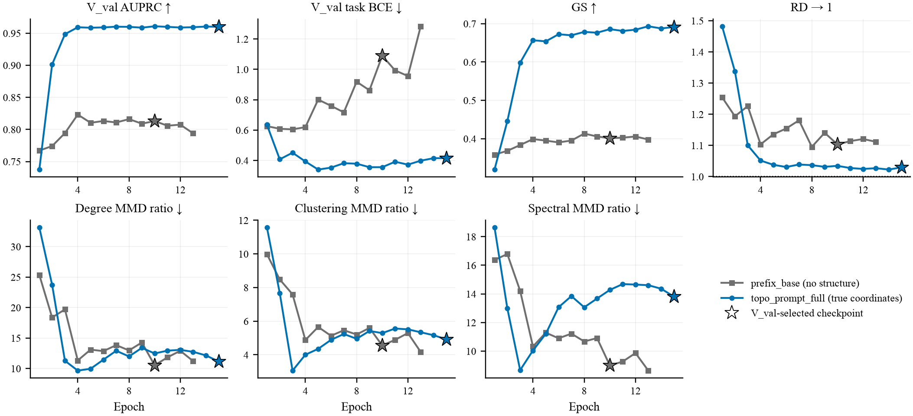
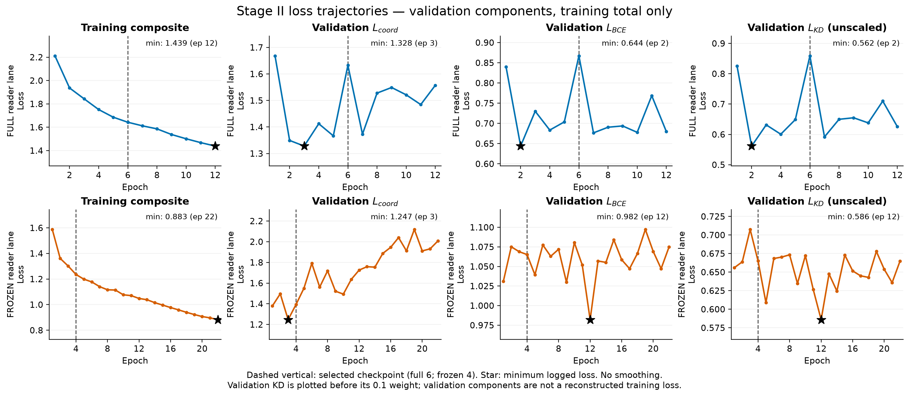
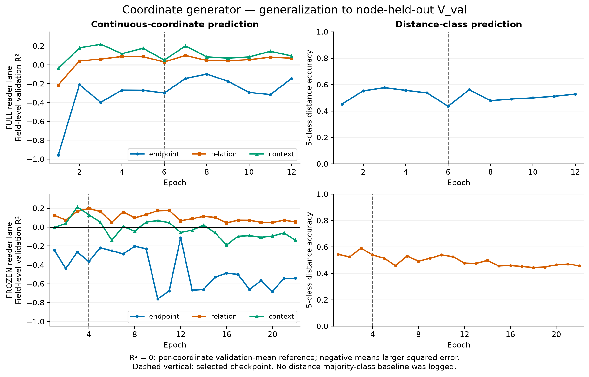
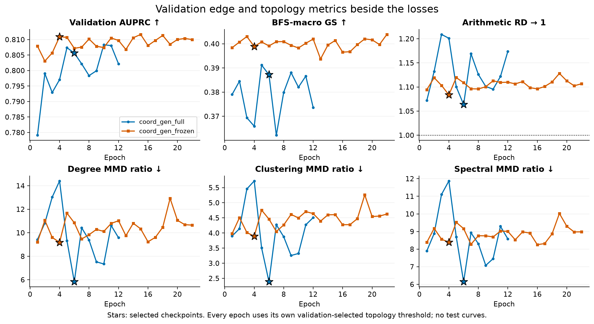

# Experiments: Topology-Conditioned Inductive Edge Prediction

**Scope (2026-09-13):** the 10% positive-budget, seed-42 node-held-out split only.
Every number uses `geometric_rd_five_rank_v1` selection and `test_protocol_v8`,
training seed 0, single-seed point estimates. Assembled-graph topology is the
primary readout; edge metrics are reported beside it, never alone.

## 1. Preliminaries

### 1.1 Problem formulation

Let the observed training graph be $G_{\mathrm{train}}=(V_{\mathrm{train}},E_{\mathrm{train}})$
and let the test nodes be disjoint from it, $V_{\mathrm{train}}\cap V_{\mathrm{test}}=\varnothing$.
A frozen intrinsic encoder turns each node's attributes into a token sequence
$x_i=E_\eta(a_i)$. For a queried pair $u,v\in V_{\mathrm{test}}$ the model receives
$x_u$ and $x_v$ only; no edge incident to $u$ or $v$ is observable. A symmetric predictor returns

$$
\widehat A_{uv}=P_\theta(Y_{uv}=1\mid x_u,x_v)=P_\theta(Y_{uv}=1\mid x_v,x_u).
$$

Scoring every queried pair $\mathcal Q_{\mathrm{test}}$ and thresholding at a fixed $\tau$
assembles a graph
$\widehat G_\tau=(V_{\mathrm{test}},\{\{u,v\}:\widehat A_{uv}\ge\tau\})$, which is compared with the
hidden $G_{\mathrm{test}}$ on two levels: pairwise edge decisions and assembled-graph topology.
The thesis under test is that fully inductive edge prediction should be *topology-conditioned*:
training structure may teach transferable regularities, but inference sees two unseen nodes,
and a pair score that is accurate in isolation still assembles into a graph whose density,
degree, clustering and spectrum can be implausible. Topology transfer counts only when it
improves the assembled graph and does not break the queried-edge decision.

### 1.2 Train, validation and test task

Three node universes never share a pair:

- **Training.** The V_val-masked training graph (`train_graph.pkl` with every pair touching
  V_val removed). Models see its positives and dynamically sampled non-edges; topology-aware
  arms may read *its* structure at training time, never at inference.
- **Validation (V_val).** A node-held-out region of the training substrate that mirrors the
  train/test boundary. It supplies (a) a fixed 1:1 classification set (`val_cls`) for the task
  loss, early stopping and the classification threshold, and (b) 500 BFS-sampled subgraphs
  whose union is scored once per epoch for the assembled-graph metrics, the topology threshold
  and checkpoint selection. No test statistic touches any of these choices.
- **Test.** Disjoint held-out nodes. Each arm is scored once on the 1:1 classification list and
  on the test topology pair union at the threshold frozen on V_val.

The deployable interface is exactly $(x_u,x_v)\mapsto\widehat A_{uv}$. Runs that read true
structure of the universe they are scored on (the oracle teacher, the Stage I reader) are
ceiling diagnostics: launched and scored under an explicit diagnostic flag, published as
`diagnostic_*` artifacts, and shown as ceiling rows, never as arms.

## 2. Method

### 2.1 Backbone

All deployable arms share the V3.1 endpoint-only backbone: a three-layer, 512-wide,
eight-head transformer encodes each endpoint's token sequence (at most 1,024 tokens of
dimension 1,536); a pair module compares the two encoded sequences and a pair-context-gated
readout with symmetric `abba_max` order aggregation feeds the classifier. B0 and the KD and
structural arms use `mixing.mode: none` (readout over the two pooled sequences); the
topology-prompt arm uses `mixing.mode: bidirectional_cross`, three shared bidirectional
cross-attention layers between the two sequences with a CLS stream, which is where a prefix
can be injected. Training is AdamW (learning rate 1e-4, weight decay 0.05, one-cycle schedule,
25 epochs, gradient clipping 1.0, BF16 DDP) on the dynamic 1:5 positive-to-negative pair
stream with positive weight 5, early stopping on validation task BCE.

### 2.2 Topology prompt: a structural interface trained on true structure, driven by predicted structure

*Figure 1. Blue modules are trained in Stage I on true coordinates and frozen afterwards; the
yellow generator is trained in Stage II; at inference only the student path runs, from
$(x_u,x_v)$ alone.*

**Structural coordinates.** For a queried pair the training graph, with the queried edge
removed first, yields 34 numbers of fixed meaning
(`src/data/struct_coords.py`): two endpoint fields of nine (log-degree, clustering,
triangles, open wedges, two-hop reach, mean neighbour degree, normalised walk returns
$(S^k)_{xx}$ for $k=2,3,4$ with $S=D^{-1/2}AD^{-1/2}$), a relation field of eleven (common
neighbours, Jaccard, simple L3 paths, walk kernels $(S^k)_{uv}$ for $k=2..5$, a shortest-path
class), and a context field of five (one-hop union, two-hop shell, shared-shell fraction,
cross-ring links, L3 density). Swapping $u$ and $v$ swaps the endpoint fields and fixes the
rest. Coordinates are standardised with training statistics stored in the checkpoint.

**Prompt interface $\Pi_\omega$.** The standardised coordinates become four tokens
$[z_u,z_v,z_{\mathrm{rel}},z_{\mathrm{ctx}}]$ (the endpoint tokens carry self/partner roles
relative to the attending stream), each expanded per layer into key/value prefix rows that are
read, through a separately softmaxed and tanh-gated attention branch with zero-initialised
gates, at all nine cross-attention sites of the trunk. At initialisation the model is exactly
the base; the AB and BA passes receive mirrored prefixes, so the logit is swap-symmetric.

The following records the completed **v1** implementation and its results. The approved v2
training contract is [the two-stage specification](superpowers/specs/2026-09-13-topology-prompt-two-stage-v2-design.md)
and §6 below; its studies have not been launched.

**Stage I: teach the reader on true structure.** `topo_prompt_full` trains trunk and prompt
from scratch under the base recipe with the true coordinates $s^*_{uv}$ of every training
row and task BCE only; light field masking (probability 0.1) keeps it from keying on exact
values. Because validation and test rows read the truth of their own universe, this run is a
ceiling diagnostic; its interventions (`gates_off`, every field or one field at its training
mean, and a universe-level `shuffle` of the coordinate bundles) attribute its gain to the
structural content. The published checkpoint is both the frozen teacher and the Stage II
reader.

**Stage II: predict the structure from the endpoints.** A coordinate generator
$g_\psi$ (`src/model/egostitch/classifier/coord_gen.py`) reads the frozen encoder's pooled
endpoint states (masked mean and max, 1,024 dimensions each) and predicts the standardised
coordinates: an endpoint head applied as $e(p_u,p_v)$ and $e(p_v,p_u)$, and a pair head on
symmetric combinations for the relation and context fields plus a five-way shortest-path
class (the fifth class is the self-pair case). The frozen reader scores the pair from the
prediction through the same $\Pi_\omega$. Only $g_\psi$ trains, on the row-weighted composite

$$
\mathcal L=\mathcal L_{\mathrm{BCE}}(\ell_{\mathrm{student}},y)
+\mathcal L_{\mathrm{coord}}(\hat s,s^*)
+0.1\,\mathcal L_{\mathrm{KD}}(\ell_{\mathrm{student}},\ell_{\mathrm{teacher}}),
$$

with Huber loss on the 30 continuous standardised coordinates plus cross-entropy on the
shortest-path class, and a soft-target BCE towards the same reader fed $s^*$. The deployed
model `coord_gen_full` is a function of $(x_u,x_v)$ alone and is scored formally without any
truth graph; the earlier attribute-conditioned prefix arms (`prefix_static`, `prefix_pair`),
which trained a prefix from the endpoint attributes without any structural target, are
superseded by this two-stage design.

### 2.3 Knowledge distillation from a topology oracle

*Figure 2. The teacher reads the hidden ego graph $G_{uv}$ through GRIT and PMA pooling and
fuses it with the pairwise encoder; the student keeps only the white path.*

The teacher (`egostitch_e2e`, generator `full_ego_oracle`, encoder `grit_gmt`) encodes the
true training ego graph around the queried pair with a GRIT graph transformer, pools it with
set attention (PMA), fuses the pooled context $t_{uv}$ with the pairwise encoding $c_{uv}$ and
classifies. It reaches the ceiling row of §3.4 but never deploys. Four losses transfer it
into the endpoint-only student through banks precomputed on training rows: **KD1** soft-target
BCE on the teacher logit (`kd_logit`, GLNN family); **KD2** strict-LLP listwise ranking plus
distribution matching over each anchor's context bank (`kd_rank`); **KD3** cosine-Gram matching
of pair representations (`kd_gram`, SPKD family); **KD4** per-row representation cosine
(`kd_rep`); `kd_rank_rep` combines KD2 and KD4. Loss weights were chosen by grid or Optuna on
V_val; B0 is the zero-KD control.

### 2.4 Structural objectives on sampled training subgraphs

A second training stream scores every legal pair of one sampled 40-node training subgraph
per optimizer step (32 locally expanded plus eight uniform background nodes) so that a loss
can see the student's *output adjacency* rather than isolated pairs. `struct_bce` keeps only
the subgraph BCE and is the sampler-matched control; `struct_grand` adds the GRAND terms
(soft graph similarity, relative density, degree-distribution MMD); `struct_new` adds
neighbour ranking, node-wise degree matching and open/closed two-hop motif counting. Weights
come from 10-trial Optuna studies. The inference interface is unchanged.

## 3. Experiments

### 3.1 Dataset and split

| Partition | Nodes | Loopless positive edges | Role |
|---|---:|---:|---|
| Training substrate (`train_graph.pkl`) | 8,072 | 47,762 | Original train and validation positives |
| Effective training | 7,203 | 31,623 | All pairs touching V_val removed |
| V_val | 869 | 4,703 | Node-held-out selection and validation |
| Excluded boundary | — | 11,436 | Cross-boundary positives excluded from training |
| Test | 2,018 | 30,128 | Disjoint held-out nodes |

V_val is one sorted-neighbour FIFO BFS from `node_007630` (a five-neighbour root drawn
uniformly with split seed 42) on the substrate, stopped before exceeding 10% of its positive
pairs: 5,347 validation positives including 644 self-loops. Training keeps 36,857 positive
pairs including self-pairs. Validation uses 50 BFS samples at each size 20, 40, …, 200 (bucket
seed 43) plus 5,347 positive and 5,347 negative classification pairs; test classification has
32,019 positives and 32,019 negatives (1,891 self rows) and test topology its own fixed
sampled-set pair union. Official metrics retain self-loops. Negatives are sampled non-edges.
The [split manifest](../data/val_region/breadth_first.json) fixes membership and buckets.

### 3.2 Evaluation protocol

**Threshold.** For each checkpoint, enumerate the distinct V_val sampled-union logit
boundaries and choose the threshold minimising
$|\,\mathrm{mean}_{\mathrm{size}}\,\mathrm{mean}_{\mathrm{subgraph}}\log\mathrm{RD}\,|$
(geometric relative density closest to 1; ties prefer higher GS, lower geometric-mean MMD,
then the larger threshold). That single threshold is frozen and replayed on every test
subgraph. Classification metrics use a separate max-F1 threshold frozen on `val_cls`.

**Checkpoint and trial selection.** At its own threshold every checkpoint is ranked on AUPRC
and GS (descending) and the degree, clustering and spectral MMD ratios (ascending); the lowest
mean rank is selected. Optuna studies select their final trial by the same five-metric rank.
Test results never select anything.

**Two metric groups.** The *assembled-graph group* is primary: BFS-macro graph similarity
(edge-set Dice, GS ↑), relative density (RD → 1) and the degree, clustering and spectral MMD
ratios against the real-vs-real floor (↓), with geometric RD and mean absolute log RD as
density diagnostics. The *edge group* is AUROC and AUPRC on raw logits, accuracy, F1 and MCC at
the frozen classification threshold, and ECE and Brier on raw probabilities. A method that
improves the assembled graph while holding the edge group is the target; a method that only
moves the edge group is not. All numbers are single-seed; the test protocol carries no
bootstrap intervals, so differences inside ±0.01 GS and ±0.5 MMD ratio are descriptive.

### 3.3 Baselines and ceilings

- **B0** — the shared backbone with task BCE only; the zero-KD, zero-structure control.
- **TUnA and PPITrans** — the authors' architectures vendored and trained on the same frozen
  1,536-dimensional token features, split, negative stream, positive weight and selection
  protocol; a fixed-feature classifier comparison, not a reproduction of either paper's
  native-embedding result. **CAZI-MBN** is adapted to the protocol but has no completed test.
- **Ceilings (never comparators).** The Full-Ego oracle reads true test structure through
  GRIT; the Stage I reader `topo_prompt_full` reads the true coordinates of every scored pair.
  They bound what topology information can buy.

### 3.4 Main results

Each arm is its V_val-selected checkpoint of its best HPO trial or grid point; variants that
freeze part of a method (the frozen-reader Stage II lane, the frozen-trunk Stage I lane, the
attribute-conditioned prefix arms) are not arms and appear only in §3.5 and the result notes.
Assembled-graph group first.

| Arm (test, V_val-frozen threshold) | GS ↑ | RD → 1 | Degree MMD ↓ | Clustering MMD ↓ | Spectral MMD ↓ | geo RD → 1 | mean abs log RD ↓ |
|---|---:|---:|---:|---:|---:|---:|---:|
| B0 | 0.4296 | 0.5574 | 9.667 | 8.118 | 14.549 | 0.5348 | 0.6266 |
| + Logit KD (`kd_logit`) | 0.4157 | 0.5325 | 8.485 | 7.490 | 12.815 | 0.5169 | 0.6603 |
| + Rank KD (`kd_rank`) | 0.4037 | 0.3829 | 19.597 | 16.234 | 28.092 | 0.3613 | 1.0181 |
| + Representation KD (`kd_rep`) | 0.4293 | 0.4863 | 13.818 | 11.569 | 20.370 | 0.4635 | 0.7698 |
| + Rank + representation KD (`kd_rank_rep`) | 0.4217 | 0.4609 | 15.068 | 12.726 | 22.382 | 0.4385 | 0.8259 |
| + Gram KD (`kd_gram`) | 0.4304 | 0.5524 | 11.631 | 9.516 | 16.227 | 0.5260 | 0.6447 |
| + GRAND objectives (`struct_grand`) | 0.4312 | 0.6210 | 8.063 | 6.740 | 11.872 | 0.5956 | 0.5217 |
| + NEW objectives (`struct_new`) | 0.4258 | 0.6540 | 8.348 | 6.846 | 12.021 | 0.6211 | 0.4913 |
| **+ Topology prompt (`coord_gen_full`)** | **0.4304** | **0.9068** | **4.216** | **3.601** | **6.723** | **0.8636** | **0.2643** |
| TUnA (feature-controlled) | 0.3990 | 0.5690 | 9.433 | 8.200 | 14.741 | 0.5449 | 0.6105 |
| PPITrans (feature-controlled) | 0.3953 | 0.5220 | 10.326 | 9.901 | 17.869 | 0.5011 | 0.6920 |
| *Ceiling: Full-Ego oracle (PMA1)* | 0.6019 | 0.7079 | 6.962 | 6.430 | 11.472 | 0.6670 | 0.4451 |
| *Ceiling: Stage I reader, true coordinates* | 0.4608 | 0.3442 | 33.345 | 25.267 | 44.234 | 0.3000 | 1.2042 |

| Arm (test) | AUROC ↑ | AUPRC ↑ | Accuracy ↑ | F1 ↑ | MCC ↑ | ECE ↓ | Brier ↓ |
|---|---:|---:|---:|---:|---:|---:|---:|
| B0 | 0.7006 | 0.7363 | 0.6044 | 0.6709 | 0.2283 | 0.2017 | 0.2663 |
| + Logit KD | 0.7024 | 0.7357 | 0.6116 | 0.6730 | 0.2408 | 0.2669 | 0.2991 |
| + Rank KD | 0.7290 | 0.7543 | 0.6530 | 0.6803 | 0.3105 | 0.1713 | 0.2424 |
| + Representation KD | 0.7037 | 0.7365 | 0.6088 | 0.6736 | 0.2371 | 0.2150 | 0.2726 |
| + Rank + representation KD | 0.7050 | 0.7364 | 0.6166 | 0.6692 | 0.2459 | 0.2232 | 0.2748 |
| + Gram KD | 0.7175 | 0.7428 | 0.6228 | 0.6843 | 0.2667 | 0.1537 | 0.2429 |
| + GRAND objectives | 0.7140 | 0.7392 | 0.6321 | 0.6794 | 0.2766 | 0.3092 | 0.3289 |
| + NEW objectives | 0.7013 | 0.7324 | 0.6159 | 0.6695 | 0.2450 | 0.3168 | 0.3293 |
| **+ Topology prompt (`coord_gen_full`)** | 0.6771 | 0.7251 | 0.5752 | 0.6522 | 0.1670 | 0.2019 | 0.2733 |
| TUnA (feature-controlled) | 0.7132 | 0.7283 | 0.6444 | 0.6729 | 0.2932 | 0.1959 | 0.2625 |
| PPITrans (feature-controlled) | 0.7238 | 0.7452 | 0.6543 | 0.6792 | 0.3124 | 0.2516 | 0.2865 |
| *Ceiling: Full-Ego oracle (PMA1)* | 0.9498 | 0.9547 | 0.8762 | 0.8794 | 0.7534 | 0.0993 | 0.1130 |
| *Ceiling: Stage I reader, true coordinates* | 0.9295 | 0.9392 | 0.7909 | 0.7414 | 0.6299 | 0.0774 | 0.1151 |

**Reading.** On the assembled graph the topology prompt is the only arm that moves the
density and shape of the test graphs decisively: RD 0.91 against 0.56 for B0 and 0.65 for the
best structural objective, the three MMD ratios roughly halved (4.2 / 3.6 / 6.7 against
8.1 / 6.7 / 11.9 for GRAND), and lower than the oracle's own 7.0 / 6.4 / 11.5, at a GS equal to
B0's and GRAND's. Per subgraph size its RD rises from 0.63 at 20 nodes to 1.09 at 200. The KD
arms trade in the other direction: Rank KD has the best edge AUPRC of any deployable arm and
the worst topology (RD 0.38, MMD 20 / 16 / 28); Logit and Gram KD change the assembled graph
within the noise band. The structural objectives improve RD and the MMD ratios modestly
without moving GS. The feature-controlled external baselines match B0 on the edge group and
are weaker on topology. The topology prompt pays on the edge group (AUROC 0.677 against 0.701
for B0): it assembles better graphs from worse individual pair scores, and the ceiling rows
show why the gap remains large, since the same reader on true coordinates reaches AUROC 0.93.
The Stage I ceiling's own test topology is poor because its V_val-selected threshold transfers
into the denser test region; that is a property of true-coordinate readers, not of the
deployable student.

### 3.5 Ablation of the topology prompt (subtractive)

Starting from the deployed `coord_gen_full` and removing one component at a time, at scoring
time on the published checkpoint (the reader's interventions) or by construction (the last
two rows). V_val numbers come from the same checkpoint's validation artifacts.

| Configuration | V_val AUPRC | V_val GS | V_val MMD d / c / s | Test GS | Test RD | Test MMD d / c / s | Test AUROC |
|---|---:|---:|---|---:|---:|---|---:|
| **Full model** (predicted coordinates through the prompt) | 0.806 | 0.387 | 5.8 / 2.4 / 6.2 | 0.430 | 0.907 | 4.2 / 3.6 / 6.7 | 0.677 |
| − predicted relation field (relation at its training mean) | 0.794 | 0.381 | 14.9 / 5.5 / 11.1 | 0.433 | 0.713 | 13.5 / 10.7 / 16.5 | 0.669 |
| − all predicted coordinates (every field at its mean) | 0.779 | 0.376 | 10.4 / 4.2 / 7.9 | 0.390 | 0.520 | 8.9 / 7.9 / 12.9 | 0.665 |
| − prompt path (gates off; the Stage I trunk alone) | 0.768 | 0.374 | 9.6 / 3.9 / 7.8 | 0.385 | 0.570 | 7.4 / 6.6 / 10.9 | 0.647 |
| − Stage I training (same recipe trained without any prompt, `prefix_base`) | 0.814 | 0.401 | 10.6 / 4.6 / 9.0 | 0.409 | 0.456 | 11.4 / 9.7 / 16.8 | 0.721 |
| *+ true instead of predicted coordinates (Stage I reader, ceiling)* | 0.961 | 0.691 | 11.1 / 4.9 / 13.8 | 0.461 | 0.344 | 33.3 / 25.3 / 44.2 | 0.930 |

The test density and shape gains vanish step by step as the predicted structure is removed:
RD 0.91 → 0.71 without the relation field → 0.52 without any predicted coordinate → 0.57 with
the prompt gated off, and the MMD ratios double or triple along the same path. The gain is
therefore carried by the predicted coordinates, mostly by the relation field, not by the
retrained trunk, which on its own is *below* the prompt-free recipe on every metric. On the
edge group the order reverses: the prompt-free recipe ranks pairs best, the trunk alone worst,
and the predicted coordinates recover part of the difference. Replacing the prediction by the
truth shows the interface's headroom on V_val (AUPRC 0.81 → 0.96, GS 0.39 → 0.69) and also
that the truth-reading ceiling transfers its density badly to the test region.

## 4. Result provenance

Every row is the published checkpoint of its V_val-selected epoch, scored once; direct tests
write their reports without the pipeline's completion marker. Raw reports under
`docs/results/` carry per-size metrics and score provenance.

| Model | Checkpoint ID | Frozen topology logit threshold | Raw report |
|---|---|---:|---|
| B0, epoch 8 | `7e78609f8c904284` | 1.687500 | [B0](results/split_seed42_geometric_20260910/b0_test_report.json) |
| Logit KD, `kd_logit_w100` / epoch 12 | `00f9a6ec6f660144` | 0.636719 | [Logit](results/split_seed42_geometric_20260910/logit_w100_test_report.json) |
| Rank KD, trial 008 / epoch 7 | `384d8d93ef40f347` | 3.640625 | [Rank](results/split_seed42_geometric_20260910/rank_trial008_test_report.json) |
| Representation KD, `kd_rep_w0p01` / epoch 8 | `f717370ad937ad30` | 1.523438 | [Rep](results/split_seed42_geometric_20260910/rep_w0p01_test_report.json) |
| Rank + representation KD, trial 004 / epoch 7 | `d13ac2b88ebf36ac` | 1.820312 | [Rank+Rep](results/split_seed42_geometric_20260910/rank_rep_trial004_test_report.json) |
| Gram KD, `kd_gram_w100` / epoch 8 | `47fb1066898c95b8` | 0.863281 | [Gram](results/split_seed42_geometric_20260910/gram_w100_test_report.json) |
| GRAND, trial 006 / epoch 14 | `47e62521e7491bee` | 0.992188 | [GRAND](results/split_seed42_geometric_20260910/grand_trial006_test_report.json) |
| NEW, trial 009 / epoch 10 | `f3aa183d4a422f24` | -0.640625 | [NEW](results/split_seed42_geometric_20260910/new_trial009_test_report.json) |
| Topology prompt, `coord_gen_full` / epoch 6 | `4a743373f0b9e4d0` | 1.359375 | [coord_gen_full](results/topo_prompt_stage2_curves/coord_gen_full/test_report.json) |
| TUnA (feature-controlled) | `bec8b0d2beeea4d0` | 1.502119 | H20 `outputs/official_ppi/tuna_seed0_20260912/test_report.json` |
| PPITrans (feature-controlled) | `26143c38e4819edd` | 2.533686 | H20 `outputs/official_ppi/ppitrans_seed0_20260912/test_report.json` |
| Full-Ego oracle, fixed bank-source checkpoint | `94fa2e50d9fc6c46` | 5.431674 | [PMA1 diagnostic](results/split_seed42_geometric_20260910/teacher_pma1_diagnostic_test_report.json) |
| Stage I reader, `topo_prompt_full` / epoch 15 | `d883bc1dbbbc03d1` | 5.187500 | H20 `outputs/split_seed42/topo_prompt_full/diagnostic_test_report.json` |

H20 sources are `outputs/split_seed42_geometric_20260910/` (`b0_v31/`,
`struct_hpo/{grand/trial_006,new/trial_009}/`, `kd_hpo/{rank,rank_rep,grid}/`, `teacher_pma1/`)
and `outputs/split_seed42/{topo_prompt_full,coord_gen_full}/`. The teacher checkpoint is
`outputs/split_seed42/teacher_pma1/best.pt`; base configs live in `configs/split_seed42/`,
teacher banks in `outputs/distill/split_seed42/`. Structural scheduling was corrected on
2026-09-12 (one subgraph per global optimizer step); the GRAND and NEW rows predate it and
remain observations under the earlier schedule. Detailed notes: `results/b1_kd_arms.md`
(KD), `results/topo_prompt_stage1.md` and `results/topo_prompt_stage2.md` (topology prompt);
execution in the [HPC runbook](../hpc/README.md).

## 5. Learning curves and analysis of the topology prompt

### 5.1 Stage I: does the reader use true structure?

*Figure 3. Validation curves of `topo_prompt_full` (true coordinates) and `prefix_base` (the
same recipe without a prompt); stars mark the selected checkpoints. Package and script:
`results/topo_prompt_stage1_curves/`.*

With true coordinates the reader separates from the prompt-free recipe within two epochs
(V_val AUPRC 0.90 vs 0.77) and plateaus at 0.96 with GS 0.65–0.70, against 0.81 and 0.40; its
validation task loss keeps a minimum of 0.34 where the base never drops below 0.60. Removing
the structure at scoring time returns it to the base (`mean`: AUPRC 0.78, GS 0.38) and a
universe-level shuffle of the coordinate bundles drives it below the base (AUROC 0.58 on
`val_cls`): the interface transmits structure and the reader relies on it. Per field, the
relation coordinates carry the most (GS 0.69 → 0.54 without them), the endpoint fields little,
the context field nothing. The V_val MMD ratios do not improve with GS, so the true-structure
gain is in which edges are admitted at RD ≈ 1, not in the shape of the admitted set.

### 5.2 Stage II: the three losses

*Figure 4. Only the composite training loss is logged; the three terms are validation
diagnostics measured every epoch (KD shown before its 0.1 weight). Dashed line: selected
epoch. The frozen-reader lane is shown for contrast only.*

- **$\mathcal L_{\mathrm{coord}}$** on V_val bottoms out at epoch 3 (1.33) and then rises
  (1.56 at the end; 1.25 → 2.01 in the frozen-reader lane). Only composite training loss
  was logged, so a monotonic fall in training coordinate loss is unestablished. Early stopping
  watches task BCE; checkpoint selection uses the five-metric V_val rank. Its selected epoch
  (6) is past the coordinate-fit optimum; this does not identify the mechanism.
- **$\mathcal L_{\mathrm{BCE}}$** of the student drops from 0.84 to 0.64 by epoch 2 and then
  oscillates between 0.68 and 0.87. The trunk alone is below the prompt-free recipe (it was
  trained to lean on the prompt, §3.5), and the task term teaches the generator coordinates
  that bring it back to the base level, not further.
- **$\mathcal L_{\mathrm{KD}}$** falls from 0.83 to 0.56 by epoch 2 and stays at 0.59–0.86. The
  teacher, the same reader on true coordinates, is confident where the student cannot be; at
  weight 0.1 its causal contribution is unmeasured without a matched ablation. Separating the three terms' causal
  contributions needs matched task-only, task + coordinate and task + KD runs, which were not
  launched.

### 5.3 What the generator predicts, and for whom

*Figure 5. Field-level R² of the standardised prediction against V_val's true coordinates
(node-held-out) and five-class shortest-path accuracy, per epoch.*

| Coordinate (training rows, published checkpoint, 4,000 rows) | R² |
|---|---:|
| endpoint field (pooled); against the *swapped* endpoint's target | 0.24; −0.05 |
| log-degree · clustering · triangles · open wedges | 0.40 · 0.23 · 0.51 · 0.34 |
| two-hop reach · mean neighbour degree · walk returns 2 / 3 / 4 | 0.19 · 0.24 · 0.06 / −0.03 / 0.01 |
| relation field | 0.31 |
| common neighbours · Jaccard · L3 paths · walks 2 / 3 / 4 / 5 | 0.38 · 0.61 · 0.48 · 0.39 / −0.03 / 0.14 / 0.12 |
| context field | 0.41 |
| distance class accuracy (five classes) | 0.66 |

On training rows the generator learns what the endpoints' attributes support (degree,
triangles, Jaccard, common neighbours, L3 paths at R² 0.4–0.6; global walk kernels near zero),
and the endpoint order is verified (own target 0.24, swapped −0.05). On V_val, whose nodes it
never saw, the same fields fall to R² ≤ 0.2 for relation and context and below zero for the
endpoint fields. The endpoint head is pair-conditioned and its targets remove the queried edge, so the
endpoint targets are not per-node constants. Their repeated node-specific component and the
train/V_val fit gap are consistent with poor head generalisation, but do not distinguish
memorisation from universe shift. Coordinate interventions establish an effect on the assembled
graph, not transferable regional density or a causal explanation of the edge cost. The standalone
probe in §6 tests new-head generalisation separately from Stage II training.

### 5.4 Validation topology dynamics

*Figure 6. Every epoch at its own validation-selected threshold; stars mark the selected
checkpoints.*

The V_val edge and GS curves are flat at the base level from epoch 2 on, while the V_val MMD
ratios swing by a factor of two across epochs (degree 5.8–14.4); the five-rank selector chose
the favourable end of that swing (epoch 6). The test topology result of §3.4 is therefore a
single seed at a favourable checkpoint and needs replication before it is written as a
finding; the direction of the effect is nevertheless consistent across the ablation rows and
across the two lanes (the frozen-reader lane moves the same way within the noise band).

**Next.** The approved [two-stage v2 specification](superpowers/specs/2026-09-13-topology-prompt-two-stage-v2-design.md)
places corruption and optional structural training inside Stage I, and interface/head adaptation,
KD and structural supervision inside Stage II; Stages III/IV are retired. First inspect V_val
admitted-set stability, run the standalone node-held-out probe, and profile one epoch of D before
allocating the wave. These are implementation and future-run instructions; no v2 study has been
launched. A strictly monotone logit rescaling cannot change the admitted set when its threshold
is re-selected, so affine drift alone cannot explain the MMD swings. Test sensitivity on the
selected epoch's neighbours is descriptive only after the method and selection rule are locked.

## 6. Hyperparameters and search plan for the two-stage topology prompt

Status: approved for implementation on 2026-09-13, following the reviewed
[two-stage v2 specification](superpowers/specs/2026-09-13-topology-prompt-two-stage-v2-design.md).
No study in this section has been launched. This section fixes names, defaults, boxes and search
order. **For these studies only**, Optuna ask-and-tell uses constrained MO-TPE with GS (max)
and geometric mean of the three V_val MMD ratios (min), with the soft constraint
`abs(log(RD)) <= 0.05`. The general three-objective studies in §3.2 retain their contract.
Each trial selects its checkpoint by the five-metric rank, runs `--skip-test`, and only the
locked winner is tested. The additional T1/S1 selection filters below are specific to this
study; they do not change the shared checkpoint selector or add runtime failure gates.

### 6.1 What is fixed and never searched

| Fixed | Value | Reason |
|---|---|---|
| split, negative stream, positive weight | split seed 42, dynamic 1:5, weight 5 | evaluation/training protocol; run seeds are separate |
| coordinate spec | v1, 34 numbers, training-statistics standardisation; structural pairs use the full training table | semantics remain fixed; no sampled-subgraph recomputation |
| coordinate reduction | Huber averaged over 30 continuous coordinates plus distance cross-entropy | equal coordinate weighting; field reweighting is an ablation |
| prompt geometry | width 128, two slots per field, nine sites, zero-init gates | same established interface |
| structural sampler | default 32 local + 8 background nodes; bfs/motif/bridge 0.5/0.25/0.25; one subgraph per step; subgraph BCE 1.0 | only total nodes, frequency and added-term scales vary below |
| Stage I optimiser | lr 1e-4, weight decay 0.05, one-cycle 25 epochs, patience 10 on task BCE | base recipe |
| Stage II budget | one-cycle 15 epochs, pct_start 0.1, final_div_factor 100; no early stopping; five-rank selection | every arm completes the annealing budget; non-finite state still fails closed |
| Stage II encoder/cross-attention | frozen | compute choice; using true coordinates does not prove they are predictable |
| Stage II supervision | every training row keeps coordinate, task and KD supervision | standalone probe measures new-head generalisation; no internal training fold |
| true-coordinate field mask | 0.1 | retained Stage I regularisation |
| corruption schedule | stationary | no severity-schedule knob |
| KD form | pointwise soft-target BCE; anchor masked-softmax KL; immutable Stage I teacher on true coordinates | anchor temperature alone controls distribution shape |
| representation KD and teacher-soft degree matching | zero in first wave | deferred matched ablations |

### 6.2 The hyperparameters

Boxes are log-uniform unless marked as a set or linear. Defaults are the first run and first
enqueued prior. `topo_prompt.*` and `coord_gen.*` keys are nested under `model.config`;
`struct` and `optim` are top-level. The chosen reader checkpoint must be supplied explicitly;
the example Stage II configs name the default Stage I v2 output, not a selected winner.

| Stage I parameter | Config key | Default | Box | Target observation |
|---|---|---:|---|---|
| corruption rate | `topo_prompt.corruption.prob` | 0.5 | {0.25, 0.5, 0.75} | brittle reader |
| shrink floor | `topo_prompt.corruption.shrink_min` | 0.3 | [0.1, 0.7] | generator under-dispersion; same shrink softens distance towards training prior |
| noise ceiling | `topo_prompt.corruption.sigma_max` | 0.5 | [0.1, 1.0] | continuous error beyond shrinkage |
| subgraph nodes | `struct.nodes` | 40 | {20, 40, 60} | shape ratios rise with flat GS |
| added structural weights | `struct.weights.{rank,degree,motif}` | 1.0 / 0.1 / 0.1 | rank [0.1, 3]; degree/motif [0.01, 1] | same; BCE remains 1.0 |

| Stage II parameter | Config key | Default | Box | Target observation |
|---|---|---:|---|---|
| generator peak LR | `optim.groups.generator.max_lr` | 3e-4 | [1e-4, 1e-3] | unstable coordinates |
| interface/head peak LR | `optim.groups.interface.max_lr` | 1e-4 | [3e-5, 3e-4] | slower reader adaptation |
| coordinate weight | `coord_gen.w_coord` | 1.0 | [0.3, 3] | coordinate anchor against decision terms |
| pointwise KD mixture | `coord_gen.kd_alpha` | 0.5 | linear [0, 0.7] | `(1-alpha) BCE(y) + alpha BCE(q_T)` keeps total classification weight 1 |
| anchor KD weight | `coord_gen.w_anchor` | 1.0 | [0.1, 3] | which-neighbour signal |
| anchor temperature | `coord_gen.anchor_temperature` | 1.0 | {0.5, 1, 2} | candidate concentration |
| structural scale | `struct.scale` | 1.0 | [0.3, 3] | scales rank/degree/motif only; BCE remains 1.0 |
| subgraph nodes | `struct.nodes` | 40 | {20, 40, 60} | reach versus cost |
| subgraphs per epoch | `struct.subgraphs_per_epoch` | null (one per step) | {0.5 (half steps), null (steps)} | compute only; searched last after profiling |
| endpoint input dropout | `coord_gen.endpoint_dropout` | 0.3 | {0.1, 0.3, 0.5} | selected by probe, not a training run |
| endpoint weight decay | `coord_gen.endpoint_weight_decay` | 0.1 | {0.05, 0.1} | same |
| endpoint width | `coord_gen.endpoint_hidden` | 256 | fixed | regularisation, not capacity search |
| representation KD | `coord_gen.w_kd_rep` | 0 | ablation only {0.1, 0.5} | deferred |

### 6.3 Search order and budgets

Every study inherits the preceding winners through an explicit base config; no cross-stage
joint search or guessed winner. Trials are single-seed; each stage's final winner is replicated
with seeds 1–2 before downstream use. Every Stage II run has the full 15 epochs.

| Study | Stage | Searched | Runs | Enqueued priors | Selection |
|---|---|---|---:|---|---|
| T1 corruption | I | rate, shrink, noise | 6 | default; hard (0.75, 0.1, 1.0); mild (0.25, 0.5, 0.25) | clean V_val five-rank; exclude noise-sensitivity p95 logit change >2 at sigma=0.5 |
| T2 teacher structure | I | nodes and three added weights at T1 winner | 6 | 40/20/60 with 1.0/0.1/0.1 | clean five-rank and sensitivity rows; T1 without stream is comparator; record immutable chosen teacher |
| P probe | — | dropout × decay, two feature sets | 6 × 2 head fits | none | held-out-endpoint R²; no Stage II training run |
| S1 optimisation | II | two peak LRs on D | 4 | default; (1e-3,1e-4); (1e-4,3e-5); (3e-4,3e-4) | five-rank; exclude a run with any consecutive-epoch admitted-set Jaccard <0.7 |
| F factorial | II | KD off/on × added structural terms off/on | 4 (+1 optional generator-only D) | A–D configs | contribution test, not search; compare edge and topology families on V_val |
| S2 loss balance | II | coordinate, alpha, anchor, temperature, structural scale on D | 10 | default; KD-heavy (0.3,0.7,3,1,1); struct-heavy (1,0.5,1,1,3) | MO-TPE above plus val_cls AUPRC >= prefix_base -0.01 |
| S3 subgraph size | II | nodes, then frequency, at S2 winner | 3 + 2 | 20/40/60; then full/half steps | five-rank with measured epoch cost |

A Stage I run is approximately 3.5 h on four GPUs. Stage II structural-stream cost is
**unmeasured**: one rank owns a subgraph per global step. Profile one D epoch before allocating
the wave. Independent boxes can run T1/T2, P and S1 only once their prerequisite artifacts exist;
F waits for S1, and S2–S3 are sequential. The ask-and-tell study utility is
`src.experiments.topology_prompt_hpo`, with `--study T1|T2|S1|S2|S3_size|S3_frequency`,
`--base-config` and `--sweep-dir`; S2 also requires `--prefix-base-auprc`. It does not
authorize launching these studies.

### 6.4 What every run records beyond the five numbers

- Stage I fixed sensitivity: all rows at lambda=0.5, sigma=0.5, and both. Record val_cls
  AUPRC/BCE/Brier, mean/p95 absolute topology-universe logit change, and all five topology
  metrics at both the clean threshold and the perturbation's re-selected threshold.
- Stage II consecutive-epoch stability on V_val: affine logit fit and residual, admitted-set
  Jaccard at each epoch's own threshold, and per-node predicted-degree changes. A monotone
  rescaling cannot move the re-selected admitted set; these rows identify actual set changes.
- KD accounting uses the same rows and weighting as the loss: teacher Bernoulli entropy,
  entropy-subtracted pointwise KD, teacher anchor entropy and anchor-term gradient norm.
- Generator diagnostics: per-field V_val R² and distance accuracy; the probe's held-out-endpoint
  R² under the chosen regularisation. The probe fits heads only on pairs touching no held-out
  training node, reports in-fold/one-held-out/two-held-out/V_val separately, and measures endpoint
  fit on held-out endpoints themselves. Stage I pooled features have prior encoder exposure to
  those nodes; raw intrinsic F0 features provide the complementary unexposed feature set.
- Winner result notes show the per-epoch spread of each MMD ratio beside the selected value.
  Predeclared selected-epoch-neighbour sensitivity on test is descriptive after method and
  selection lock and never selects anything.

### 6.5 What this section does not authorise

This fixes names, defaults and boxes. Launching a study, changing a fixed value in §6.1 or
adding a parameter requires updating this section in the same change. Test results select
nothing. No study has been launched by the implementation change.
