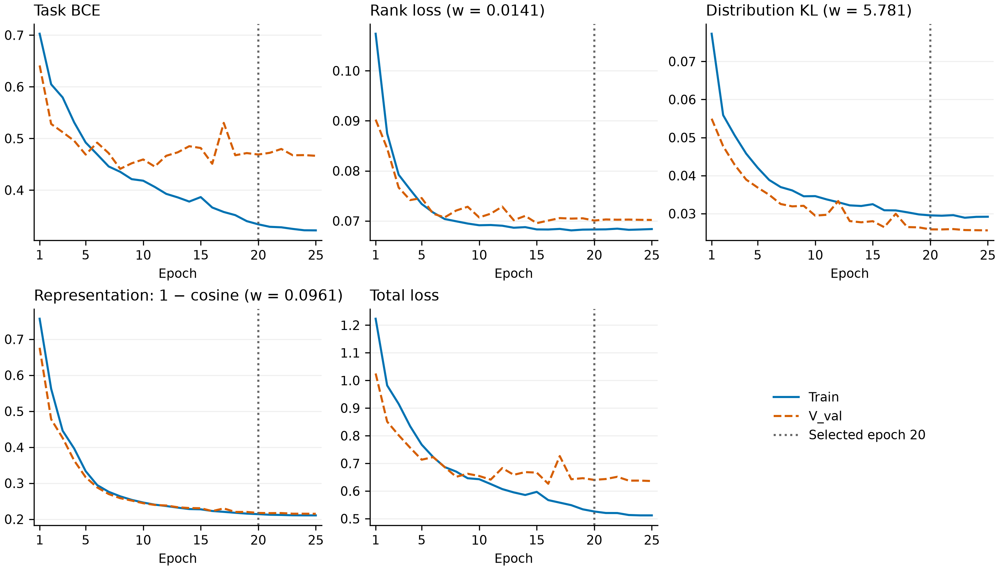
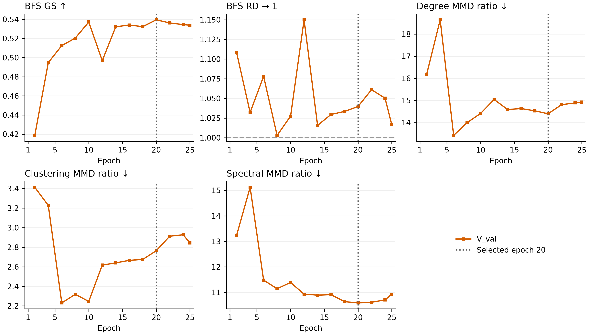

# Experiments: Topology-Conditioned Inductive Edge Prediction

**Protocol update (2026-09-10):** closest-geometric-RD threshold selection,
five-metric checkpoint ranking, and three-objective Optuna (§1.2/§1.5). The
headline split remains the seed-42 random node-held-out V_val. Result sections
retain their recorded campaign/split provenance; changing selection rules does
not update historical results or restart running experiments.

## 1. Experimental setup

### 1.1 Dataset and splits

| Object | Nodes | Loopless positive graph edges | Role |
|---|---:|---:|---|
| Full reference graph | 10,090 | 122,092 | positive graph truth only |
| Train-side substrate (`train_graph.pkl`) | 8,072 | 47,762 | original train⁺∪val⁺ graph and pair pool, before the internal split |
| ↳ Effective training (node-held-out protocol) | 7,203 | 31,623 | every pair touching V_val excluded |
| ↳ `V_val` region (node-held-out protocol) | 869 | 4,703 | node-held-out validation |
| ↳ Dropped boundary | — | 11,436 | cross-boundary positives, held out from training |
| Test graph | disjoint 2,018 | 30,128 | held out until final evaluation |
| Loopless test candidate universe | same 2,018 | — | all 2,035,153 unordered distinct-node pairs |

The primary strategy is `breadth_first`. V_val uses a sorted-neighbor FIFO BFS from
root `node_007630`, a uniform draw over five-neighbor roots with the pre-registered
split seed 42 (the project's original default), capped at 10% of substrate positive
pairs including loops. The prefix has 5,347 positives (644 self-loops), below the
5,364 cap. All 869 V_val nodes and every pair touching them are held out; fit has
7,203 nodes and 36,857 positives (31,623 loopless). Inner BFS buckets retain seed 43
and 50 uniform-root draws per size 20–200. Classification validation has 5,347
positives and 5,347 endpoint-frequency negatives, seed 0.

**Headline split rule (2026-09-09):** no test information enters the split. The root
is a single seeded draw, not a choice among candidates, so V_val density is whatever
the draw gives and the fixed topology threshold transfers to test unaided. The
2026-09-08 split (root `node_002696`, seed 273, 642 nodes) selected its root by
matching true test bucket edge-count distributions; its results (§2.2, §3.1) are a
labeled test-informed upper bound on threshold transfer, never the headline.
[Selection rule, comparison and provenance](results/validation_density_selection/README.md);
[frozen manifest](../data/val_region/breadth_first.json).

**Result provenance:** §2.1 will hold headline (seed-42) results only. §2.2 and §3.1
hold 2026-09-08 test-informed-split results; §2.3 and §4 retain historical results
with their original split/checkpoint identities. The 20%-positive-budget node-held-out diagnostic
used 1,250 nodes and a teacher that had seen those nodes; it is separate diagnostic
evidence, not a current-split result ([reports](results/node_heldout_diagnostic_20260907/README.md)).
Local and H20 manifests were verified byte-identical on 2026-09-08. Completed
current-split B0 and structural BCE results do not imply completion of the teacher
or KD campaign. [First-attempt failures and retry status](results/split20260908_execution/README.md).

**Dynamic training negatives:** `src/data/training_sampler.py:enumerate_edge_stream`
is shared by Full-Ego and V3.1. It proposes negatives through a 50:50 mixture of
uniform node pairs (with self-pair boost) and degree-weighted positive-endpoint
replacement, rejecting known positives and within-call duplicates; the sampling
universe excludes V_val, so no negative touches a held-out node. Students use one global sampling rank
(seed, epoch, rank=0), then distribute batches; Full-Ego retains its original
per-rank sampling. Thus student membership is GPU-count independent, while the
teacher and student share the sampler rather than necessarily identical multi-GPU
pair sets. Every student epoch retains all positive samples and draws five times
as many negatives. Task BCE weights positive rows by 5 and negative rows by 1,
normalizing by the global effective weight across DDP ranks. Label smoothing is
zero, matching the teacher; optimizer and KD weights are otherwise unchanged.

Offline KD row targets cover the unique union of sampled pairs across all configured
training epochs, with exact pair/label joins and per-epoch row IDs. The union is
only a scoring bank: each epoch consumes its own 1:5 subset. Build it with the
same split, seed, negative ratio and epoch count as the student YAML. Old fixed-row
banks cannot be reused. Training representations stay on CPU and only batch targets
move to the device. Validation labels and thresholds are unchanged. `kd_rank`
context-bank sampling remains its separate declared KD objective. The 15 shipped KD weight-sweep configs share the updated 1:5 setting. Human-owned
autoresearch campaign configs and historical results are not migrated.

Each node carries a frozen intrinsic token sequence (≤1024 tokens × 1536 dims); F0 is its fp32 mean-pooled vector. Active V3.1 students and matched control use the shared Full-Ego dynamic negative sampler at 1:5 each epoch; fixed benchmark negatives are split-accounting data, not their training stream. Graph truth is observation-biased, so uncertain negatives are disclosed.

### 1.2 Evaluation protocol

**Task contract.** For a queried pair $u,v\in V_{\mathrm{test}}$ the model receives exactly $(x_u,x_v)$ and returns
the symmetric probability $\widehat A_{uv}=P(Y_{uv}=1\mid x_u,x_v)$. No observed test edge, neighbor identity, retrieval
result, degree, or graph statistic is task input; training topology may supervise a representation or objective. After scoring
a pair universe, predictions are assembled into $\widehat G_\tau$ only for evaluation. Inferred topology is intermediate context, never the prediction target and never generic graph generation.

**Evidence classes.** A *comparator* is a frozen model or score artifact evaluated without changing its checkpoint or opening new test-dependent choices; a *formal result* follows this fixed pre-test protocol.

**Selection protocol (2026-09-10, `geometric_rd_five_rank_v1`).** Threshold
selection and checkpoint selection are separate ordered steps. All arms use the
same frozen V_val sampled-set pair union and 500 subgraphs, retaining self-loops.
Historical results retain their recorded selection protocol.

**Step 1 — threshold for each checkpoint.** Enumerate every distinct validation
logit boundary with atomic score ties and `logit >= threshold`. Define
`L(t) = mean_size(mean_subgraph(log RD_i(t)))` and `RD_geo(t) = exp(L(t))`.
Sizes have equal weight; subgraphs within a size have equal weight. Choose the
threshold minimizing `abs(L(t))`, not `mean(abs(log RD_i(t)))` and not the distance
of arithmetic macro RD from 1. Exact density-error ties prefer higher macro GS,
then lower geometric mean of the degree/clustering/spectral MMD ratios, then the
larger threshold. Comparisons use unrounded values.

A candidate emptying any positive-reference subgraph has infinite density error;
no epsilon replaces a zero RD. Since all reference subgraphs have positive edges,
the lowest threshold predicts all pairs and always supplies a finite candidate.
There is no RD band, checkpoint eligibility gate, or quality-based refusal to
publish: coarse score ties may leave a nonzero residual density error, which is
reported honestly.

**Step 2 — checkpoint selection.** At each checkpoint's own step-1 threshold,
rank five metrics: AUPRC and GS descending, degree/clustering/spectral MMD ratios
ascending. AUPRC uses raw logits and is independent of the threshold. Exact metric
ties receive average ranks. Select the smallest equal-weight mean of the five
ranks; mean-rank ties prefer higher GS, lower geo-MMD, then the earlier epoch.
RD is reported but never ranked. Early stopping remains validation task BCE with
configured patience. Rank checkpoints with completed topology measurements.

**Density reporting.** Report arithmetic macro RD, geometric RD, mean per-subgraph
absolute log RD, and per-size density summaries alongside GS and all three MMD
ratios. Geometric RD near 1 balances multiplicative over/under-density but does not
ensure each subgraph is accurate; arithmetic RD can exceed 1. For fixed-threshold
test replay, a zero RD is reported as geometric RD 0; infinite mean absolute log
RD is encoded as JSON null with an explicit zero-RD subgraph count, never hidden
by an arbitrary epsilon.

**Frozen replay.** Publish the selected checkpoint with its own topology threshold
embedded in `best.pt`. Validation rescoring may report drift but never silently
reselects the threshold. Test replays it unchanged. The teacher's true-G_val
oracle remains a separate diagnostic threshold surface, using the same geometric
RD rule. Neither the threshold nor the split is adjusted using test information.

**Classification threshold.** Selected separately as the max-F1 logit threshold on the balanced
`V_val` classification rows (`val_cls`) and frozen before test. It serves only Accuracy/F1/MCC;
AUROC/AUPRC use raw logits, ECE/Brier use the raw sigmoid probabilities, and no logit shift
stands in for calibration.

**Test replay.** Test topology scores only its sampled-set pair union plus support-only rows for
the grounded arm; the frozen topology threshold replays unchanged as the one reported operating
point (self-loops included), and the frozen classification threshold replays on the balanced test rows.

**Uncertainty.** Runs are single-seed (disclosed). Arm-versus-baseline deltas report size-stratified paired-bootstrap intervals over test sampled sets and test rows.

### 1.3 Metrics

Pairwise: AUROC and AUPRC (threshold-free); Accuracy, F1, and MCC at the frozen max-F1
threshold; ECE and Brier on raw probabilities. Detailed edge tables also retain class
balance, uncertain-negative disclosure, and the completed easy, hard, degree-corrected,
full-universe, and PA-null negative-regime controls, which qualify every edge claim.

Topology (five numbers, always reported together, directions in headers): BFS-macro
graph similarity (GS ↑, edge-set Dice/F1), BFS-macro relative density (RD → 1), and
degree / clustering / spectral MMD ratios (↓; the denominator is the deterministic
real-vs-real floor, so ratio 1 is that floor). Descriptors retain self-loops.

### 1.4 Compared methods

The KD bank/HPO entries below describe historical method development. Current
`configs/split20260908/` runs rebuild banks from the node-held-out PMA(1) teacher;
they reuse selected hyperparameters, not old teacher banks or old-split checkpoints.

| Arm | KD signal | Teacher | Searched hyperparameters | Role |
|---|---|---|---|---|
| Pairwise baseline (B0) | none | — | none (frozen) | frozen endpoint-only comparator |
| kd_logit | GLNN-style pointwise soft-target BCE | PMA(4) Full-Ego Oracle row bank | `w_logit ∈ {0.01, 0.1, 1, 10, 100}` | attribution control |
| kd_ranking | LLP-style rank + distribution matching over context banks | PMA(4) Full-Ego Oracle context bank | `w_rank` log-uniform [0.01, 1]; `w_dist` log-uniform [0.1, 100]; bank ∈ {h2ns1, h2ns3, h2ns5, h3ns3}; margin ∈ {0.05, 0.1, 0.2} | primary transfer test (RQ2) |
| kd_representation | pair-representation cosine | PMA(4) Full-Ego Oracle row bank | `w_rep ∈ {0.01, 0.1, 1, 10, 100}` | representation-matching arm |
| kd_rank_rep | strict-LLP rank + distribution KD plus per-row pair-representation cosine | PMA(4) Full-Ego Oracle context bank + row bank | `w_rank` log-uniform [0.01, 1]; `w_dist` log-uniform [0.1, 100]; `w_rep` log-uniform [0.01, 100]; bank and margin inherited from kd_ranking | joint logit + representation transfer |
| kd_gram | SPKD-style cosine-Gram relational match (Tung & Mori 2019) | PMA(4) Full-Ego Oracle row bank | `w_gram ∈ {0.01, 0.1, 1, 10, 100}` | relational-geometry arm |
| kd_generation | pair-latent generative head | PMA(1) Full-Ego Oracle latent bank | none; `w_gen=1` fixed (det/EDM variants compared) | generative test |
| struct_bce | none (structural stream, BCE only) | — | none | sampler-matched structural baseline |
| struct_grand | GRAND soft-GS + log-ratio RD on the structural stream | — | `gs`, `rd` log-uniform [0.1, 2.0] | ported density/overlap terms |
| struct_new | neighbour ranking + node-wise degree + open/closed motif counts on the structural stream | — | `rank` [0.1, 3.0], `degree` [0.01, 1.0], `motif` [0.01, 1.0], log-uniform | direct output-adjacency supervision |
| Oracles | observed topology | Full-Ego graph → GRIT → PMA | none (diagnostic only) | diagnostic ceilings |

### 1.5 Training, HPO, and reproducibility

The V3.1 student uses d_model 512, 3 encoder + 3 cross-attention layers, 8 heads, rich pooling (mean/attn/max/gated), pair_context_gated readout with abba_max aggregation, and zero label smoothing in the current split campaign (historical grid runs used 0.05).
Optimization: AdamW, lr 1e-4, weight decay 0.05, onecycle, 25 epochs, 1,024 pairs per batch, clip 1.0, bf16 DDP.

**Current Optuna selection.** TPE uses three fixed objectives: maximize AUPRC,
maximize GS, minimize geo-MMD. There is no RD constraint. Each trial reports its
actually published checkpoint at that checkpoint's threshold, without reselection
at a different cadence. Across completed trials, choose the winner using the same
five-metric equal mean rank as step 2; the final cross-trial tie-break is earlier
trial number. Write the winner, selected epoch, threshold and metric surface to
`best_trial.json`. Search objectives and final selection criteria are intentionally
different; rank itself is not an objective because adding trials changes ranks.
Numerical/data/I/O failures remain FAIL; RD deviation alone is not a failure or
reason to prune a completed run.

**Existing sweeps and offline replay.** Changing this rule does not require
retraining saved checkpoints or stopping current sweeps. Re-score every saved
epoch on V_val, apply steps 1 and 2, and save reselected checkpoint/threshold and
reports separately from the original artifacts. This cannot recreate an old TPE
trajectory or epochs never trained after early stopping. A new-objective Optuna
study requires a separate directory; old objective values must not be mixed in.
Re-evaluated observations can inform a new study with their provenance retained.
Use measured full replay throughput to schedule this work; scoring-only timings
exclude model loading, I/O and topology evaluation. Local code changes do not
modify already-running remote workers.

**Historical HPO.** The earlier Phase-0 grid and rank/rank+rep campaigns optimized
GS and geometric-mean MMD under a soft RD constraint. Their archived results below
retain that provenance. The best configuration selected without test feedback is
evaluated on held-out test once.

The `kd_rank_rep` study completed all 12 trials (four priors plus eight guided trials), with context bank `h2ns3` and margin 0.1 fixed. Trial 5 was selected for held-out evaluation; its published checkpoint is epoch 20. Its weights and V_val selection metrics are recorded in §4.6.

The structural arms are not KD: each optimizer step adds one sampled 40-node training subgraph
(32 locally expanded nodes from a BFS, wedge/triangle, or two-ball bridge seed at a 50/25/25 mix,
plus 8 uniform background nodes) whose legal pairs are forwarded and scored as a logit matrix.
`struct_grand` and `struct_new` each run a 10-trial constrained MO-TPE study
(`src/experiments/struct_hpo.py`, 2 enqueued priors, 3 startup trials) uses the same
three objectives and final five-metric mean-rank winner as the KD driver.
The selected winner runs the held-out protocol once. `struct_bce` is a single run and the first comparator for both.

## 2. Main results — edge and assembled topology

### 2.1 Headline split (seed-42 random root), in progress

Root `node_007630`, split seed 42, 869-node V_val (§1.1). Campaign configs live in
`configs/split_seed42/` (B0, PMA1 teacher, five KD students, three structural arms), all
seed 0. Plan of 2026-09-09: B0 with held-out test; teacher; per-arm KD HPO sweeps on V_val
(strict-LLP `kd_rank` study, the loss-weight grid for `kd_logit`/`kd_gram`/`kd_rep`, the joint
`kd_rank_rep` study) and the `struct_grand`/`struct_new` studies, each winner tested once. No
seed replicates and no `struct_bce` control in this plan. Relaunched 2026-09-10 on two containers
with `eval.patience: 5` and `eval.topology_every: 2` for every sweep run; `kd_rank` trials 0-1 and
the completed `struct_grand` study used patience 10. No held-out results yet.

### 2.2 Test-informed split (2026-09-08), secondary upper bound

Root `node_002696`, split seed 273, 642-node V_val, selected by matching test bucket
edge-count distributions (§1.1). These numbers are an upper bound on threshold
transfer, not held-out evidence; compare arms within this table only. B0 is reported below;
the completed structural-stream BCE comparator is reported separately in §3.1.
As checked on 2026-09-08, the PMA1 teacher retry is running, KD is waiting for that
teacher, GRAND HPO trial 0 is running, and NEW HPO is queued.

| Arm | AUROC | AUPRC | Accuracy | F1 | MCC |
|---|---:|---:|---:|---:|---:|
| Pairwise baseline (B0, seed 47, epoch 6) | 0.7081 | 0.7413 | 0.6153 | 0.6743 | 0.2474 |

| Arm | BFS GS | BFS RD | Degree | Clustering | Spectral |
|---|---:|---:|---:|---:|---:|
| Pairwise baseline (B0, seed 47, epoch 6) | 0.4364 | 1.2008 | 3.908 | 3.984 | 5.854 |

Pairwise baseline (B0): [held-out report](results/b0_v31_split20260908/test_report.json),
checkpoint `7112498f`, `outputs/split20260908/b0_v31/` (H20 30030, attempt
`444a3f2eb0aa4cb3b85d34f605110cda`). Classification threshold (max-F1 on `val_cls`) is a
probability of 0.0940 (logit −2.266); the topology threshold is a probability of 0.7549
(logit 1.125), selected on the V_val density-first cascade (validation GS 0.4466, RD 0.9690,
MMD degree/clustering/spectral 3.12/2.25/5.08) and replayed unchanged on test.

### 2.3 Old split (pre-2026-09-06), historical — superseded

The following paired edge/topology tables retain historical checkpoints and their
original V_val-selected thresholds. They are not comparators for current-split runs;
KD2 Trial 8 was provisional at the time of that report.

| Arm | AUROC | AUPRC | Accuracy | F1 | MCC |
|---|---:|---:|---:|---:|---:|
| Full-Ego Oracle | 0.9519 | 0.9566 | 0.8711 | 0.8776 | 0.7464 |
| Pairwise baseline | 0.7067 | 0.7316 | 0.6261 | 0.4769 | 0.3072 |
| kd_logit (`kd_logit_w100`) | 0.7195 | 0.7417 | 0.6459 | 0.6670 | 0.2941 |
| kd_ranking (strict Trial 8; provisional) | 0.7183 | 0.7457 | 0.6477 | 0.6656 | 0.2970 |
| kd_representation (`kd_rep_w0p1`) | 0.7108 | 0.7402 | 0.6234 | 0.6760 | 0.2610 |
| kd_gram (`kd_gram_w1`) | 0.7169 | 0.7428 | 0.6426 | 0.6713 | 0.2897 |
| kd_rank_rep (Trial 5) | 0.7084 | 0.7364 | 0.6320 | 0.6708 | 0.2716 |

| Arm | BFS GS | BFS RD | Degree | Clustering | Spectral |
|---|---:|---:|---:|---:|---:|
| Full-Ego Oracle | 0.6429 | 0.9955 | 2.667 | 1.875 | 5.207 |
| Pairwise baseline | 0.3672 | 0.3221 | 21.03 | 18.49 | 28.39 |
| kd_logit (`kd_logit_w100`) | 0.4048 | 0.4248 | 15.63 | 13.07 | 22.06 |
| kd_ranking (strict Trial 8; provisional) | 0.4143 | 0.4399 | 14.56 | 12.41 | 21.03 |
| kd_representation (`kd_rep_w0p1`) | 0.4121 | 0.5626 | 8.725 | 7.552 | 13.15 |
| kd_gram (`kd_gram_w1`) | 0.3959 | 0.4989 | 10.16 | 8.851 | 15.43 |
| kd_rank_rep (Trial 5) | 0.4179 | 0.4717 | 13.93 | 11.67 | 19.45 |

`kd_rank_rep` Trial 5: [held-out report](results/kd_rank_rep_hpo/test_report.json), seed 0, checkpoint epoch 20. Classification and topology logit thresholds are frozen on validation at −1.7578125 and 2.671875, respectively; §4.6 separately reports training-time V_val telemetry.

## 3. Ablations and sensitivity

### 3.1 Structural stream (wave 1, 2026-09-08 test-informed split)

Design: [spec](superpowers/specs/2026-09-07-structural-stream-topology-losses-design.md). Terms
reduce only over legal pairs (distinct, feature-bearing fit nodes; neither endpoint in V_val). Wave 1 compares
the `struct_grand` and `struct_new` winners against `struct_bce`, then against the new-split
`b1_kd_control` once it exists, reporting the pairwise and five topology numbers together and
checking the selected epoch before crediting a term. Runs use `configs/split20260908/struct_*.yaml`
(outputs under `outputs/split20260908/struct_*` and `struct_hpo/<arm>`).

`struct_bce` retry completed publication and held-out testing: seed 0, epoch 7,
checkpoint `a6d5c8704f6d7959`, attempt `fb4221f7a4eb4fc59b32bcf89e756e41`.
Its validation-frozen topology logit threshold is 0.443359375; classification
probability threshold is 0.1801067. [Report](results/struct_bce_split20260908/test_report.json).

| Arm | AUROC | AUPRC | Accuracy | F1 | MCC |
|---|---:|---:|---:|---:|---:|
| struct_bce | 0.7017 | 0.7330 | 0.6154 | 0.6736 | 0.2470 |

| Arm | BFS GS ↑ | BFS RD → 1 | Degree ↓ | Clustering ↓ | Spectral ↓ |
|---|---:|---:|---:|---:|---:|
| struct_bce | 0.4382 | 1.1356 | 3.837 | 3.779 | 6.379 |

GRAND HPO trial 0 is running; NEW HPO and both selected winners remain pending.
B0 uses seed 47 and this comparator uses seed 0, so their difference does not isolate
an effect of the structural stream. Initial failures and applied fixes are recorded
in the [execution audit](results/split20260908_execution/README.md).

## 4. Analysis

Learning curves are seed-0 `V_val` selection surfaces (final HPO winners except provisional KD2 Trial 8); the dotted marker is the selected epoch. Every arm asks whether KD moves anything that $(x_u,x_v)$ alone does not reveal.

### 4.1 KD1: soft logits (`kd_logit`, selected epoch 25)
 
- Faithful to GLNN (Zhang et al. ICLR 2022): BCE to the teacher sigmoid equals the paper's KL up to the teacher entropy. The teacher is near-perfect on its own rows (AUPRC 0.984 train / 0.978 V_val).
- The student matches the teacher where it has seen the rows (logit correlation 0.913 train) and less elsewhere (0.866 V_val; KL above the entropy floor 0.10 vs 0.23 nats). Raising the KD weight leaves V_val AUPRC unchanged, so the weight is not the limit.
- Reading: GLNN's own low-$I(X;Y\mid E)$ regime. Soft labels transfer only what $(x_u,x_v)$ already reveals.
- Held-out: AUPRC +0.010 and GS +0.02 over control; RD and all three MMD ratios worse.

### 4.2 KD2: ranking over context banks (`kd_rank`, selected epoch 18)
 
- Current provisional strict-LLP Trial 8 (`w_rank=0.1`, `w_dist=10`, `h2ns3`, margin 0.1): held-out AUPRC/AUROC 0.7457/0.7183 and GS/RD 0.4143/0.4399, but MMD 14.56/12.41/21.03. HPO is unfinished, so this early test is diagnostic unless Trial 8 later wins by V_val alone and must not influence selection.

### 4.3 KD3: relational Gram (`kd_gram`, selected epoch 10)
 
- SPKD-style (Tung & Mori ICCV 2019) feature-cosine Gram with an off-diagonal mean; the swept weights span KD-gradient dominance from far below to above the task gradient, so the paper's γ has no untested analogue.
- The target's cosine Gram is rank-2 ($R^2=0.996$) and correlates $-0.86$ with teacher probability differences: KD3 relationally re-encodes KD1's target.
- The converged Gram loss (0.066 train / 0.074 V_val) equals a label-block-mean predictor (0.067 / 0.074; constant predictor 0.119 / 0.138). Label-level fit is reached; nothing beyond it is demonstrated.

### 4.4 KD4: per-row representation cosine (`kd_rep`, selected epoch 14)
 
- Same target $t_{uv}$ as KD3, so the same loss geometry applies. The cosine loss plateaus at 0.195--0.206 on train and V_val alike (cosine ≈ 0.80).
- That is the score of a constant vector along the teacher mean direction (median row cosine to it 0.82 / 0.83): the student learned the shared offset, not the rows.
- The fused pre-head vector is no better: more logit-aligned (top-axis correlation 0.99) and its structural probe equals content plus logit (CN 0.90 vs 0.85). Distilling it is KD1 plus content self-distillation; no rerun.

### 4.5 What $t_{uv}$ carries, and what the student can reach
$t_{uv}$ is the teacher's topology-branch pooled vector before fusion (§1.4 figure). Linear ridge probes on held-out train rows ([audit](results/kd_rep_audit/README.md); V_val within 0.02):

| Probe | Value | Reading |
|---|---:|---|
| variance share of the top axis of $t_{uv}$, and its correlation with the teacher logit | 0.93, $-0.96$ | one direction dominates, and it is the edge decision |
| $R^2$ of $t_{uv}\to$ common neighbours, degree, Jaccard, Adamic-Adar | 0.96--0.99 | structure is still readable, from the low-variance tail |
| $R^2$ of $(x_u,x_v)\to t_{uv}$ | 0.40--0.47 | under half of the vector is a function of the student's input |
| $R^2$ of $(x_u,x_v)\to$ the same descriptors | 0.2--0.7 | linear lower bound on the structure any student can recover from content |
| $R^2$ of the student's $c_{uv}\to$ the same descriptors, MLP head trained jointly with the task ([kd_struct](results/kd_struct/README.md)) | CN 0.65, degree sum 0.61, degree difference 0.50, Jaccard 0.77, Adamic-Adar 0.62 | nonlinear lower bound; at 100× the task weight only degree difference rises (0.64) |

- *The structure is there, on axes the losses ignore.* $t_{uv}$ passes the hidden ego graph's descriptors through almost losslessly (input pass-through, not learned abstraction), but cosine and Gram losses weight directions by variance, so they match the logit axis and miss the tail. KD3/KD4 failed on loss geometry, not on missing information.
- *Only the content-predictable part can transfer.* The student never sees $t_{uv}$ at test time, so representation KD moves at most the part of $t_{uv}$ that is a function of $(x_u,x_v)$: linearly 0.40--0.47 of the vector, 0.2--0.7 per descriptor, and 0.50--0.77 per descriptor through the head on $c_{uv}$. Both are lower bounds: the head shares one schedule with the task loss, its encoder is task-coupled, and self-pairs inflate CN and Jaccard.

### 4.6 Joint ranking and representation (`kd_rank_rep`, Trial 5, selected epoch 20)

- Combines strict-LLP rank/distribution matching with per-row representation cosine; `w_rank=0.0141`, `w_dist=5.781`, `w_rep=0.0961`, bank `h2ns3`, margin 0.1, seed 0.
- All three KD losses fall then plateau. At epoch 20, train/V_val representation cosine is 0.786/0.783, while task BCE is 0.334/0.469: close representation fit does not establish better held-out edge decisions.
- From epoch 20 to 25, V_val total loss improves slightly (0.640 → 0.636), but GS falls (0.5395 → 0.5339) and all three MMD ratios worsen. The selected checkpoint reflects the joint edge/topology criterion rather than minimum loss.

| Epoch | V_val AUPRC | BFS GS ↑ | BFS RD → 1 | Degree ↓ | Clustering ↓ | Spectral ↓ |
|---|---:|---:|---:|---:|---:|---:|
| **20 (selected)** | **0.9209** | **0.5395** | **1.0397** | **14.398** | **2.764** | **10.588** |
| 25 (last) | 0.9213 | 0.5339 | 1.0167 | 14.922 | 2.844 | 10.929 |

These are training-time V_val selection metrics, distinct from the final report's rescored validation threshold surface. [Curve data and provenance](results/kd_rank_rep_hpo/README.md).

- **Held-out:** AUPRC 0.7364, AUROC 0.7084; GS 0.4179, RD 0.4717, MMD degree/clustering/spectral 13.93/11.67/19.45. Against rank-only Trial 8, the joint arm improves all five topology metrics but lowers AUPRC (0.7457 → 0.7364). Against representation-only, it slightly raises GS but worsens RD and all three MMD ratios. This single-seed result shows a tradeoff, with no joint advantage across edge and topology metrics.
