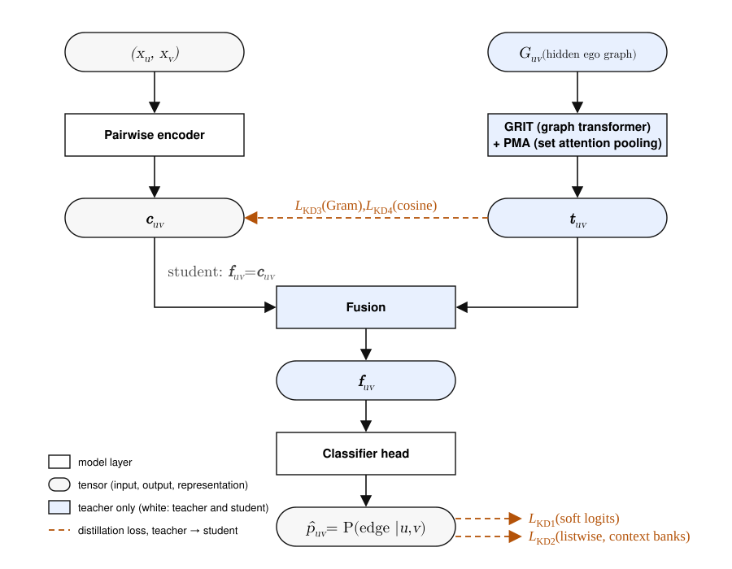

# Experiments: Topology-Conditioned Inductive Edge Prediction

**Status (2026-09-02):** paper-style protocol and evidence record. Section 2 records the Pairwise baseline, Full-Ego Oracle ceiling, and completed KD1; KD2--KD4 await held-out tests.

## 1. Experimental setup

### 1.1 Dataset and splits

| Object | Nodes | Loopless positive graph edges | Role |
|---|---:|---:|---|
| Full reference graph | 10,090 | 122,092 | positive graph truth only |
| Train-side substrate (`train_graph.pkl`) | 8,072 | 47,762 | original train⁺∪val⁺ graph and pair pool, before the internal split |
| ↳ Effective train | within the same 8,072 | 38,234 | excludes `V_val`-internal rows; outside–outside and cross-boundary pairs train |
| ↳ `V_val` region | 2,553-node subset | 9,528 | all internal pairs withheld |
| Test graph | disjoint 2,018 | 30,128 | held out until final evaluation |
| Loopless test candidate universe | same 2,018 | — | all 2,035,153 unordered distinct-node pairs |

Train and test nodes are disjoint; the primary split strategy is `breadth_first`. `V_val` is grown by K=5 dispersed-seed hashed-frontier BFS on the substrate's loopless giant component, stopped at 20% induced loopless edges; all graph-edge counts are loopless positives. Raw train-side, `V_val`, and test labeled sets are balanced 1:1; effective train need not be. `V_val` is only pair-disjoint; test is node-disjoint.

Each node carries a frozen intrinsic token sequence (≤1024 tokens × 1536 dims); F0 is its fp32 mean-pooled vector. Negatives are the fixed benchmark's balanced samples. Graph truth is observation-biased, so uncertain negatives are disclosed.

### 1.2 Evaluation protocol

**Task contract.** For a queried pair $u,v\in V_{\mathrm{test}}$ the model receives exactly $(x_u,x_v)$ and returns
the symmetric probability $\widehat A_{uv}=P(Y_{uv}=1\mid x_u,x_v)$. No observed test edge, neighbor identity, retrieval
result, degree, or graph statistic is task input; training topology may supervise a representation or objective. After scoring
a pair universe, predictions are assembled into $\widehat G_\tau$ only for evaluation. Inferred topology is intermediate context, never the prediction target and never generic graph generation.

**Evidence classes.** A *comparator* is a frozen model or score artifact evaluated without changing its checkpoint or opening new test-dependent choices; a *formal result* follows this fixed pre-test protocol.

**Model selection.** Training early-stops on total val loss (patience 10): the val task BCE plus
each active KD term's val counterpart at its training weight. The published checkpoint is chosen
independently, by mean rank over V_val AUPRC plus the five bucket-topology metrics (§1.3).

**Topology threshold.** Selected on the `V_val` 20--200-node sampled-set pair union. Define `D_RD(t)` as the size-bucket
macro-average of mean `|log RD|`; among finite atomic candidates, let `t_min=argmin_t D_RD(t)` and retain exactly those with
`D_RD(t) <= D_RD(t_min) + SE_t`, where `SE_t` is the size-stratified paired-bootstrap SE of the difference. Among survivors minimize
`D_shape=(1/3) sum_s log(max(r_s(t), epsilon))`, `epsilon=1e-12`, then break ties toward the larger threshold; empty-prediction candidates have `D_RD=+inf`. Freeze before test.

**Classification threshold.** Selected separately as the max-F1 logit threshold on the balanced
`V_val` classification rows (`val_cls`) and frozen before test. It serves only Accuracy/F1/MCC;
AUROC/AUPRC use raw logits, ECE/Brier use the raw sigmoid probabilities, and no logit shift
stands in for calibration.

**Test replay.** Test topology scores only its sampled-set pair union plus support-only rows for
the grounded arm; the frozen topology threshold replays unchanged as the one reported operating
point (self-loops included), and the frozen classification threshold replays on the balanced test rows.

**Uncertainty.** Runs are single-seed (disclosed). Arm-versus-baseline deltas report size-stratified paired-bootstrap intervals over test sampled sets and test rows.

### 1.3 Metrics

Pairwise: AUROC and AUPRC (threshold-free); Accuracy, F1, and MCC at the frozen max-F1
threshold; ECE and Brier on raw probabilities. Detailed edge tables also retain class
balance, uncertain-negative disclosure, and the completed easy, hard, degree-corrected,
full-universe, and PA-null negative-regime controls, which qualify every edge claim.

Topology (five numbers, always reported together, directions in headers): BFS-macro
graph similarity (GS ↑, edge-set Dice/F1), BFS-macro relative density (RD → 1), and
degree / clustering / spectral MMD ratios (↓; the denominator is the deterministic
real-vs-real floor, so ratio 1 is that floor). Descriptors retain self-loops.

### 1.4 Compared methods

| Arm | KD signal | Teacher | Searched hyperparameters | Role |
|---|---|---|---|---|
| Pairwise baseline (B0) | none | — | none (frozen) | frozen endpoint-only comparator |
| kd_logit | GLNN-style pointwise soft-target BCE | PMA(4) Full-Ego Oracle row bank | `w_logit ∈ {0.01, 0.1, 1, 10, 100}` | attribution control |
| kd_ranking | LLP-style rank + distribution matching over context banks | PMA(4) Full-Ego Oracle context bank | `w_rank` log-uniform [0.01, 1]; `w_dist` log-uniform [0.1, 100]; bank ∈ {h2ns1, h2ns3, h2ns5, h3ns3}; margin ∈ {0.05, 0.1, 0.2} | primary transfer test (RQ2) |
| kd_representation | pair-representation cosine | PMA(4) Full-Ego Oracle row bank | `w_rep ∈ {0.01, 0.1, 1, 10, 100}` | representation-matching arm |
| kd_gram | SPKD-style cosine-Gram relational match (Tung & Mori 2019) | PMA(4) Full-Ego Oracle row bank | `w_gram ∈ {0.01, 0.1, 1, 10, 100}` | relational-geometry arm |
| kd_generation | pair-latent generative head | PMA(1) Full-Ego Oracle latent bank | none; `w_gen=1` fixed (det/EDM variants compared) | generative test |
| Oracles | observed topology | Full-Ego graph → GRIT → PMA | none (diagnostic only) | diagnostic ceilings |

### 1.5 Training, HPO, and reproducibility

The student is V3.1: d_model 512, 3 encoder + 3 cross-attention layers, 8 heads, rich pooling
(mean/attn/max/gated), pair_context_gated readout with abba_max order aggregation, label smoothing
0.05. Optimization: AdamW, lr 1e-4, weight decay 0.05, onecycle, 25 epochs, 1,024 pairs per batch, clip 1.0, bf16 DDP.

HPO: a Phase-0 grid (24 runs) fixed per-arm incumbents (kd_logit_w100, kd_rank_wr0p1_wd1, kd_gram_w1, kd_rep_w0p1); kd_rank
continues with a 16-trial constrained MO-TPE study (GS ↑, geometric-mean MMD ↓, soft constraint `|log RD| <= 0.05`) over w_rank ×
w_dist × context bank (hops × negative-sampling rate) × margin. The best configuration per arm runs the held-out test protocol exactly once; provenance and HPC completion are rules 5--6 (§5).

## 2. Main results — edge and assembled topology

Table 2 (pairwise, current selected result per arm) and Table 3 (the five topology numbers at each arm's single frozen V_val-selected threshold) are reported together; KD2 Trial 8 is provisional while its HPO remains unfinished.

| Arm | AUROC | AUPRC | Accuracy | F1 | MCC |
|---|---:|---:|---:|---:|---:|
| Full-Ego Oracle | 0.9519 | 0.9566 | 0.8711 | 0.8776 | 0.7464 |
| Pairwise baseline | 0.7067 | 0.7316 | 0.6261 | 0.4769 | 0.3072 |
| kd_logit (`kd_logit_w100`) | 0.7195 | 0.7417 | 0.6459 | 0.6670 | 0.2941 |
| kd_ranking (strict Trial 8; provisional) | 0.7183 | 0.7457 | 0.6477 | 0.6656 | 0.2970 |
| kd_representation (`kd_rep_w0p1`) | 0.7108 | 0.7402 | 0.6234 | 0.6760 | 0.2610 |
| kd_gram (`kd_gram_w1`) | 0.7169 | 0.7428 | 0.6426 | 0.6713 | 0.2897 |

| Arm | BFS GS | BFS RD | Degree | Clustering | Spectral |
|---|---:|---:|---:|---:|---:|
| Full-Ego Oracle | 0.6429 | 0.9955 | 2.667 | 1.875 | 5.207 |
| Pairwise baseline | 0.3672 | 0.3221 | 21.03 | 18.49 | 28.39 |
| kd_logit (`kd_logit_w100`) | 0.4048 | 0.4248 | 15.63 | 13.07 | 22.06 |
| kd_ranking (strict Trial 8; provisional) | 0.4143 | 0.4399 | 14.56 | 12.41 | 21.03 |
| kd_representation (`kd_rep_w0p1`) | 0.4121 | 0.5626 | 8.725 | 7.552 | 13.15 |
| kd_gram (`kd_gram_w1`) | 0.3959 | 0.4989 | 10.16 | 8.851 | 15.43 |

## 3. Ablations and sensitivity

## 4. Analysis

Learning curves are seed-0 `V_val` selection surfaces (final HPO winners except provisional KD2 Trial 8); the dotted marker is the selected epoch. Every arm asks whether KD moves anything that $(x_u,x_v)$ alone does not reveal.

### 4.1 KD1: soft logits (`kd_logit`, selected epoch 25)
 
- Faithful to GLNN (Zhang et al. ICLR 2022): BCE to the teacher sigmoid equals the paper's KL up to the teacher entropy. The teacher is near-perfect on its own rows (AUPRC 0.984 train / 0.978 V_val).
- The student matches the teacher where it has seen the rows (logit correlation 0.913 train) and less elsewhere (0.866 V_val; KL above the entropy floor 0.10 vs 0.23 nats). Raising the KD weight leaves V_val AUPRC unchanged, so the weight is not the limit.
- Reading: GLNN's own low-$I(X;Y\mid E)$ regime. Soft labels transfer only what $(x_u,x_v)$ already reveals.
- Held-out: AUPRC +0.010 and GS +0.02 over control; RD and all three MMD ratios worse.

### 4.2 KD2: ranking over context banks (`kd_rank`, selected epoch 18)
 
- Current provisional strict-LLP Trial 8 (`w_rank=0.1`, `w_dist=10`, `h2ns3`, margin 0.1): held-out AUPRC/AUROC 0.7457/0.7183 and GS/RD 0.4143/0.4399, but MMD 14.56/12.41/21.03. HPO is unfinished, so this early test is diagnostic unless Trial 8 later wins by V_val alone and must not influence selection.

### 4.3 KD3: relational Gram (`kd_gram`, selected epoch 10)
 
- SPKD-style (Tung & Mori ICCV 2019) feature-cosine Gram with an off-diagonal mean; the swept weights span KD-gradient dominance from far below to above the task gradient, so the paper's γ has no untested analogue.
- The target's cosine Gram is rank-2 ($R^2=0.996$) and correlates $-0.86$ with teacher probability differences: KD3 relationally re-encodes KD1's target.
- The converged Gram loss (0.066 train / 0.074 V_val) equals a label-block-mean predictor (0.067 / 0.074; constant predictor 0.119 / 0.138). Label-level fit is reached; nothing beyond it is demonstrated.

### 4.4 KD4: per-row representation cosine (`kd_rep`, selected epoch 14)
 
- Same target $t_{uv}$ as KD3, so the same loss geometry applies. The cosine loss plateaus at 0.195--0.206 on train and V_val alike (cosine ≈ 0.80).
- That is the score of a constant vector along the teacher mean direction (median row cosine to it 0.82 / 0.83): the student learned the shared offset, not the rows.
- The fused pre-head vector is no better: more logit-aligned (top-axis correlation 0.99) and its structural probe equals content plus logit (CN 0.90 vs 0.85). Distilling it is KD1 plus content self-distillation; no rerun.

### 4.5 What $t_{uv}$ carries, and what the student can reach
$t_{uv}$ is the teacher's topology-branch pooled vector before fusion (§1.4 figure). Linear ridge probes on held-out train rows ([audit](results/kd_rep_audit/README.md); V_val within 0.02):

| Probe | Value | Reading |
|---|---:|---|
| variance share of the top axis of $t_{uv}$, and its correlation with the teacher logit | 0.93, $-0.96$ | one direction dominates, and it is the edge decision |
| $R^2$ of $t_{uv}\to$ common neighbours, degree, Jaccard, Adamic-Adar | 0.96--0.99 | structure is still readable, from the low-variance tail |
| $R^2$ of $(x_u,x_v)\to t_{uv}$ | 0.40--0.47 | under half of the vector is a function of the student's input |
| $R^2$ of $(x_u,x_v)\to$ the same descriptors | 0.2--0.7 | lower bound on the structure any student can recover from content |

- *The structure is there, on axes the losses ignore.* $t_{uv}$ passes the hidden ego graph's descriptors through almost losslessly (input pass-through, not learned abstraction), but cosine and Gram losses weight directions by variance, so they match the logit axis and miss the tail. KD3/KD4 failed on loss geometry, not on missing information.
- *Only the content-predictable part can transfer.* The student never sees $t_{uv}$ at test time, so representation KD moves at most the part of $t_{uv}$ that is a function of $(x_u,x_v)$: linearly 0.40--0.47 of the vector, 0.2--0.7 per descriptor. Being linear, these are lower bounds.
