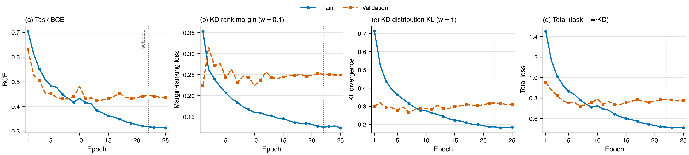
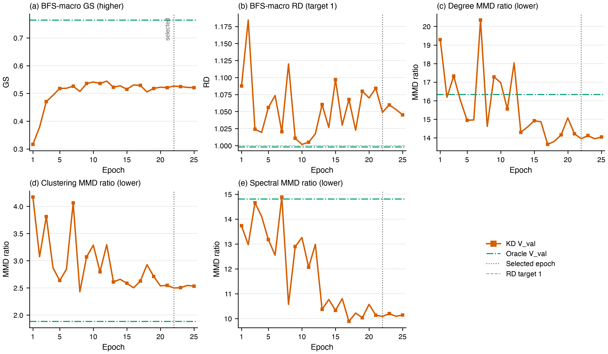
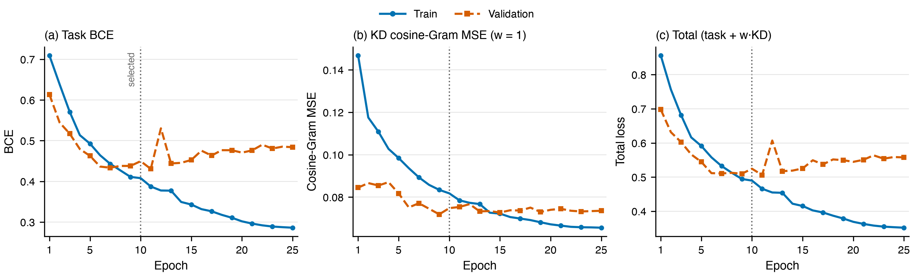
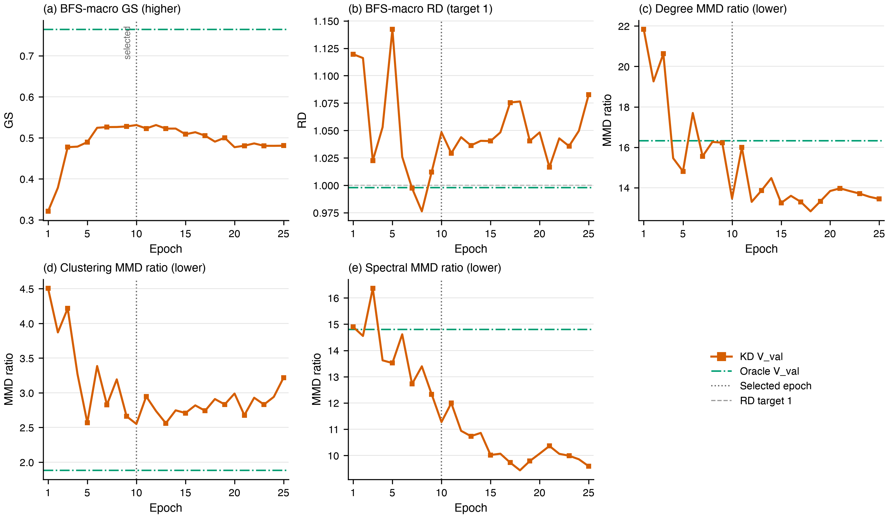
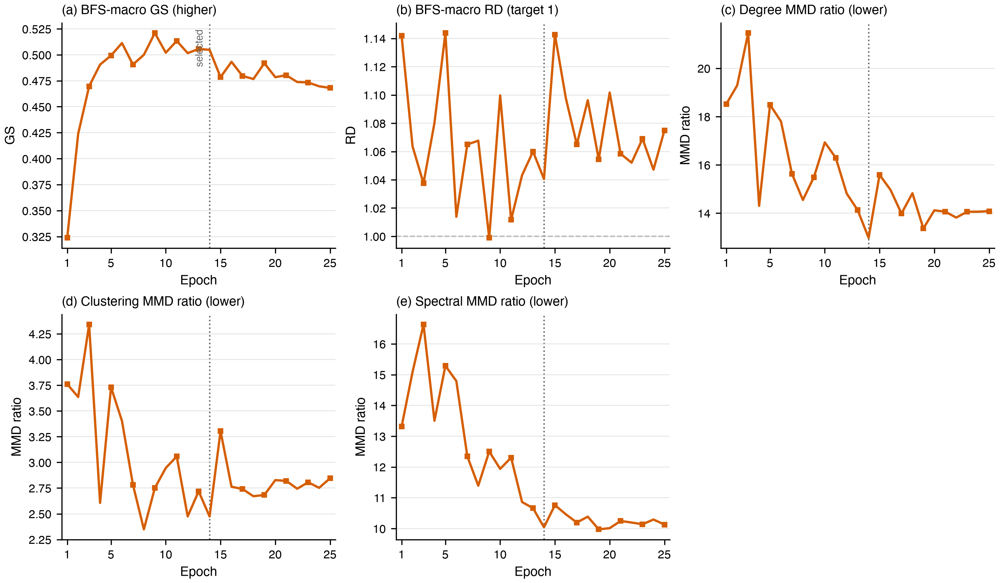

# Experiments: Topology-Conditioned Inductive Edge Prediction

**Status (2026-09-02):** paper-style experiment protocol and evidence record. Section 2 records the
Pairwise baseline, Full-Ego Oracle ceiling, and completed KD1; KD2--KD4 await held-out tests.

## 1. Experimental setup

### 1.1 Dataset and splits

| Object | Nodes | Loopless positive graph edges | Role |
|---|---:|---:|---|
| Full reference graph | 10,090 | 122,092 | positive graph truth only |
| Train-side substrate (`train_graph.pkl`) | 8,072 | 47,762 | original train⁺∪val⁺ graph and pair pool, before the internal split |
| ↳ Effective train | within the same 8,072 | 38,234 | excludes `V_val`-internal rows; outside–outside and cross-boundary pairs train |
| ↳ `V_val` region | 2,553-node subset | 9,528 | all internal pairs withheld |
| Test graph | disjoint 2,018 | 30,128 | held out until final evaluation |
| Loopless test candidate universe | same 2,018 | — | all 2,035,153 unordered distinct-node pairs |

Train and test nodes are disjoint; the primary split strategy is `breadth_first`.
`V_val` is grown by K=5 dispersed-seed hashed-frontier BFS on the substrate's loopless giant component, stopped at 20% induced loopless edges; all graph-edge counts are loopless positives.
Raw train-side, `V_val`, and test labeled sets are balanced 1:1; effective train need not be. `V_val`
is only pair-disjoint; test is node-disjoint.

Each node carries a frozen intrinsic token sequence (≤1024 tokens × 1536 dims); F0 is
its fp32 mean-pooled vector. Negatives are the fixed benchmark's balanced samples. Graph truth is observation-biased, so uncertain negatives are disclosed.

### 1.2 Evaluation protocol

**Task contract.** For a queried pair $u,v\in V_{\mathrm{test}}$ the model receives
exactly $(x_u,x_v)$ and returns the symmetric probability
$\widehat A_{uv}=P(Y_{uv}=1\mid x_u,x_v)$. No observed test edge, neighbor identity,
retrieval result, degree, or graph statistic is task input; training topology may
supervise a representation or objective. After scoring a pair universe, predictions are
assembled into $\widehat G_\tau$ only for evaluation. Inferred topology is intermediate
context, never the prediction target and never generic graph generation.

**Evidence classes.** A *comparator* is a frozen model or score artifact evaluated without changing
its checkpoint or opening new test-dependent choices; a *formal result* follows this fixed pre-test protocol.

**Model selection.** Training early-stops on total val loss (patience 10): the val task BCE plus
each active KD term's val counterpart at its training weight. The published checkpoint is chosen
independently, by mean rank over V_val AUPRC plus the five bucket-topology metrics (§1.3).

**Topology threshold.** Selected on the `V_val` 20--200-node sampled-set pair union. Define
`D_RD(t)` as the size-bucket macro-average of mean `|log RD|`; among finite atomic candidates,
let `t_min=argmin_t D_RD(t)` and retain exactly those with `D_RD(t) <= D_RD(t_min) + SE_t`,
where `SE_t` is the size-stratified paired-bootstrap SE of the difference. Among survivors
minimize `D_shape=(1/3) sum_s log(max(r_s(t), epsilon))`, `epsilon=1e-12`, then break ties
toward the larger threshold; empty-prediction candidates have `D_RD=+inf`. Freeze before test.

**Classification threshold.** Selected separately as the max-F1 logit threshold on the balanced
`V_val` classification rows (`val_cls`) and frozen before test. It serves only Accuracy/F1/MCC;
AUROC/AUPRC use raw logits, ECE/Brier use the raw sigmoid probabilities, and no logit shift
stands in for calibration.

**Test replay.** Test topology scores only its sampled-set pair union plus support-only rows for
the grounded arm; the frozen topology threshold replays unchanged as the one reported operating
point (self-loops included), and the frozen classification threshold replays on the balanced test rows.

**Uncertainty.** Runs are single-seed (disclosed). Arm-versus-baseline deltas report
size-stratified paired-bootstrap intervals over test sampled sets and test rows.

### 1.3 Metrics

Pairwise: AUROC and AUPRC (threshold-free); Accuracy, F1, and MCC at the frozen max-F1
threshold; ECE and Brier on raw probabilities. Detailed edge tables also retain class
balance, uncertain-negative disclosure, and the completed easy, hard, degree-corrected,
full-universe, and PA-null negative-regime controls, which qualify every edge claim.

Topology (five numbers, always reported together, directions in headers): BFS-macro
graph similarity (GS ↑, edge-set Dice/F1), BFS-macro relative density (RD → 1), and
degree / clustering / spectral MMD ratios (↓; the denominator is the deterministic
real-vs-real floor, so ratio 1 is that floor). Descriptors retain self-loops.

### 1.4 Compared methods

| Arm | KD signal | Teacher | Role |
|---|---|---|---|
| Pairwise baseline (B0) | none | — | frozen endpoint-only comparator |
| kd_logit | GLNN-style pointwise soft-target BCE | PMA(4) Full-Ego Oracle row bank | attribution control |
| kd_rank | LLP-style rank + distribution matching over context banks | PMA(4) Full-Ego Oracle context bank | primary transfer test (RQ2) |
| kd_rep | pair-representation cosine | PMA(4) Full-Ego Oracle row bank | representation-matching arm |
| kd_gram | Gram-matrix relational match | PMA(4) Full-Ego Oracle row bank | relational-geometry arm |
| kd_gen | pair-latent generative head | PMA(1) Full-Ego Oracle latent bank | generative test (RQ3); det/EDM complete |
| Oracles | observed hidden topology | — | diagnostic ceilings |

All arms share the identical V3.1 student, data, feature packs, and threshold rule;
only the KD signal differs. Teachers read hidden topology at training time only, and
the queried edge is always masked from its own structural context. B2/B3 latent arms
are unrun; the B4 retrieval-grounded scaffold exists only as a separately labeled
support condition with a disclosed support universe and no current formal result.

### 1.5 Training, HPO, and reproducibility

The student is V3.1: d_model 512, 3 encoder + 3 cross-attention layers, 8 heads, rich
pooling (mean/attn/max/gated), pair_context_gated readout with abba_max order
aggregation, label smoothing 0.05. Optimization: AdamW, lr 1e-4, weight decay 0.05,
onecycle schedule, 25 epochs, 1,024 pairs per batch, gradient clip 1.0, bf16 DDP.

HPO: a Phase-0 grid (24 runs) fixed per-arm incumbents (kd_logit_w100, kd_rank_wr0p1_wd1,
kd_gram_w1, kd_rep_w0p1); kd_rank continues with a 16-trial constrained MO-TPE study
(GS ↑, geometric-mean MMD ↓, soft constraint `|log RD| <= 0.05`) over w_rank × w_dist ×
context bank (hops × negative-sampling rate) × margin. The best configuration per arm runs
the held-out test protocol exactly once; provenance and HPC completion are rules 5--6 (§5).

## 2. Main results — edge and assembled topology

Table 2 (pairwise, best HPO per arm) and Table 3 (the five topology numbers at each arm's single
frozen V_val-selected threshold) are reported together, never one family alone. Prose reports per-arm
deltas against the Pairwise baseline and the joint verdict of protocol rule 7: a selected method must
improve assembled topology without an unacceptable edge-metric loss and survive its coupling ablation.

| Arm | AUROC | AUPRC | Accuracy | F1 | MCC |
|---|---:|---:|---:|---:|---:|
| Full-Ego Oracle | 0.9519 | 0.9566 | 0.7783 | 0.7184 | 0.6151 |
| Pairwise baseline | 0.7067 | 0.7315 | 0.6083 | 0.3987 | 0.3020 |
| kd_logit (`kd_logit_w100`) | 0.7195 | 0.7417 | 0.5950 | 0.3473 | 0.2917 |
| kd_rank | — | — | — | — | — |
| kd_rep | — | — | — | — | — |
| kd_gram | — | — | — | — | — |

| Arm | BFS GS | BFS RD | Degree | Clustering | Spectral |
|---|---:|---:|---:|---:|---:|
| Full-Ego Oracle | 0.6429 | 0.9955 | 2.667 | 1.875 | 5.207 |
| Pairwise baseline | 0.3896 | 0.4223 | 13.08 | 11.93 | 18.09 |
| kd_logit (`kd_logit_w100`) | 0.4048 | 0.4248 | 15.63 | 13.07 | 22.06 |
| kd_rank | — | — | — | — | — |
| kd_rep | — | — | — | — | — |
| kd_gram | — | — | — | — | — |

**Status.** KD1 epoch 25 (`7038fe0cd79ee244`) supplies the completed held-out
`test_protocol_v6` row. Versus Pairwise: AUROC +0.013, AUPRC +0.010, GS +0.015;
RD is unchanged at 0.42 while all MMD ratios worsen. KD2--KD4 remain selection-only.

## 3. Ablations and sensitivity

- **KD components (winning arm):** w_rank vs w_dist, margin, and context-bank configuration,
  harvested from the MO-TPE study surfaces — the LLP-style rank-loss/distribution-loss decomposition.
- **Threshold protocol:** the raw probability-0.5 operating point versus the frozen
  V_val-selected threshold, re-measured per sampled set on current arms. Historical
  free-run densities (retired arms 5.7--16.2× over-dense at 0.5) are motivation, never evidence.

## 4. Analysis

**Learning curves.** Completed seed-0 HPO-winner `V_val` surfaces (not held-out), one arm per block:
losses, then the five topology metrics; the dotted marker is the selected epoch. KD2 is the retired
incidental-batch objective, not strict LLP. KD1 ran all 25 epochs: train task loss 0.709→0.341, val
AUPRC 0.781→0.927, logit correlation to the teacher 0.16→0.91 (train) / 0.52→0.87 (`V_val`), val
soft-target BCE 0.604→0.365 against the 0.134 teacher-entropy floor, BFS GS 0.339→0.546 at RD 1.032.
**KD1 `kd_logit_w100` (selected epoch 25)**  
**KD2 `kd_rank_wr0p1_wd1` (selected epoch 22)**  
**KD3 `kd_gram_w1` (selected epoch 10)**  
**KD4 `kd_rep_w0p1` (selected epoch 14)**  
- **Calibration:** ECE and Brier on raw probabilities; any fitted temperature/Platt map is a separate, disclosed row.
- **Inference cost:** the student scores a pair from $(x_u,x_v)$ alone (no graph, retrieval, or
  neighbor access) while every teacher requires hidden ego topology; report parameters and throughput.
- **Failure modes:** MMD ratios remain above the real-vs-real floor even for oracles;
  uncertain negatives bound achievable edge metrics.

## 5. Protocol rules

1. Report pairwise and all five topology metrics together; no favorable nearby
   threshold or aggregate substitutes for the fixed rule.
2. Preserve provenance: Oracle, S0, S0-R, S1, and any test-informed follow-up remain
   `formal:false` even when their execution is valid.
3. Freeze both `V_val` thresholds (topology cascade; max-F1 classification) before test,
   evaluate test once, and never tune either on test or pass a logit shift off as calibration.
4. Bind comparisons to the same frozen features, split, sampled sets, grounding
   support, self-loop convention, checkpoint, and fixed-threshold rule.
5. Validate score precision before analysis. Record checkpoint ID, artifact hashes,
   threshold/quota policy, random seed, code commit, and metric implementation.
6. Require completion markers, no `failure.json`, exited workers, complete outputs, and
   verified hashes before declaring an HPC experiment complete.
7. A selected method must improve assembled topology without an unacceptable
   edge-metric loss and must survive its topology-context or coupling ablation.

The S0, S0-R, and S1 artifacts retain `evidence_class=diagnostic`, the `breadth_first`
strategy, and their input-manifest digests; these records must remain attached to any
derived table.
