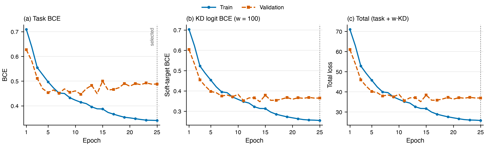
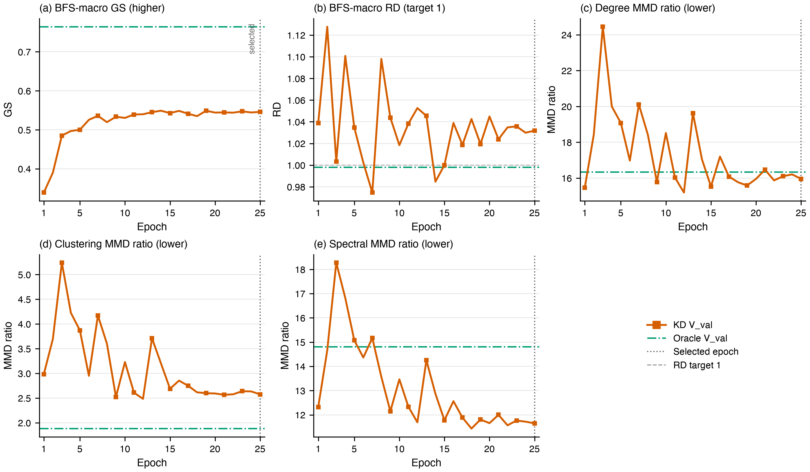

# KD1 (`kd_logit`): 4-H20 HPO winner curves

**Status (verified 2026-08-31):** this directory records the 4-H20 HPO winner
`kd_logit_w100`, not the older published 2-H20 unit-weight KD1 run. The winner completed 25 epochs
with `w_logit=100`; the selected-epoch marker is epoch 25. The run used `--skip-test`, so nothing in
this directory is a held-out test result.

## Objective

Each official training row joins by `_row_id` to one frozen teacher logit. The endpoint-only V3.1
student still receives exactly `(x_u, x_v)` at inference.

```text
L_total = L_task + 100 · L_logit
```

`L_task` is the supervised smoothed-label BCE. `L_logit` is pointwise BCE between the student logit
and the frozen teacher probability. All other KD weights are zero.

## Learning and validation-topology curves



The first figure plots train/validation losses; the second plots BFS-macro GS/RD and all three MMD
ratios on V_val, with Oracle V_val references. The dotted line marks selected epoch 25.
[CSV](learning_curves.csv) contains all exact 25-epoch values, and the
[plot script](plot_learning_curves.py) reproduces both PNGs directly from it.

## Campaign provenance

| field | value |
|---|---|
| campaign/run | `outputs/b1_row_kd_hpo/kd_logit_w100` |
| runtime | 4 H20 ranks; bf16; seed 0; 25 epochs; `--skip-test` |
| KD weights | `w_logit=100`; all other KD weights `0` |
| selected epoch | 25 |
| V_val surface | AUPRC 0.9274; GS 0.5459; RD 1.0318; degree/clustering/spectral MMD 15.96/2.58/11.65 |

The campaign-wide source is [the HPO grid report](../kd_hpo_grid/README.md). It explicitly separates
these 4-rank V_val selection surfaces from the older 2-rank published KD1–KD4 reports.
