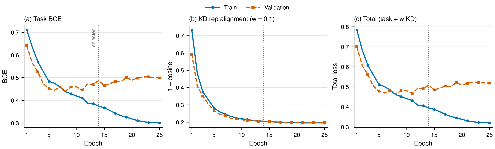

# KD4 (`kd_rep`): model design and learning curves

**Status (verified 2026-08-23):** KD4 is the current full-row per-row representation arm. Training stopped after epoch 24 under patience 10, published epoch 14, completed held-out testing, has no `failure.json`, and had released its two H20 GPUs when inspected.

## 1. Arm identity and teacher

The strict student input is `(x_u, x_v)`. Every official row joins by `_row_id` to the frozen teacher's symmetrized pooled representation. The 512-wide student pair representation is aligned directly to the 512-wide teacher target, so no projection head is needed.

```text
(x_u, x_v, y, row_id) ──> V3.1 student ──> logit s, pair representation z_s
               row_id ──> frozen target bank ──> teacher representation z_t
L_total = L_task + 1.0 · L_rep
```

The frozen teacher is the diagnostic-only Full-Ego oracle checkpoint `outputs/egostitch_e2e_stage1_v3/full_ego_teacher_kd/best.pt` (id `c390709fb7070c62`, epoch 6): `full_ego_oracle` generator (`n_ground=50`), 4-layer width-96 `grit_gmt` encoder with RRWP `k=8`, and `b0_v31` classifier. The shared target bank has 86,498 train rows, 22,804 V_val rows, 42,238 positive train rows, and 8,070 nodes. Teacher checkpoint SHA-256 is `8d7cdad619f130db8df19413692005919bde66a66fdfeb1763a08321c40f7469`; target NPZ SHA-256 is `ef65e905da9da0a78a83c9a4c6f198ac73e1c65d11b1d96dccf0cfa9d5b4d82b`.

## 2. Student and training hyperparameters

| group | hyperparameters |
|---|---|
| encoder | input 1536; width 512; 3 encoder layers; 3 cross-attention layers; 8 heads |
| pooling/readout | mean + attention + max + gated; `pair_context_gated`; AB/BA max; no mixing |
| head/regularization | MLP `[512,256,128]`; GELU; LayerNorm; head dropout 0.2; dropout/token/cross-attention/stochastic-depth 0.1; label smoothing 0.05 |
| optimizer/schedule | AdamW path; max LR `1e-4`; weight decay 0.05; clip 1.0; OneCycle cosine (`pct_start=0.1`, div 25, final div 10000) |
| runtime | configured 25 epochs, stopped at 24; 524,288 global tokens; 4,096 pairs/rank; 2 H20 ranks; bf16; seed 0 |

All 86,498 rows were covered exactly per completed epoch for 2,448 steps. Attempt id is `fca0bce16b4d46e083e73e036ee465f6`; published checkpoint id is `93541253e60fa56f`.

## 3. Loss terms and weights

| term | definition | weight |
|---|---|---:|
| supervised task | smoothed-label `BCEWithLogits`, `ε=0.05` | 1.0 |
| representation KD | `mean_i [1 - cosine(z_s,i, z_t,i)]` | `w_rep=1.0` |
| total | `L_task + L_rep` | — |

All other KD weights are zero. Unlike KD2/KD3, this KD term is pointwise by official row; the teacher representation is train-only supervision, never inference input.

## 4. Learning curves



Figure: train/validation task, representation, and derived total losses. The dotted line marks published epoch 14. [Vector PDF](learning_curves.pdf); [CSV](learning_curves.csv); [plot script](plot_learning_curves.py).

Train task and representation losses are artifact-native. Validation representation loss is exactly `1 - val_kd_rep_cos` from persisted telemetry. Validation task loss was replayed on 2026-08-23 from all 24 checkpoints over the exact 22,804-row V_val block with the original bf16 forward. Derived totals are the unit-weight sums of the displayed summaries.

| point | train task | train rep | derived train total | val task | val rep | derived val total |
|---|---:|---:|---:|---:|---:|---:|
| minimum derived val total, epoch 10 | 0.384861 | 0.134392 | 0.519252 | **0.454833** | 0.134350 | **0.589183** |
| published epoch 14 | 0.331864 | 0.125128 | 0.456992 | 0.472827 | **0.131438** | 0.604266 |
| final epoch 24 | **0.238459** | **0.113605** | **0.352065** | 0.534796 | 0.132622 | 0.667418 |

The validation representation term stays near 0.13 after epoch 10, while validation task loss rises; the later generalization gap is primarily supervised. This classification-only run selected epoch 14 by validation AUPRC, not by minimum loss; topology metrics were computed only after publication.

## 5. Held-out result

| edge metric | value |
|---|---:|
| AUPRC / AUROC | 0.745435 / 0.720241 |
| ECE / Brier | 0.213116 / 0.263612 |

| topology operating point | GS ↑ | RD → 1 | degree MMD ↓ | clustering MMD ↓ | spectral MMD ↓ |
|---|---:|---:|---:|---:|---:|
| primary fixed V_val threshold (`logit=2.953125`) | 0.409257 | 0.606739 | 6.671847 | 5.949064 | 10.857750 |
| per-subgraph RD=1 diagnostic | 0.433668 | 1.000000 | 2.247373 | 2.741356 | 4.149036 |

The per-subgraph row is oracle-calibrated and nondeployable. The fixed threshold improves density relative to KD2/KD3 but remains under-dense; this document makes no cross-arm superiority claim.

## 6. Artifact provenance

| artifact | verified identity/state |
|---|---|
| config | source name `configs/b1_kd_rep_breadth_first.yaml`; artifact-recorded serialized config hash `488f246a1c8b27a7ba2f423506827fdf95b7f5e88fd6196af3e6efde927ea1c6` (not asserted as the current working-tree file hash) |
| run | `outputs/b1_row_kd/kd_rep`; epochs 1–24; selected epoch 14; checkpoint `93541253e60fa56f` |
| terminal state | `complete.json` and `test_complete.json` present; no `failure.json`; GPUs released |
| validation replay | 24 checkpoints × 22,804 exact V_val rows; H20 bf16; completed 2026-08-23 |
