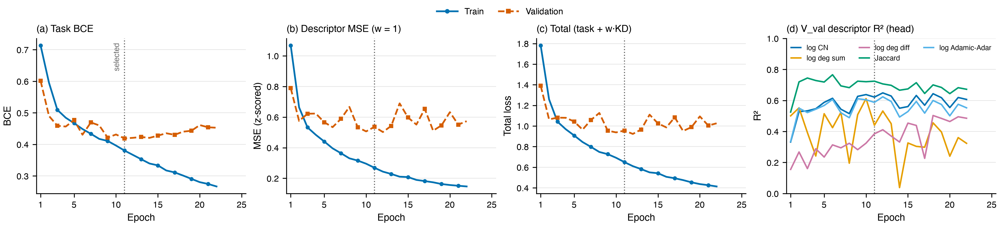
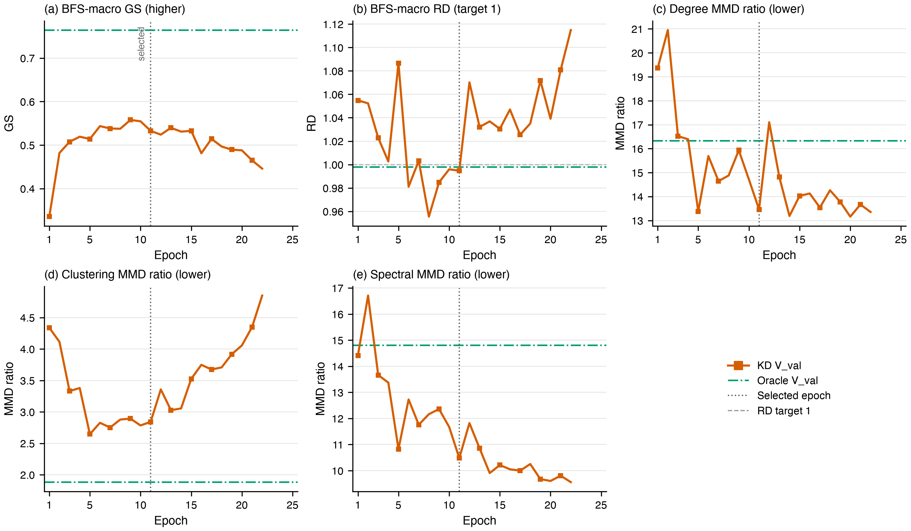

# kd_struct: descriptor-level auxiliary arm (2026-09-02)

**Status:** single run `outputs/b1_row_kd/kd_struct` (commit 5a3d0bf), 2 H20 ranks, bf16, seed 0,
`w_struct=1`. Early-stopped by total val loss (patience 10) at epoch 22; checkpoint selection picked
epoch 11; the held-out test protocol ran automatically (`test_report.json`, numbers in
`docs/03-experiments.md` §2).

## Objective

No teacher. An MLP head on the student's pair representation regresses five z-scored truth-graph
descriptors of the queried row with the queried partner masked from both neighbour sets: log1p
common neighbours, log1p degree sum, |log1p degree difference|, Jaccard, log1p Adamic-Adar. Training
rows read the training graph (no V_val-internal edge); V_val rows read the full train-side substrate.

```text
L_total = L_task + 1.0 · MSE(head(pair_repr), z(descriptors))
```

## Learning and validation-topology curves



Panel (d) of the first figure is the per-descriptor V_val R² of the head, the nonlinear lower bound
on the structure the student's pair representation can recover from `(x_u, x_v)`.
[CSV](learning_curves.csv) holds all 22-epoch values; the [plot script](plot_learning_curves.py)
reproduces both PNGs from it.

## Selected-epoch V_val surface

| field | value |
|---|---|
| task / descriptor MSE (train, val) | 0.381 / 0.419; 0.269 / 0.536 |
| descriptor R² (CN, deg sum, deg diff, Jaccard, AA) | 0.62, 0.44, 0.39, 0.72, 0.59 (best epochs 0.65, 0.61, 0.50, 0.77, 0.62) |
| AUPRC; GS; RD; degree/clustering/spectral MMD | 0.9226; 0.5326; 0.9948; 13.46 / 2.84 / 10.48 |

## w_struct=100 bound run (2026-09-03, `outputs/b1_row_kd/kd_struct_w100`, commit fd82cc2)

Same recipe with the descriptor MSE at 100x the task gradient, so the head reads structure nearly
task-free. Early-stopped at epoch 19 (best total val loss at 9), selected epoch 16, checkpoint
`b7c718e95537d952`. V_val R² (CN, deg sum, deg diff, Jaccard, AA): selected 0.61 / 0.45 / 0.58 / 0.70 /
0.57; stable plateau over epochs 15--19 0.61--0.65 / 0.42--0.52 / 0.58--0.64 / 0.68--0.71 /
0.57--0.60; single-epoch peaks 0.68 / 0.74 / 0.64 / 0.77 / 0.67. Against the w=1 best epochs
(0.65 / 0.61 / 0.50 / 0.77 / 0.62) only degree difference moves durably (linear probe 0.20); degree
sum stays node-level unstable (-0.12 at epoch 11). V_val AUPRC 0.914, GS 0.554. Held-out: AUROC/AUPRC
0.7215/0.7405, Accuracy/F1/MCC 0.6486/0.6740/0.3008, ECE/Brier 0.1223/0.2297; GS/RD 0.4012/0.4426, MMD
14.14/11.97/19.50 (RD-ordered like every arm). Heavier descriptor supervision moves neither the decision nor the assembled graph.

## Matched-epoch control (2026-09-03)

`kd_control` epoch-0011 checkpoint through the held-out protocol (`outputs/b1_row_kd_hpo/kd_control/matched_epoch_0011`):
AUROC/AUPRC 0.7157/0.7463, Accuracy/F1/MCC 0.6342/0.6738/0.2767, ECE/Brier 0.138/0.235; GS/RD 0.4114/0.4462,
MMD 13.97/12.25/20.82. Against kd_struct's epoch 11 the edge margin is +0.003 AUPRC and the topology
differences track RD; the epoch-10 checkpoint of the same control run scores 0.7515 AUPRC.
