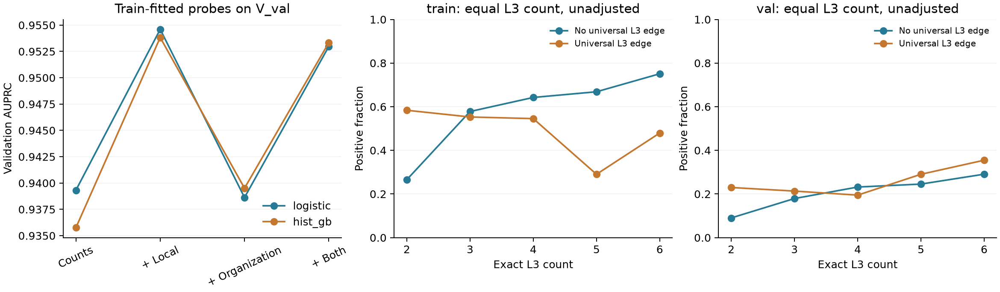

# Path organization: train / V_val exploration

**Follow-up completed:** [sampler-aligned probes alongside frozen content](content_probe_report.md)
separate triangles, neighbor degree, and endpoint-role products, with three fixed
training-only node holdouts and paired node/community uncertainty. The results
below remain the initial counts-only exploration, not that follow-up.

2026-09-14. **Oracle structural diagnostic; no test data accessed.** This first
pass finds useful local structural context, but no consistent incremental gain
from the measured L3 organization features once that context is included.
It does not evaluate a template prompt, endpoint-feature generator, or frozen reader.

## Data and measurement

The current seed-42 split was rebuilt from `split.pkl`, `train_graph.pkl`, and
the original train/val negative lists using `derive_val_region_split`; node
membership and validation negatives were checked against the current manifest.
No global positive file, test graph, test pairs, or test features were opened.

| Universe | Nodes | Distinct-endpoint positives | Negatives | Rows with L3 >= 2 |
|---|---:|---:|---:|---:|
| Train | 7,203 | 31,623 | 33,856 | 31,380 |
| V_val | 869 | 4,703 | 5,347 | 6,911 |

Training and validation use their separate induced truth graphs. Each queried
edge is removed **before all measurements**, including degrees and local context.
Self-positive pairs (5,234 train; 644 validation) are excluded: this exploration
concerns two distinct endpoints. Negatives are the fixed benchmark training
negatives and official `val_cls` validation negatives, not the dynamic 1:5
training stream. Thus these scores are not directly comparable with headline
model results or calibrated probabilities over all possible pairs.

Feature blocks are symmetric under endpoint exchange:

- **Counts:** minimum/maximum endpoint degree, common-neighbor count, exact
  simple L3 count, and distance category 2 / 3 / other. The last category combines
  distance >= 4 with disconnected pairs; full shortest distance is not controlled.
- **Local:** minimum/maximum endpoint triangle count and mean neighbor degree.
  Together with degree, triangle counts determine local clustering.
- **Organization:** number of internal nodes and distinct edges in the union of
  all simple L3 paths; its cycle rank; maximum fraction of paths sharing one
  edge or one internal node; fraction of pairs of paths with disjoint internal
  nodes; minimum/maximum endpoint neighbors used and unused by these paths.
  A universal shared edge is an **L3-path bottleneck**, not necessarily a global
  connectivity bottleneck: longer alternative paths can exist.

The proposed six-node diagrams pass the same-count test and differ in edge
sharing and internal disjointness. Extraction was also checked against explicit
edge-deleted path enumeration on all 1,024 simple graphs over five nodes,
including endpoint swapping and triangle counts.

## Train-fitted probes on V_val

Both probe families use `log1p` features. Logistic regression uses training-fitted
standardization, C=1, max_iter=1000. Histogram gradient boosting uses 100 iterations,
15 leaves, minimum leaf size 50, L2=1, seed 42, and no early stopping. All settings
were fixed before the first validation result; there was no validation tuning.

| Probe | Features | AUROC | AUPRC | Log loss ↓ |
|---|---|---:|---:|---:|
| Logistic | Counts | 0.9369 | 0.9393 | 0.3835 |
| Logistic | Counts + local | **0.9548** | **0.9546** | **0.3222** |
| Logistic | Counts + organization | 0.9340 | 0.9386 | 0.4108 |
| Logistic | Counts + local + organization | 0.9528 | 0.9530 | 0.3395 |
| Tree | Counts | 0.9298 | 0.9358 | 0.4487 |
| Tree | Counts + local | **0.9543** | **0.9538** | **0.3582** |
| Tree | Counts + organization | 0.9343 | 0.9395 | 0.4507 |
| Tree | Counts + local + organization | 0.9539 | 0.9533 | 0.3645 |

Organization alone adds 0.0038 AUPRC to the tree probe, with worse log loss;
the logistic probe worsens on all three measures. With local context present,
adding organization worsens all three measures in both families. The L3 >= 2
subset likewise shows no AUPRC or log-loss gain beyond the local-context block
(full subset metrics are in `probe_metrics.csv`). These are point estimates
from one split, not significance claims; pair rows share proteins and graph edges.



## Does equal path count conceal different associations?

Yes descriptively, but this does not establish an independent benefit. For exact
L3=2, positive fractions are:

| Universe | No edge shared by every L3 path | An edge shared by every L3 path |
|---|---:|---:|
| Train | 162 / 610 = 26.6% | 708 / 1,213 = 58.4% |
| V_val | 13 / 144 = 9.0% | 71 / 309 = 23.0% |

This association runs against a simple assumption that redundant paths must
indicate interaction more strongly. It can reflect degree, local context, and
negative-sampling effects. No-shared-edge also does not imply complete internal
node disjointness in general.

An exact joint match on both endpoint degrees, common neighbors, L3 count, and
the distance category has **zero strata with >=5 rows in each organization group**
in either universe. The fully matched contrast is therefore unsupported at this
minimum sample size; we do not silently relax matching to produce a result.
Internal degree sequences and complete rooted graph isomorphism are not controlled.

## Implication for the proposed prompt design

The observed local-context gain supports investigating how endpoint roles help
assess a queried edge. The evidence here does **not yet support** path-organization
features as a reliable improvement beyond that local context, and does not reject
richer complete-template representations that this small descriptor block omits.

Before choosing a template library, a follow-up should check this pattern under
sampler-matched negatives and additional train-only node splits, with uncertainty
that accounts for shared endpoints. The subsequent, separate hypothesis is whether
`(x_u,x_v)` can predict the relevant structural distinctions. Finally, a frozen
reader experiment must measure changes in task loss/logits under controlled
template and endpoint-role interventions. None of those later experiments was
run here. GS/RD/MMD graph-reconstruction scores are not evaluated in this
pair-association exploration; no deployable arm or topology threshold is selected.

## Reproduction and artifacts

```bash
rtk proxy .venv/bin/python -m src.experiments.path_organization \
  --output docs/results/path_organization_train_val
rtk proxy .venv/bin/python -m pytest tests/test_path_organization.py -n0
```

`summary.json` records the parent source HEAD and exact metrics; the newly added
exploration implementation is `src/experiments/path_organization.py`.
`train_features.csv` / `val_features.csv` retain canonical pair IDs and all measured
features; `val_predictions.csv` retains every probe prediction. `*_l3_groups.csv`
contains exact-L3 label-rate counts. The script regenerates all tables and the figure.
