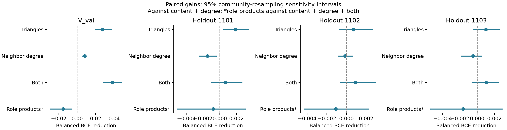

# Endpoint context alongside frozen content

2026-09-14. Completed sampler-aligned probes and three predeclared training-only
node holdouts. **Triangles have a repeatable positive direction, but a small and
uncertain increment in the extra holdouts. Neighbor-degree context and the tested
endpoint-role products do not show a repeatable BCE benefit.** No prompt or virtual
context model was trained.

The [fixed protocol](content_probe_protocol.md), [exact holdout memberships](content_probe_holdouts.json),
[dataset counts](content_probe_datasets.json), and [all metrics, paired intervals, and fitted coefficients](content_probe_results.json)
are retained. No arm or hyperparameter was selected from these outcomes.

## What was compared

Frozen content is `prefix_base/best.pt`, checkpoint `614003b9ba3a8d53`, epoch 10.
The underlying network and checkpoint were unchanged. C denotes a training-fitted
affine calibration of its logit; the raw logit is reported separately. All further
probes jointly fit a fixed logistic head on C's input logit and the indicated
context, using training-only standardization, C=1, and positive weight 5.

- D: independently sorted log1p endpoint degrees.
- T: independently sorted log1p endpoint triangle counts.
- N: independently sorted log1p endpoint mean-neighbor degrees.
- R: assignment-preserving products. For endpoint tuples `(d_u,t_u,n_u)` and
  `(d_v,t_v,n_v)` after log1p, add `d_u*t_u+d_v*t_v`, `d_u*n_u+d_v*n_v`,
  `t_u*n_u+t_v*n_v`, and `d_u*t_u*n_u+d_v*t_v*n_v`. These retain which quantities
  belong to the same protein while remaining invariant to swapping endpoints.
  They are a specific role-combination probe, not a complete rooted template.

All quantities come from the appropriate induced truth graph **after deleting the
queried edge**, so these are oracle context probes. No endpoint features predict
that context yet. All arms share the same canonical evaluation pairs and the same
cached frozen logits. No test graph or test pair list was used.

## Populations and dependence

| Evaluation | Defined nodes | Evaluated non-self pairs | Positives |
|---|---:|---:|---:|
| Sampler-aligned V_val | 869 | 31,423 | 4,703 |
| Training holdout 1101 | 1,440 | 11,953 | 1,106 |
| Training holdout 1102 | 1,440 | 11,768 | 1,105 |
| Training holdout 1103 | 1,440 | 12,839 | 1,259 |
| Official val_cls, secondary | 869 | 10,050 | 4,703 |

The holdouts were uniformly sampled from the original 7,203 training nodes with
fixed seeds before outcomes. Each new probe fits on the complement's induced
graph, with no boundary edges or shared evaluation endpoints. Negative sampling
uses the existing production sampler at ratio 5 and one fixed epoch. Production
samples with self-positives included; subsequently excluding all self-pairs changes
the retained class ratio. Balanced BCE gives equal total weight to the two classes.

**The frozen content model previously saw the training-holdout nodes and labels.**
Only the newly fitted probes hold those nodes out. Its AUROC there is consequently
about 0.976–0.978, versus 0.768 in V_val. These holdouts assess transfer of an
increment conditional on that existing model, not fresh unseen-protein performance.
V_val was excluded from content training but used for its original checkpoint
selection and the earlier exploration; it is not an untouched final test.

Intervals below are paired 2.5–97.5 percentile sensitivity intervals from 1,000
shared multiplicity draws. Node draws account for shared endpoints; community
draws cluster endpoints using a fixed Louvain partition and account for additional
within-community dependence. V_val has only 13 communities. Neither interval
captures all cross-community shared-edge dependence, refitting uncertainty, or
content-model training uncertainty. The overlapping holdouts are not independent
replications; we do not turn their row counts into a significance claim.

## Primary marginal comparisons

Positive values mean lower balanced BCE. T, N and T+N are compared with C+D;
R is compared with C+D+T+N.

| Evaluation | + T | + N | + T+N | + R |
|---|---:|---:|---:|---:|
| V_val | +0.027645 | +0.008075 | +0.038158 | −0.015218 |
| Holdout 1101 | +0.001876 | −0.001472 | +0.000678 | −0.000788 |
| Holdout 1102 | +0.000720 | −0.000147 | +0.000924 | −0.001093 |
| Holdout 1103 | +0.001012 | −0.000476 | +0.001025 | −0.001625 |
| Official val_cls | +0.025013 | +0.009909 | +0.037733 | −0.014692 |

Triangle-only intervals make the uncertainty in that positive direction explicit:

| Evaluation | Node interval | Community interval |
|---|---|---|
| V_val | [0.021996, 0.033301] | [0.019406, 0.036807] |
| Holdout 1101 | [0.000119, 0.004053] | [0.000485, 0.003430] |
| Holdout 1102 | [−0.001471, 0.003091] | [−0.000719, 0.002600] |
| Holdout 1103 | [−0.000574, 0.002905] | [−0.000428, 0.002531] |

The **total C+D+T+N increment over calibrated C** is +0.043340 BCE in V_val,
but only +0.000102 / +0.000560 / +0.000745 across the three extra holdouts.
Both interval types include zero for all three of these holdout contrasts.
Their AUPRC point gains are +0.004654 / +0.004083 / +0.005698; no uncertainty
claim is made for those ranking gains. Adding R reverses the total BCE direction
versus C in all three holdouts.



## Ranking and calibration must be separated

Sampler-aligned V_val, identical 31,423 rows:

| Probe | Balanced BCE ↓ | AUROC ↑ | AUPRC ↑ |
|---|---:|---:|---:|
| Raw frozen content | 1.1886 | 0.7675 | 0.4528 |
| C | 0.9331 | 0.7675 | 0.4528 |
| C+D | 0.9279 | 0.7689 | 0.4549 |
| C+D+T | 0.9003 | 0.7816 | 0.4662 |
| C+D+N | 0.9198 | 0.7638 | 0.4511 |
| C+D+T+N | 0.8898 | 0.7760 | 0.4630 |
| C+D+T+N+R | 0.9050 | 0.7770 | 0.4611 |
| D+T+N+R without content | 0.6132 | 0.7448 | 0.3049 |

Train-fitted content calibration alone improves BCE by 0.2555, much more than
the additional context correction. Even C+D+T+N has worse balanced BCE than
constant probability 0.5 (log(2)=0.6931): the frozen score and its training-fitted
calibration transfer poorly in absolute loss. An incremental BCE gain therefore
must not be described as a well-calibrated or strong combined reader.

Triangles improve ranking too (+0.012736 AUROC / +0.011295 AUPRC over C+D).
Neighbor degree improves V_val loss but reduces both ranking metrics there.
The triangle ranking direction is positive in all three extra holdouts, although
small. The assignment-preserving R probe worsens BCE and AUPRC in every evaluation;
it is not evidence for a general benefit of endpoint-role combinations.

Official val_cls also gives a triangle AUPRC gain (+0.005245 over C+D), but uses
the same 869 proteins and positives as the sampler-aligned V_val experiment.
It is a negative-population sensitivity check, not an independent replication.
The previous exploration used different feature blocks as well as different
training negatives, so its approximately 0.95 AUPRC is not a direct baseline here.

## Research implication

These results narrow the recovery target to **triangle context conditional on
degree and frozen content**. They do not establish a stable, practically useful
increment across genuinely unseen proteins: the extra holdout gains are small,
two triangle intervals cross zero, and those proteins were seen by content training.
The richer neighbor-degree and role-combination additions do not earn a claim of
repeatable improvement from this experiment.

If pursuing virtual context next, use the triangle increment as a bounded oracle
target and compare recovery against the same frozen-content control. A subsequent
test must distinguish recovery due to the predicted context from that due to the
fixed structure and pretrained reader. This run supplies neither that recovery
nor those interventions. It does not justify expanding the template dictionary.

## Execution and verification

- Scoring used the existing H20 runner at remote HEAD
  `3aee292c7712a5f2b8b9376f8d9b9df9cf39834c`, host `a4uvdi75hfet1-0`.
  Only the generated pair-list artifact was transferred; working code was not copied.
- 641,011 unique pair/label rows were scored, merged, and fully joined against
  the prepared union. Checkpoint ID, finite logits, all probe endpoint boundaries,
  and unique evaluation rows were verified. Logits are stored FP32 with BF16
  encoding and pair inference. Scoring workers exited and all four GPUs released.
- Against the older published val_cls cache, rebatched inference has mean absolute
  logit difference 0.00483, maximum 0.203125, and 81.0% exact equality. Its non-self
  AUROC/AUPRC are 0.764129/0.748066 versus 0.764119/0.748049 in the new cache.
  Every paired comparison uses only the new common cache, never mixed score versions.
- All logistic fits converged within 70 iterations of the fixed 1,000 limit.
  Six targeted tests passed, including exhaustive five-node edge-deletion checks,
  endpoint swap invariance, sampler boundaries, and constant paired-gain resampling.
  Changed-file Ruff and mypy checks passed.

Local artifacts are in `outputs/analysis/endpoint_content_20260914/`: per-split
feature/pair arrays, content scores, all evaluation predictions, membership files,
and results. The compact result JSON and exact memberships are linked above.

```bash
rtk proxy .venv/bin/python -m src.experiments.endpoint_content prepare \
  --output outputs/analysis/endpoint_content_20260914
# Score score_pairs.tsv using the frozen checkpoint via hpc/run.sh score;
# transfer the merged content_scores.npz artifact back, then:
rtk proxy .venv/bin/python -m src.experiments.endpoint_content analyze \
  --output outputs/analysis/endpoint_content_20260914 \
  --scores outputs/analysis/endpoint_content_20260914/content_scores.npz
```

Preparation requires the saved `holdouts.json` (identical to the linked memberships).
No held-out topology threshold or deployable graph-reconstruction result is selected.
