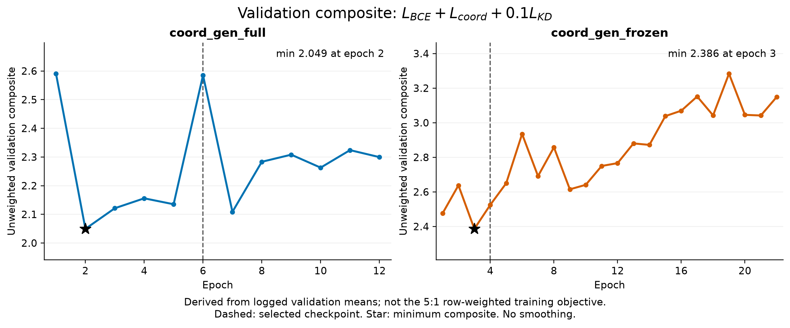

# Stage II: generator and loss-curve audit

Source: live H20 `outputs/split_seed42/{coord_gen_full,coord_gen_frozen}/`, retrieved
2026-09-13. Run commit `aeb04d0`, seed 0. Complete per-epoch `metrics.jsonl`, metadata,
completion markers and test reports are copied in the two arm directories. No new
training, scoring or GPU probe was run. The test report supplies the selected epoch;
all plotted component losses and fit metrics are validation diagnostics, not test.

## What was actually recorded

- Training: only the composite `train_loss`. Separate training coordinate, task and
  KD curves, separate Huber/CE curves and gradient contributions are unavailable.
- Validation: `val_coord_loss`, `val_task_loss`, `val_kd_loss`, field-level R² and
  five-class distance accuracy. KD is shown without its 0.1 coefficient.
- All three validation components are unweighted row means. Their sum below is
  a derived unweighted validation composite, not the 5:1 row-weighted training
  objective. The training stream is dynamic 1:5, while val_cls is fixed 1:1.
- Dashed lines identify selected epochs 6 / 4. Stars identify loss minima, which
  need not be selected: the selector ranks AUPRC, GS and the three MMD ratios.

## Loss curves


[SVG](loss_curves.svg) · [PDF](loss_curves.pdf) · [All epochs, CSV](learning_curves.csv)

| Lane | Logged metric | Epoch 1 | Minimum (epoch) | Selected | Last |
|---|---|---:|---:|---:|---:|
| coord_gen_full | `train_loss` | 2.2114 | 1.4386 (12) | 1.6427 | 1.4386 |
| coord_gen_full | `val_coord_loss` | 1.6681 | 1.3281 (3) | 1.6324 | 1.5572 |
| coord_gen_full | `val_task_loss` | 0.8399 | 0.6439 (2) | 0.8671 | 0.6798 |
| coord_gen_full | `val_kd_loss` | 0.8251 | 0.5615 (2) | 0.8589 | 0.6254 |
| coord_gen_frozen | `train_loss` | 1.5874 | 0.8827 (22) | 1.2358 | 0.8827 |
| coord_gen_frozen | `val_coord_loss` | 1.3788 | 1.2466 (3) | 1.3933 | 2.0080 |
| coord_gen_frozen | `val_task_loss` | 1.0311 | 0.9821 (12) | 1.0652 | 1.0748 |
| coord_gen_frozen | `val_kd_loss` | 0.6560 | 0.5860 (12) | 0.6651 | 0.6648 |

## Validation composite



[SVG](validation_composite.svg) · [PDF](validation_composite.pdf) · [CSV](validation_composite.csv)

Derived as `val_task_loss + val_coord_loss + 0.1 * val_kd_loss`. The task metric
is unweighted mean BCE (`_stable_bce_with_logits`); coordinate and KD diagnostics
are also row means. They are recorded in separate validation passes, so this is
a sum of logged diagnostics rather than a newly measured single-forward loss.
Training instead weights every per-row term by positive/negative weights 5:1.
The exact training-weighted validation objective cannot be recovered from these
aggregate means. This composite was not the stopping or checkpoint selector.

## Generator fit


[SVG](generator_fit.svg) · [PDF](generator_fit.pdf)

| Selected checkpoint | Endpoint R² | Relation R² | Context R² | Distance accuracy |
|---|---:|---:|---:|---:|
| full, epoch 6 | -0.299 | 0.031 | 0.050 | 43.66% |
| frozen, epoch 4 | -0.365 | 0.198 | 0.131 | 53.96% |

R² aggregates SSE and per-coordinate centered SST within each continuous field;
it is not the average of per-coordinate R². Negative means worse squared error
than predicting each validation coordinate's own mean. That mean is a diagnostic
reference, not a deployable baseline. No majority-class distance baseline was logged.

## What works, and what remains unproven

1. **Generator: weak unseen-node coordinate fit.** Endpoint R² stays negative;
   relation/context recover only part of the variation. The frozen lane's late
   fit deteriorates. This is consistent with overfitting and/or train-to-validation
   structural shift, but does not isolate memorization as the cause.
2. **Coordinate loss: early validation improvement, then deterioration.** Both
   minima are at epoch 3. Full rises from 1.328 to 1.557 (+17.3%); frozen rises
   from 1.247 to 2.008 (+61.1%). The trajectories fluctuate, not monotonically.
   Falling training total does not prove that each training component falls.
3. **Task BCE: early improvement in full, no sustained improvement in frozen.**
   Full ends 19.1% below epoch 1 (0.840 → 0.680); frozen ends 4.2% above it
   (1.031 → 1.075), despite a dip at epoch 12. This describes optimization under
   the joint objective; it does not isolate BCE's causal contribution.
4. **KD: early improvement in full, mostly oscillation in frozen; usefulness is
   unresolved.** Full 0.825 → minimum 0.562 → last 0.625; frozen 0.656 → minimum
   0.586 → last 0.665. Soft-target cross-entropy equals teacher entropy plus a
   Bernoulli KL term. The entropy floor was not logged, so neither the raw loss
   magnitude nor failure to reach zero establishes failed distillation.

The existing gates-off/mean interventions test dependence on prompt content;
they do not remove any training loss. To determine the benefit of each loss,
compare matched task-only, task+coordinate, task+KD and all-three training runs
under the same validation selector. These are suggested discriminating controls,
not jobs launched by this audit. Seed replication is needed for robustness.

## Validation task and topology dynamics


[SVG](validation_topology.svg) · [PDF](validation_topology.pdf)

These curves preserve the logged validation values; minor differences from a later
published-checkpoint rescore are not overwritten. Every epoch uses its own
validation-selected threshold. No held-out metric selected the checkpoints.

Reproduce all figures and the full table:

```sh
rtk proxy .venv/bin/python docs/results/topo_prompt_stage2_curves/plot.py
```
