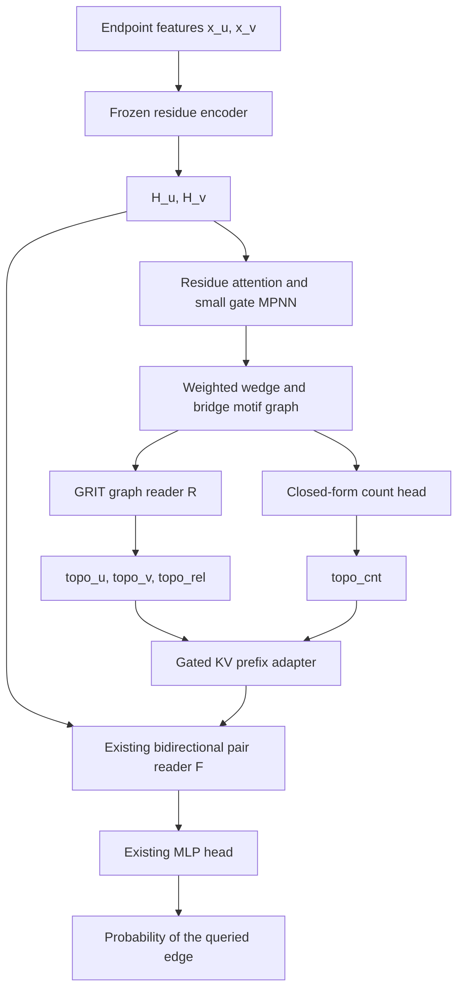

# Motif graph prompts read by GRIT

**Date:** 2026-09-16, amended 2026-09-18. **Version:** v13 (supersedes v12; change log in §11).
**Status:** implemented and run once (wave 1, `686627d`, 2026-09-17/18): Stage I and its two family
ablations, Stage II and its bridge-only / closure-only controls. Stage I gains (+0.066 test AUPRC, +0.08 GS
over the frozen trunk); every Stage II row finished at the trunk. The wave-1 verdict
(`docs/results/motif_prompt_verdict/README.md`) locates the failure in the generator's initialisation and
supervision, not in the reader or the interface, and v10 amends §4, §7.3, §7.5, §0.2 and §8 accordingly
(fix plan: `docs/tmp/2026-09-18-motif-stage2-fix-plan.md`). Wave 2 retrains Stage II only.
It supersedes the coordinate/coarse-block interface **for this proposed arm only**. Existing
`virtual_prompt_d*` checkpoints, run records and the historical September 15 specification remain valid
descriptions of their own implementations.

Evidence: [synthesis](../../../literature/research_reports/2026-09-16-virtual-topology-prompt-litreview/phase4_synthesis.md),
[verification/corrections](../../../literature/research_reports/2026-09-16-virtual-topology-prompt-litreview/phase3_verification.md),
[adversarial review](../../../literature/research_reports/2026-09-16-virtual-topology-prompt-litreview/phase5_adversarial_review.md),
[feasibility audit](../../../literature/research_reports/2026-09-16-virtual-topology-prompt-litreview/phase5_feasibility_audit.md),
the A–E reports, and the dataset probes in `docs/tmp/template_discriminativeness/`.
Numerical settings are design defaults, not literature-derived optima.

## 0. Decision, pilot and what changed

### 0.1 The decision

Both requested revisions are adopted, each with one reversal.

- **Revision 1, a graph reader instead of predicted statistics: adopted as an addition, not a
  replacement.** GRIT reads the predicted motif graph and emits endpoint and relation tokens; the
  closed-form counts stay, computed from the *same* predicted adjacency and carried as a fourth prompt
  token. The supporting evidence, stated at its real strength: LPFormer is itself a learned
  pair-conditioned attention encoder and still concatenates raw counts into its score, and on ogbl-ppa
  ablating those counts moves Hits@100 63.32 → 44.37 while ablating the learned attention moves it
  63.32 → 62.77. That is one dataset, one architecture, and *observed-graph* counts; it does not
  establish a general ratio across architectures, and it does not show that our truncated, predicted,
  weighted motif masses behave like LPFormer's count features. It is a strong reason to keep a count
  pathway and no reason to delete the reader. Our own probes point the same way without bounding
  anything: ranking every nonself pair of a universe by hub-penalised closure mass alone reaches
  precision@|E| 0.63 on V_val and 0.57 on test (a whole-universe oracle diagnostic with its own row set
  and self-loop convention, **not** comparable to a reported BFS-macro GS), while richer readouts of
  attribute-derived block structure gained about 0.04 AUROC over counts in the specific readouts we
  measured — a measurement of those readouts, not a ceiling on a graph reader.
- **Revision 2, prior-knowledge templates instead of a free coarsening: adopted, with our data choosing
  the templates.** A fixed, pair-labelled, 26-slot motif graph replaces the K-block coarsening. Two
  families: shared-neighbour wedges and length-three bridges. Weights carry hub penalties (`1/sqrt(d)`
  per incident edge, so a wedge contributes `1/d(w)` and a bridge `1/sqrt(d_i d_j)`), the forms that rank
  pairs best on our graphs. L3 enters degree-normalised, never as raw path counts. The L3 principle is
  motivation only: on this benchmark positives are overwhelmingly closed, and "bridge without closure"
  is more typical of negatives than positives.

Why this shape: the pair is inside the computation rather than appearing only in the output, the input
tensor is fixed-size, and every richer component degrades to a count-only model that is itself a strong
ranker. Pair labelling is a sound design reason; it is not a retrospective proof that the previous
endpoint-conditioned interface violated an applicable impossibility theorem.

### 0.2 Bounded pilot before the wave, and the stop rule it does and does not license

**v10 status.** Neither pilot was run before wave 1. Pilot A is superseded: the wave-1 reader x graph
counterfactual answered its question directly (the Stage II interface on the true template recovers Stage I's
gain, 0.8867 vs 0.8872 V_val AUPRC; a 25% true-template mix recovers 71% of the gap). Pilot B is **retained and
becomes wave 2's first two epochs**: under §7.5's graph-only warm-up the generator trains on `L_G` alone, so the
epoch-2 checkpoint of the `stop_after_epoch: 2` prefix *is* pilot B's conditional head, read by
`src/experiments/motif_pilot_b.py` at three levels on node-disjoint held-out training rows and V_val:

1. *Fit:* `L_G` below the asymmetric constant template re-fitted by Adam under the same `L_G` on both universes
   (wave 1: generator 0.135 / 0.143 against the constant's 0.105 / 0.099, i.e. worse); positive-row wedge-mass
   reconstruction below 0.7 (wave 1: 0.99); predicted mean wedge mass within a factor 3 of the truth's (wave 1:
   1/85).
2. *Conditional dependence:* the row-transplant rise of `L_G` under ten seeded permutations, every one at least
   +25% (wave 1: +1-3% on one permutation).
3. *Downstream utility:* the predicted graph through the frozen Stage I bundle and through the prefix's own
   interface, both above `gates_off` on V_val `val_cls` AUPRC (0.8136) with no retraining.

Failing level 1 or 2 stops the wave and records a resource-allocation negative for this generator class; failing
level 3 alone lets the joint phase run, flagged. The wording below on what a negative does and does not license
stands unchanged.

Three designs have finished at the trunk's level, and the measured common factor is weak
attribute-to-structure transfer for unseen proteins. Before committing the wave, buy information cheaply.

**Pilot A, about one GPU-hour, no model change.** Score the published `topo_prompt_frozen` checkpoint
through the existing `row_coords` path with `--allow-oracle-diagnostic` on **V_val**, under four
coordinate sources: true coordinates; coordinates composed from kNN-50 attribute-transferred
neighbourhoods; the training mean; and kNN-50 after the coordinate calibration defined below. That
checkpoint is the right instrument because `gates_off` reproduces `prefix_base` exactly and it holds the
best shape ratios of any row (V_val AUPRC 0.940 / GS 0.648 on truth).

*Coordinate calibration, defined — and it is not density matching.* Rescale each **continuous** coordinate
by a single affine map fitted on **training** rows so that its mean and standard deviation match the
training-row statistics of the corresponding true coordinate. Eligible coordinates are the continuous
entries of the reader's spec only. The categorical distance indicators (`dist_2`, `dist_3`, `dist_4plus`,
`dist_inf` in spec `v1`) are **excluded**: an independent affine map per indicator destroys their
simplex semantics. Where a predicted coordinate has zero variance on training rows, apply the shift alone
and record the coordinate as degenerate. This changes inputs, not the threshold, which is selected
afterwards by the usual rule.

This is coordinate moment calibration. It does **not** match the assembled-graph density that the
nonlinear reader and its threshold produce; those are different quantities and the pilot must not conflate
them. The **output-density control** is a separate object, defined in §8 as an independently trained
baseline evaluated at a common assembled density, and it is not part of pilot A.

**Pilot B, CPU plus one state-caching pass.** Fit a head from frozen **residue** states to the **96 edge
weights** of §2 — the generator's own bounded output space, under G's `u<->v, L<->R` equivariance — and derive
the §7.3 profiles from those weights. Evaluate on held-out training nodes and on V_val. Pooled-feature kNN
discards exactly what residue attention can read, so pilot A alone would understate the design's input.

*Predict edges, not profiles, and read against a feasible baseline.* A head that emits sorted profiles
directly can beat every realisable generator by predicting a profile no graph attains, which would make the
pilot unreadable. Concretely: mix empty templates with templates holding one bridge at attachments `1/sqrt(2)`
and interior weight 1. The mean sorted profile carries two attachments at `0.3536` and a top path product at
`0.25`, while any graph with those attachments and interior weights in `[0,1]` has a largest path product of
`0.3536^2 = 0.125`. The mean profile is infeasible, and a predictor that reaches it is not a generator. Pilot
B therefore predicts edge weights and reports four quantities:

- the **conditional head**, the object of interest;
- the **symmetric constant graph**: one row-independent 96-weight vector optimised on training rows against
  the same §7.3 loss, tied across sides and symmetric on the interior block — the plain "predict the average"
  competitor;
- the **asymmetric fixed template**, the baseline the reported margin is read against: one row-independent
  96-weight vector carrying **no symmetry constraint**, optimised on training rows against the same §7.3 loss
  and evaluated directly on its invariant profiles. v6 reached this object by the wrong route and saddled it
  with a superfluous oracle orientation. `L_slot` is **exactly invariant** to `u<->v, L<->R`: the swap leaves
  every wedge product fixed, transposes the bridge-product and interior matrices and exchanges the two
  attachment vectors, so all four sorted profiles are unchanged. Verified over 100 random fixtures at a maximum
  loss difference of `6.9e-18` in float64 (`1.9e-9` in fp32) — rounding. Target-informed orientation therefore
  buys exactly nothing here, and no upper bound follows from it. What the symmetric constant graph genuinely
  lacks is the ability to hold two distinct attachment values: tying the sides duplicates every entry of its
  attachment profile, so a head emitting one fixed *asymmetric* template — say attachments `1/sqrt(2)` and
  `1/sqrt(3)` — beats it on every row while predicting nothing row-dependent. Dropping the symmetry constraint,
  not adding an orientation, is the fix. This template need not be a legal equivariant generator; `L_slot`
  cannot tell the difference, which is precisely why it is the right comparator for this loss;
- the **unconstrained mean-profile predictor**, a reference only. It may sit below both. Part of any such gap is
  infeasibility, since the mean profile need not be realisable, but optimisation failure and the head's function
  class land in the same gap, and the counterexample above does not attribute a particular gap to infeasibility.

*What pilot B can and cannot establish.* It measures **weight-profile and family-mass predictability**,
because that is all §7.3 supervises. It does **not** measure whether motif connectivity transfers: the
sorted-product target is invariant to which witness carries which mass, and sorting the binary interior
targets reduces them to the number of interior edges. Report the margin over the asymmetric fixed template, not
the raw fit. Profile accuracy and downstream utility are reported as separate quantities and neither is
allowed to stand in for the other.

Beating **one fitted** template is empirical evidence on held-out rows, not a bound over all fixed templates:
the head may simply have found a better constant along a different optimisation path. Report two further
quantities beside the margin. First, the dispersion of the head's predicted sorted profiles across rows, per
coordinate, in units of `s_family`. Second, a **row-transplant control** that reuses §8's seeded whole-graph
transplant: keep every predicted graph intact and re-pair the held-out predictions with targets under one
seeded permutation, then report the rise in `L_slot`. A head whose loss does not rise under transplant is not
using row information, whatever its margin over the fitted template.

v7's collapse control — averaging the predicted 96-weight vectors and scoring that one constant — is
**withdrawn**. Edge-space averaging is not invariant to the anonymous-slot permutation §3 randomises, so it can
destroy a motif that both rows predicted perfectly. Two rows carrying the same wedge at weight `0.5` through
different closure slots each score zero loss, with identical sorted profiles and wedge mass `0.25`, yet their
edgewise mean holds two half-strength wedges: mass `0.125` and loss `0.00244140625`, reproduced. That gap is
slot misalignment, not row-dependent prediction. The transplant leaves the same fixture at exactly zero, which
is the correct reading. If orientation is wanted for the downstream classification instead, that is a separate
target-informed diagnostic and is labelled as one.

*Conditioning measurement, pre-registered (§7.3).* Fit the head twice, at `beta_i = 0` and `beta_i = 1`, on
held-out training rows. **Do not divide by a near-zero target.** v5's per-row relative error with a `1e-6` floor
is dominated by rows whose true mass is zero, and empty motifs are legitimate targets here: against truth
`[0, 0.1]` the near-correct prediction `[1e-4, 0.1]` scores a mean relative error of 50.0 while the collapsed
`[0, 0]` scores 0.5, so that selector prefers total collapse — the gate saturation §4 exists to avoid. Report
two separate quantities per family instead, both as means over rows:

- **false mass on zero-target rows:** `mean(mass_hat)` over rows with `mass* = 0`, in mass units;
- **reconstruction on positive-target rows:** `mean|mass_hat - mass*|` over rows with `mass* > 0`, divided by
  the fixed scalar `s_family = mean(mass*)` over all training rows with `mass* > 0`. That scale is computed
  once, recorded in the report, and reused unchanged across both fits and every later comparison.

Adopt `beta_i = 1` if it lowers the **bridge** family's normalised positive-target reconstruction and its
zero-target false mass satisfies `F_1 - F_0 <= max(0.1 * F_0, delta * s_bridge)` with `delta = 0.01`, fixed here
and not revisited once the pilot has run; otherwise keep `beta_i = 0`. The absolute allowance exists because a
bare 10% guard collapses to zero tolerance at `F_0 = 0`, where it would reject a reconstruction improving from
1.0 to 0.1 against a false mass moving from 0 to `1e-9`. A difference below 5% of the `beta_i = 0` value —
comparing the means defined above, never medians — is a tie and keeps `beta_i = 0` as the simpler objective.
Report both strata's row counts. If the zero-target stratum is empty the guard is vacuous and is recorded as
such; if the positive-target stratum is empty the decision is undefined, `beta_i = 0` stands, and the reason is
recorded. An empty stratum never yields a silent mean. Per-group gradient norms (closure, attachment, interior
heads) at initialisation and at the end are reported as telemetry beside the decision, not as part of it.

**What the pilots license.** A negative on both is a *resource-allocation* decision: we stop investing in
endpoint-only structure generation on this evidence, and we write that negative. It is **not** a proof
that no endpoint-only generator can succeed. kNN-50's inputs are not strictly richer than the generator's
(it reads training adjacency; the generator reads residue states, which kNN-50 does not), and feeding its
coordinates into a frozen reader confounds generator quality, coordinate calibration and reader
distribution shift. `phase3_verification.md` already recorded that kNN-50 is not an information ceiling
even among functions of its own features; this specification does not reinstate that claim.

**Reading.** The decision is made on **V_val and held-out training rows only**. Test rows are not scored
for this decision: choosing an architecture on test evidence is the exact failure this project demoted a
whole split for. Any test-side version of either pilot is run after the architecture is fixed, reported
as a labelled diagnostic, and disclosed. The margins used to read the pilots (±0.01 GS, ±0.5 MMD ratio)
are the project's practical reporting thresholds, not statistical uncertainty bounds.

### 0.3 Amendments carried since the first decision

Ten amendments separate this arm from the v1 text; v10 adds the four wave-2 fixes after the first measured
run (§11). Five further owner reviews corrected the supervision and
the instruments that judge it — the path-product loss and its raw interior term, pilot B's feasible and
orientation-aware baselines, its selector, the structural-frequency and batching reclassifications, the
calibration / output-density split with its algorithm and self-loop convention, and the caching, autocast,
warm-up-schedule and gradient-check fixes. All are listed in §11 and already applied in the sections below.

| # | Change | Reason |
|---|---|---|
| A | Counts retained as a fourth prompt token (§5.1); literature strength stated at its real scope (§0.1) | LPFormer's ablation supports keeping counts; it does not establish a cross-architecture ratio |
| B | `L_slot` replaced by a fully specified, permutation-invariant per-family **order-statistics** loss covering **all 96 edges**, in the same bounded space as the prediction (§7.3) | The v2 community-occupancy target left the 64 interior bridge edges with zero derivative, mismatched Stage I's witness semantics, and left slot correspondence, smoothing and the count→weight conversion undefined |
| C | **Reversed: the sampled-subgraph stream and its structural objectives are kept in both stages** (§7.1, §7.2), with the cost stated and a compute lever named | Owner decision: this arm is the paper's deployable topology row, and the structural objectives are what produced the project's best topology to date |
| D | Caching of compiled graphs decided from measured compilation time, not by rule (§3) | Both the audit's "15× worse" and v2's "never cache" were wrong; measured, recomputation is 1.34× (§3) |
| E | Teacher selected by **downstream utility under predicted inputs**, with the Stage I checkpoint rule reconciled explicitly (§7.4) | Minimising token reconstruction error is optimised by constant or low-variance tokens |
| F | Corruption widened to `lambda ~ U(0,1)` (§3) | Realised generator quality maps to roughly the upper half of the old range |
| G | Density-matched and degree-matched controls; count-only, GRIT-only and combined are **separately trained arms**, and the prefix adapter gains per-field row masking (§6, §8) | Verified: `prefix_branch` softmaxes over all prefix rows jointly and gates are per head, not per field, so zeroing a field's tokens is not an exact submodel |
| H | Modules under `classifier/`; fp32 promotion in the RRWP path; precision validation extended to this family (§9) | Audit findings confirmed against current source |
| I | `topo_cnt` given an explicitly symmetric degree representation (§5.1) | `[deg_u, deg_v]` is not swap-invariant, yet §6 leaves the token unchanged under AB/BA |
| J | Cost figures labelled derived vs measured (§9) | The audit states plainly that no new row is grounded in a profile |

## 1. Task contract



Inference is exactly `(x_u,x_v) -> p_uv = p_vu`. No node IDs, neighbour lookup, training-node bank,
observed query graph, label or universe statistic enters this forward. Learned slot vectors are ordinary
parameters, initialised randomly, not a retrieval database. The motif graph is an intermediate
computation for this edge decision, not a generated interactome.

## 2. The graph: two templates, shared witnesses

Fixed slot sets `V^P = {u,v} union C union L union R`, with `|C|=|L|=|R|=8` (26 nodes).

| Family | Allowed edges | Number | Role |
|---|---|---:|---|
| `closure` | `u-c`, `c-v` for c in C | 16 | A shared witness; with the queried edge removed the motif is a wedge, never a triangle containing the answer |
| `attach` | `u-l` for l in L; `r-v` for r in R | 16 | Endpoint attachments, shared parameters across sides |
| `interior` | `l-r` for l in L, r in R | 64 | The bridge crossing |

These 96 undirected edges have weights in `[0,1]`. Every other adjacency entry, the diagonal and the
queried `u-v` entry is exactly zero. GRIT's attention grid may include `(u,v)` and diagonal pair states;
those are attention entries, not graph edges.

Each physical edge receives one predicted weight used in both orientations; no two path gates compete for
a shared edge. Multiple bridges share witnesses. C and L/R are **role copies**: an observed protein may
occur in both families, but this is not an induced-subgraph claim. For a bridge the two real intermediates
are distinct.

The endpoints share an endpoint-role embedding, C slots a closure-role embedding, L/R slots a bridge-role
embedding. R receives role embeddings, weighted adjacency and derived walk/degree encodings only —
neither raw residue states nor generator hidden states nor slot-index embeddings — so an unrestricted
pair-feature vector cannot enter disguised as node features. Permutations within C, or within each side of
the bridge, do not alter its prediction. Generator slot seeds are private to G.

All 26 slots exist in both stages (`mask=1`); unused slots carry zero incident edges. An empty template is
valid. The reader's input size is constant, which removes literal off-size extrapolation; it does not
remove shifts in effective connectivity or density, which §8's controls and §3's corruption address.

## 3. Constructing the Stage I training graph

For each nonself training pair, start from the legal, loopless training graph and remove the `{u,v}` edge
**before** constructing neighbourhoods, candidates, weights or truncation scores. All V_val nodes and every
pair touching them remain excluded.

1. **Closure:** take `N(u) intersect N(v)` minus the endpoints. Select at most eight witnesses by
   descending `1/d(w)` in the edge-removed graph. Set both incident weights to `1/sqrt(d(w))`, so the
   product is the resource-allocation contribution `1/d(w)`.
2. **Bridge:** take the bipartite candidate graph between `N(u)\{v}` and `N(v)\{u}` with distinct
   intermediates. Score each left candidate by the sum of `1/sqrt(d(i) d(j))` over its candidate bridges,
   right candidates analogously; keep the top eight per side and their mutual original edges. Set `u-i` to
   `1/sqrt(d(i))`, `j-v` to `1/sqrt(d(j))`, and a present interior bridge to 1. An isolated selected
   intermediate keeps its endpoint attachment and is not counted as a path.
3. Fill remaining slots with role-only isolated nodes. Use stable seeded tie-breaking independent of
   labels. Swapping endpoints must exchange L and R and preserve C, including tie-breaking. Randomise slot
   order within roles during training; no training identity is an input feature. The §7.3 loss is
   permutation-invariant, so this randomisation and the loss are consistent by construction.

The product along each retained bridge is its degree-normalised L3 contribution. The families keep these
priors **in the edge weights**; §5.1 also exposes their sums. The compiler discards unselected witnesses
and cross-family identity, so its ceiling is below a full-ego oracle.

**Caching is a measured choice, not a rule.** Measured on the real seed-42 split: the corpus holds
**2,483,246 unique rows** against **221,142** presented per epoch. The sampler aliases `epoch_rows[0]` to
`epoch_rows[1]` for probe planning while the training loop runs epochs 1–15, so the training total is
`15 × 221,142 = 3,317,130` presentations and recomputing per epoch costs **1.34×** the compilations of
caching once. (An earlier revision of this file said 1.43× by summing the aliased epoch 0; the audit's
"15× worse" was wrong in the other direction.) A cached table is 96 fp32 weights per row against the fixed
global edge list, **0.95 GB** (0.48 GB fp16); per-row indices do not exist because the template is fixed.
Decide from a measured compile time on 10k rows: cache if compilation is slow enough that 1.34× matters
against 0.95 GB of host memory, otherwise recompile per epoch. Count probe-planning compilations
separately. Record the choice and the measured rate in `profile.json`.

The structural stream's subgraph pairs (§7.1) are resampled every step, so their *hit rate* is low, but
their targets are functions of the queried pair and the fixed training graph and are therefore perfectly
cacheable; whether a cache pays is empirical, not prohibited. Cache the shared CSR adjacency and degree
unconditionally.

**Self rows** use an explicit empty template in Stage I — an override, not a consequence, since
`N(u) intersect N(u) = N(u)` would otherwise fill the closure family. They retain task BCE and are
excluded from §7.3 and §7.5. Stage II applies the same feature-only generator to every row including
identical-feature pairs; no self flag exists at inference. Report self and nonself strata separately.

**Stationary corruption:** on nonself Stage I rows use the clean adjacency half the time, otherwise
`(1-lambda) A* + lambda Abar` with `lambda ~ Uniform(0,1)`. `Abar` is the mean training adjacency after
random within-role permutations, computed from the training corpus only. The range is widened from v1
because previous generators' realised quality corresponds to the upper part of it.

## 4. Generator G: residue-conditioned edge gates

Reuse frozen `prefix_base` residue states. One four-head attention layer lets learned 96-dimensional slot
queries read `H_u` and `H_v` separately with residue-length masks: eight shared bridge queries per side and
eight shared witness queries over both proteins. Initialise queries independently; never from named
training proteins or a retrieval bank.

- Endpoint gate states are projections of each endpoint's masked pooled residue state.
- Left and right states come from the same bridge-query module attending to `H_u` and `H_v`.
- Each C state combines its two attention outputs through `[a_u+a_v, |a_u-a_v|]` and a shared MLP.

Run two shared residual message-passing layers of width 96 over the fixed candidate template, with
relation-specific message transforms and mean aggregation. Internal features reach the gate heads only.

For each allowed undirected edge predict `w_ij = sigmoid(MLP_type([h_i+h_j, |h_i-h_j|]))`, one value used
in both orientations, attachment heads shared across sides. **LayerNorm the gate-head inputs** and
reparameterise the heads through an MLP rather than optimising edge logits directly: the predecessor's gate
died when its input norm grew (`||u*v||` 23 to 162, pushing the pre-activation to 13 where the sigmoid
derivative is about 2e-6). Initialise output biases per edge type **from a magnitude, never from a density**, with small nonzero head
weights so gradients reach the generator. Wave 1 set every bias to `logit(mean training weight of the type)`;
for closure that mean is `0.0185`, a *density* (58% of training rows have no closure edge at all; the mean
non-zero closure weight is `0.196`), so the closure heads started at `z = -3.97`, sat at `-4.34` for the whole
run (sigmoid derivative `0.015`, 100% of rows beyond `|z| > 3`) and moved `+0.004` logits in 5,413 steps. The
`[0.01, 0.99]` clip does not catch this. v10 rule (`closure_bias_init: nonzero_mean`): the closure bias is
`logit(w)` with `w` the mean **non-zero** closure weight of the training corpus, subject to a mass check: if the
initial wedge mass `8 w^2` exceeds twice the mean positive-row wedge mass `m_C^+`, use `w = sqrt(m_C^+ / 8)`
instead. Attach (`z ~ -1.2`, unsaturated) and interior keep the density rule: the interior non-zero mean is 1,
which the clip would turn into `z = 4.6`, a new saturation. All statistics come from the training corpus in the
same pass that computes `Abar`, never from balanced diagnostic samples. The rule, the value used and the
pre-activation distribution per type at initialisation are recorded in `profile.json`. No global
pair-density gate, free adjacency, hard top-k, Gumbel sampler or evaluation-time binarisation. Soft edges
are a deterministic computational graph, not independent Bernoulli probabilities nor a claim to recover
named neighbours.

v12 (wave-3 phase C), two optional keys, defaults unchanged. The wave-2 prefixes emitted the eight closure
slots of a row **identical** in 100% of rows (83% in the init-only prefix), witness attention uniform (entropy
0.996 of `log L`, cosine 0.997 between the eight witness reads) and the witness queries never left their
`0.02*randn` initialisation. Three causes, all in the read rather than in the message passing (mean
aggregation over a complete template sends every slot of a role the same message and provably cannot create
slot differences): (i) the read returned the bare attention output `r_k = MHA(q_k, H, H)`, so slot identity
rode on the attention weights alone and a near-uniform attention returned eight copies of the same mean of
`V`; (ii) the heads' last `Linear(96,1)` was initialised at `std = 1e-3`, so the bias -- whose gradient does not
pass through the slot states -- absorbed the target mean immediately while every upstream gradient was
attenuated by that weight; (iii) the head features were formed as `cat([h_i+h_j, |h_i-h_j|]).float()`, casting
*after* the arithmetic, so under autocast a slot difference below the bf16 ulp of the sum was rounded away
before the fp32 head saw it. `motif_prompt.slot_read: residual_block` replaces the bare read with a
query-preserving pre-norm block, `Z = Q + MHA(LN_q(Q), LN_h(S), LN_h(S))` then `Z + FFN(LN_z(Z))` with
`FFN = Linear(96,192)-GELU-Linear(192,96)`, one instance shared by both endpoints of the bridge read and one
by the witness read (so the `u<->v, L<->R` equivariance is untouched), and initialises the slot queries at
`std = 1.0` because the residual must be comparable in norm to the attention output.
`motif_prompt.head_output_init_std` scales the heads' output layer (`1e-3` is the wave-1 value). The promotion order is
fixed unconditionally: it changes an older checkpoint's bf16 numerics only by that rounding.
`slot_read: bare` with `head_output_init_std: 1e-3` reproduces wave-2 behaviour exactly. The four-way
comparison (`bare`/`residual_block` x `1e-3`/`1e-2`) is run by
`python -m src.experiments.motif_generator_fit --group {baseline,residual,head_gain,combined}`, which fits a
freshly initialised generator alone, on cached frozen-trunk inputs of a fixed witness-count-stratified row
set, against `L_G`, the re-fitted asymmetric constant and the transplant null.

v13: that fit answered it. `residual_block` took the fraction of rows with identical closure slots from
`0.6` to `0.0` and the witness-read spread from `0.004` to `0.98` at no cost in held-out `L_G`, while
`head_output_init_std: 1e-2` alone moved nothing measurable. **The residual read is therefore the design of
this section**: the Stage II model is `motif_prompt_stage2_v3` (the wave-2 init-only setting plus
`slot_read: residual_block`), continued from `motif_prompt_stage2_v3_prefix`, and
`motif_prompt_stage2_v3_headgain_prefix` carries the output-scale attribution on the full corpus. The keys
stay optional with their wave-1 defaults, and `bare` is kept for one purpose only -- reproducing the
published wave-1 and wave-2 rows -- so every pre-v13 config keeps it unchanged.

G is equivariant to `u<->v, L<->R`. Its private seeds can distinguish attachments while the reader stays
order-invariant; this permits more than one activity value but does not guarantee the model uses it.

## 5. Reading the graph: counts and GRIT

### 5.1 The count head (retained)

From the same predicted adjacency `Ahat`, compute differentiably, in fp32:

```
wedge_mass    = sum_{c in C} w(u,c) w(c,v)                      hub-penalised closure mass
bridge_mass   = sum_{l,r} w(u,l) w(l,r) w(r,v)                  degree-normalised L3 mass
deg_u         = sum_j w(u,j),   deg_v = sum_j w(v,j)
```

```
topo_cnt = W_cnt [ log1p(wedge_mass), log1p(bridge_mass),
                   log1p(deg_u) + log1p(deg_v), |log1p(deg_u) - log1p(deg_v)| ]
```

The degree pair enters through a sum and an absolute difference, so `topo_cnt` is **invariant** under
`u<->v` by construction and §6 correctly leaves it unchanged across AB/BA. These are the two statistics our
all-pairs probe ranks highest and the two the compiler's weights carry.

### 5.2 GRIT R and the three topology tokens

Vendored GRIT layers through a small adapter: three layers, width 96, four heads, RRWP `[I,P,P^2,P^3]`,
covering both motif lengths. **Disable autocast around the RRWP arithmetic and then promote to fp32**,
before forming adjacency sums, degree normalisation and walk products. Casting the adjacency alone is not
enough: verified locally on torch 2.10, `torch.bmm` and `@` return bf16 from **fp32 inputs** inside an
active autocast context, and return fp32 only with autocast disabled. `dense_rrwp` today computes in
`adj.dtype`, so it must be wrapped in `torch.autocast(..., enabled=False)`, not merely fed fp32 tensors.
Confirm on GPU as well as CPU. Use the existing `1e-6` degree floor; isolated rows have zero transition
entries. Keep typed raw weights in the edge embedding and weighted degree in the degree input, since walk
normalisation alone discards edge scale. Retain the per-token LayerNorm adapter to avoid batch-dependent
predictions. All 26 nodes take part in full attention. GRIT's published expressiveness results quantify
over binary adjacencies; no equivalent claim is made here for fractional weights, and no located work
measures RRWP accuracy against edge-weight noise, so §3's corruption sweep is our only evidence.

After the final layer, with node states `h_u,h_v` and directed pair states `e_uv,e_vu`:

```
topo_u   = W_node h_u        topo_v = W_node h_v        topo_rel = W_pair (e_uv + e_vu)/2
```

The endpoint map is shared; the relation token is swap-invariant. It exists although the queried adjacency
entry is zero, because attention and RRWP update the pair representation without inserting the answer.
Anonymous pooling seeds are query-independent and would not yield two endpoint-specific tokens; a mean over
nodes would obscure the queried relation.

**Adapter note.** The vendored layer already computes the final edge state and writes it to
`batch.edge_attr` whenever `update_e` is set; only the `O_e`/`norm_e` constructor flags are disabled on the
last layer of the existing encoder. The new adapter passes them true and gathers row `(u,v)` by a
precomputed index buffer. No vendor edit, no PMA readout; the existing oracle encoder and its checkpoints
are untouched.

## 6. Interface with F: preserve the content residual

Start from the published `prefix_base`, including its residue encoder, bidirectional cross-attention,
`abba_max` aggregation and MLP head. Freeze all of it in both stages.

At each of the nine cross-attention sites a small adapter maps the ordered fields
`[topo_self, topo_partner, topo_rel, topo_cnt]` to two prefix rows per field, eight rows total, through the
existing role-aware swap rules and the separately normalised prefix branch. The update stays
`content_update + tanh(alpha_site,head) * topology_prefix_update`, with `alpha = 0` at Stage I
initialisation. Keep the trained Stage I gates when Stage II starts. With gates off, frozen `F` and the
head reproduce the published base bit for bit. Retain the AB/BA symmetrisation, swapping the two endpoint
tokens and leaving `topo_rel` and `topo_cnt` unchanged, which is correct because both are swap-invariant
(§5.1, §5.2).

**Field masking, and why an inference ablation is not a submodel.** Verified in the current implementation:
`prefix_branch` applies a single `softmax` over *all* prefix rows jointly, and the gates are shaped
`(n_layers, SITES, n_heads)` — per head, never per field. Zeroing a field's token values therefore leaves
its keys in the softmax denominator, and deleting its rows changes the normalisation of the others.
Neither operation reproduces a model trained without that field. The adapter therefore supports explicit
**per-field row masking** (the field's rows are removed from the prefix entirely, and the branch
renormalises over the remainder), and the count-only, GRIT-only and combined variants of §8 are
**separately trained arms**. Masking at inference is reported only as an intervention, never as an
attribution of training-time gain.

Freezing `F` is supported by this project's own measurement: the frozen-trunk Stage I lane reached V_val
AUPRC 0.940 / GS 0.648 against the fully trained lane's 0.961 / 0.691, with better test topology.

## 7. Training schedule and losses

### 7.1 Streams present in both stages

Two streams, as in the established two-stage recipe:

- **Task stream:** legal training pairs with the dynamic 1:5 negative stream, weighted BCE, positive
  weight 5.
- **Structural stream (retained, owner decision):** one sampled 40-node training subgraph per step
  (32 local + 8 background; bfs/motif/bridge 0.5/0.25/0.25), scored over its legal pairs, with
  `{subgraph BCE 1.0, rank 1.0, degree 0.1, motif 0.1}` — the seed-42 structural winner. Every pair inside
  the sampled subgraph needs its own compiled motif graph, so this stream, not the reader, dominates cost
  (§9). This stream is why the arm can be read as a topology method at all, and it is the reason the
  project's best topology row to date exists.

  **Neither `struct.subgraphs_per_epoch` nor `max_pairs_per_rank` is a compute lever.** A step without a
  subgraph contributes an exact zero structural loss and active steps receive no inverse-frequency
  compensation, so halving `subgraphs_per_epoch` roughly halves structural supervision relative to task BCE:
  the recipe is no longer `{1, 1, 0.1, 0.1}`. `max_pairs_per_rank` is no safer, and v4's description of it as
  chunking was wrong. In `build_distributed_epoch_plan` it sets
  `local_cap = min(max_pairs_per_rank, token_budget_per_rank // (2*boundary))`, then
  `global_cap = local_cap * world_size` and `step_count = ceil(rows / global_cap)`, and the planned batch
  dataset's length *is* the rank's optimizer-step count. Lowering the cap where it binds shrinks the global
  batch and multiplies optimizer steps; because `subgraphs_per_epoch: null` means `count = steps`, it
  multiplies the structural subgraphs per epoch by the same factor. Where it does not bind, it saves nothing.

  The one true chunking lever is **`struct.token_budget`**: it sets `per_chunk` within a subgraph's pair
  scoring only, so every legal pair of the sampled subgraph is still scored exactly once into the same
  assembled logit matrix and the objective is unchanged. Take memory there first. Since 2026-09-17 the
  structural pass forwards and backpropagates *before* the task forward, with the subgraph's pairs striped
  evenly over the ranks, and **`struct.resident_tokens`** sets how many chunk tokens a rank holds without
  checkpoint recompute; both are compute and memory details that leave the objective unchanged (the pair
  logits are all-reduced with autograd, so the parameter gradient equals the joint backward's). If `max_pairs_per_rank` must
  still move, treat it as a batching-protocol change: either hold the logical batch and the per-step structural
  draw fixed with gradient accumulation, or apply the identical cap to **every** control in §8 and say so in the
  result note. The same rule governs a frequency change, which may additionally be compensated by scaling the
  structural weight by the inverse frequency, accepting the higher gradient variance that introduces. Never
  silently trade any of the three for wall time.

### 7.2 Stage I: teach R and the interface on a bounded true graph

Train R, its token projections, the count head, role embeddings and the prefix adapter/gates; freeze F and
its head. Each graph target is compiled from the full legal training graph minus the queried edge. Both
streams of §7.1 are active. Run a full 15-epoch one-cycle, no early stopping. AdamW, LR `1e-4`, weight
decay `1e-2`, clip 1.

V_val true-template scoring is a labelled oracle diagnostic, never a training target. Stage I success
proves only that a bounded true graph is usable through this interface; it is not evidence of
endpoint-only transfer.

### 7.3 `L_slot`: the per-family order-statistics loss (all 96 edges)

The v2 target is replaced, and so is v3's first attempt at it. Supervise sorted **path products**, not
sorted edge weights. Sorting the 16 closure edge weights as one multiset is invariant to moving weight
between the two sides of a wedge: truth `w(u,c1)=w(c1,v)=0.5` and prediction `w(u,c1)=w(u,c2)=0.5` have
identical edge multisets and therefore zero loss, while their wedge masses are 0.25 and 0. Products remove
that failure, because the quantity supervised is the one the count head reads.

Per row, define

```
p_c   = w(u,c) * w(c,v)                     c in C          8 wedge products
q_lr  = w(u,l) * w(l,r) * w(r,v)            l in L, r in R  64 path products
a_k   = the 16 raw attachment weights       u-l and r-v
b_lr  = the 64 raw interior weights         l-r
```

and the identical quantities `p*, q*, a*, b*` on the compiled graph. Then

```
L_slot = beta_p * mean_i Huber( sort_desc(p)_i , sort_desc(p*)_i )
       + beta_q * mean_i Huber( sort_desc(q)_i , sort_desc(q*)_i )
       + beta_a * mean_i Huber( sort_desc(a)_i , sort_desc(a*)_i )
       + beta_i * mean_i Huber( sort_desc(b)_i , sort_desc(b*)_i )
```

```
       + beta_c * mean_i Huber( sort_desc(w_C)_i , sort_desc(w_C*)_i )        v10: the 16 raw closure weights
```

with `beta_p = beta_q = beta_a = beta_i = beta_c = 1` and `delta = 1` (`beta_c = 0` is the wave-1 loss, bit for
bit). Sorting is a permutation, so gradient reaches the predicted weight occupying each rank; the product terms
route it to both (or all three) edges of each motif, and the raw terms keep gradient flowing to an edge whose
path product vanishes because a *different* edge of that path is zero. All 96 edges are *reached* on
non-degenerate inputs, but reached is not taught: through a product the closure gradient is attenuated by the
partner weight and by the sigmoid derivative of a saturated head, `dL/dz_c ~ dL/dp * w_partner * sigma'`,
measured in wave 1 at `2e-6` per edge against `2e-4` for an interior edge, and the slot gradient into the
closure head at 1/1800 of the interior head's; the closure-only control's whole slot loss was `0.0003` for 15
epochs. The raw closure term is exactly the repair §7.3 already applied to the interior family, and the wedge
products stay because the raw multiset alone cannot tell a wedge from two weights on different witnesses.
Direct wedge-mass supervision is not the fix: `d m_C / d z_c` still carries the partner weight.

**The raw interior term exists because the products alone are badly conditioned.** For a bridge `q = a b c`,
`dq/db = a c`, so the interior gradient is attenuated quadratically by small attachments, and the attachment
term contributes nothing to it, since `dL_a/db = 0`. This bites on fully non-degenerate inputs, not only at
zero. With every attachment at `0.1`, every predicted interior at `0.1` and every true interior at 1, the
predicted and true bridge masses are 0.064 and 0.64 — a 90% mass deficit — yet the mean product term is
`4.05e-5` and the gradient into an interior logit is `1.27e-7`, against `1.27e-3` under direct interior
supervision: four orders of magnitude on this fixture, before batch averaging. Connected gradients are
therefore not the same thing as an effective teaching signal, and §9's check does not test for one. The
interior term is exactly symmetric with the attachment term already present and restores an `O(1)` signal;
because the interior targets are binary, its sorted form supervises how many interior edges exist, which is
all a permutation-invariant loss can say about them. `beta_i` is decided by the pre-registered pilot-B
measurement of §0.2 and may be set to zero there. Rescaling `beta_q` instead is rejected: it would move the
wedge-to-bridge mass balance as well as the conditioning.

Because `wedge_mass = sum_c p_c` and `bridge_mass = sum_{l,r} q_lr` are sums over the supervised
multisets, and a sum is permutation-invariant, matching the sorted products **pins both count-head
quantities exactly**. The loss is permutation-invariant within each role family, consistent with the slot
randomisation of §3, and needs no correspondence between anonymous slots and named witnesses. It lives in
the bounded `[0,1]` space of the prediction, so no conversion from unbounded occupancy counts and no
smoothing operator has to be defined.

What it still does not do: it pins family masses and strength profiles, **not connectivity**. Two graphs
with the same product multisets but different witness assignments are indistinguishable to it, which is
deliberate, since witness identity is the quantity the probes say does not transfer. A successful profile
fit is therefore **not** evidence that motif connectivity transfers, and §0.2 and §8 must not read it that
way. If pilot B shows the interior family is unpredictable while the closure family is, set `beta_q`
and `beta_i` to zero and report the arm as closure-supervised rather than implying more.

### 7.4 Teacher selection

**v10: the teachability pilots are dropped.** Wave 1 measured the reader swap at 0.0005 V_val AUPRC against
0.086 for the graph swap, so Stage II uses the published five-metric Stage I winner
(`motif_prompt_stage1/best.pt`) as the single bundle, reported as such. The text below is kept as the record
of the procedure and of the prefix/resume mechanics that §7.5 now reuses for the warm-up.

Two distinct selections, stated separately because v2 conflated them:

- The **published Stage I reader** is the checkpoint chosen by the existing five-metric V_val rank. This is
  the row reported as the Stage I diagnostic.
- The **immutable teacher `R_T`** is chosen by **downstream utility under predicted inputs**, never by how
  reproducible its tokens are. Minimising token reconstruction error is optimised by constant or
  low-variance tokens, and errors in differently scaled representation spaces are not comparable. The
  procedure: take at most three Stage I candidates (the five-metric winner and its neighbours), run the
  **first two epochs of the §7.5 schedule** against each, and rank the candidates by the existing
  `geometric_rd_five_rank_v1` rule on their V_val panel under *predicted* inputs, with fixed probe, data
  order and seed. Cost is three two-epoch pilots, not three full runs. If time forbids even that, the
  default is the five-metric winner, reported as "not selected for teachability".

**"The first two epochs" is literal, and v4's account of it contradicted itself.** OneCycle is sized by
`schedule_total_steps`, the exact optimizer-step count over `1..optim.epochs`, so a config with `epochs: 2`
yields a *compressed* two-epoch cycle that ramps and anneals inside the warm-up — a different probe, ranking
teachers under an LR trajectory the real run never sees. The pilot instead keeps `optim.epochs: 15` and halts
after epoch 2 through a new `optim.stop_after_epoch` key; `--max-steps` cannot do this, because the v3_1 loop
ignores it. Under that configuration the two epochs *are* a valid prefix of the 15-epoch run: same trainability
mask, same LRs, same data order.

**Checkpoint bundle and handoff.** A Stage I candidate is a **bundle**: GRIT `R`, the count head, the
token projections `W_node`/`W_pair`/`W_cnt`, the role embeddings, and the prefix adapter with its gates.
Each teachability pilot loads one candidate's complete bundle for both roles — `R_T` is an immutable
eval-mode copy of that bundle, and `R_S` plus the adapter are initialised from the *same* bundle, so the
student never starts from a different Stage I checkpoint than its teacher. The winning bundle is the one
that initialises the final student. Because the pilot is a true prefix, the winner is **continued**, not
restarted — a reversal of v4, which asserted the opposite from a wrong premise. The resume path restores
model, optimiser, scheduler and per-rank RNG state and refuses to resume unless the saved resume config,
world size, warmup steps and `schedule_total_steps` all match, so an accepted continuation is a continuation
of the same run; exclude `optim.stop_after_epoch` from that config comparison exactly as `output_dir` is
already excluded. If the pilot config differs from the final Stage II config in any other key, or the world
size or data order changes, restart from the Stage I bundle instead: the prefix property is what licenses
continuing, and it is conditional. Selection reads V_val only, the universe the protocol already uses for
checkpoint and threshold selection, so continuing adds no new exposure. Either way, two epochs are a budgeted
proxy for early transfer only; they do not establish which teacher wins after the epoch-3 unfreezing, and the
result note says so.

### 7.5 Stage II: generate the graph from the endpoints

Initialise `R_S`, the count head, the token projections, the role embeddings and the prefix adapter from
the **single selected Stage I bundle of §7.4**, the same bundle `R_T` copies; freeze F and the head
throughout.

| Epochs | Trainable | Loss reaching G | Frozen |
|---|---|---|---|
| 1–2 | G (attention, private seeds, gate MPNN, heads) | **`L_G` only** (`warmup_losses: graph_only`): the predicted weights are detached before the trunk, the structural pass and `R_T`, so task BCE, the structural stream and `L_topo` are computed and logged but contribute exactly zero gradient to G | `R_S`, count head, prefix adapter, F/head, `R_T` |
| 3–15 | G; final block and output projections of `R_S`; count head; prefix adapter/gates | the joint objective below | Earlier `R_S` blocks and role/input embeddings; F/head; all `R_T` |

15-epoch one-cycle, no early stopping, five-metric selection. New generator at AdamW LR `1e-4`, weight
decay `1e-2`, clip 1; reader and prefix parameters use 0.1 times the instantaneous generator LR once
opened. The freeze-forever arm uses the same initialisation, batches and schedule.

Why the warm-up is graph-only (v10): at wave 1's initialisation the gradient into G was `45.5` from the task
term, `6.9` from `0.1 L_topo` and `0.053` from `L_slot`; removing the task term alone would still leave the
topo term ~130x the graph term, and a LayerNormed direction match is satisfied by a constant prompt (wave 1:
`L_topo` fell 0.70 -> 0.34 while the graph never moved). Two epochs are the pre-registered checkpoint of §0.2,
not a guarantee of sufficiency; the epoch-2 prefix is continued under the guarded resume path, and the keys
that are inert before the interface opens (`w_slot`, `w_slot_multiplier`, `w_topo`) are excluded from the
resume comparison for such a prefix, so one prefix serves every joint-phase arm.

```
L_II = L_task_BCE + L_struct + lambda_G * L_G + lambda_T * L_topo
```

`lambda_G` is **not** a carried-over constant (`w_slot = 1` against a task gradient 5-18x larger at the wave-1
checkpoint and 170-860x larger at initialisation is the cheap no-structure minimum wave 1 found). With
`w_slot: balanced` it is set once, at the first optimizer step of the first interface-open epoch, on a fixed
256-row probe batch: `lambda_G = clamp(10^round(log10(||grad_G L_task|| / ||grad_G L_G||)), 0.1, 1000)`
times `w_slot_multiplier`, broadcast from rank 0, recorded in `profile.json`, `metrics.jsonl` and the
checkpoint, and never re-balanced on resume. `lambda_T` is `w_topo` (0.1 in the main arm; 0 in the no-topo
arm). Per-parameter-group gradient norms of G under each term, the gate-head pre-activation statistics and the
predicted family masses are logged every epoch on the same probe batch, so a drift back towards the constant
graph is visible during training.

`L_G`'s rows are the streams' own rows by default (`graph_row_weighting: uniform`). Optionally
(`graph_row_weighting: closure_balanced`) each stream's rows are re-weighted inside `L_G` so the rows whose
closure target is non-empty carry `graph_row_positive_share` of its mass and the empty rows the rest: at the
task stream's 1:5 ratio about 82% of rows have an empty closure family, so the uniform reading lets the
marginal "predict almost nothing" dominate the graph gradient. The weights sum to the stream's valid-row
count and are formed from counts summed over ranks in the same reduction that produces the per-stream row
counts, so `L_G` keeps its scale and its global mean; the task stream, the sampler, the structural stream and
every other loss are untouched, and `graph_rows_closure_nonempty_frac` logs the realised imbalance each epoch
either way.

`L_struct` is §7.1's structural stream. `L_topo` is the light representation term: with fixed non-affine
LayerNorm `N`, `mean over fields and dimensions of (N(R_T(Ahat)) - stopgrad(N(R_T(A*))))^2`, over all four
token fields, averaged over valid nonself rows per stream and then across streams; an empty stream
contributes a differentiable zero. `R_T(Ahat)` runs with autograd so the loss reaches G; only `R_T(A*)` is
detached. F never receives the teacher's true-graph tokens in the student scoring path.

Do **not** add a class-conditional path-count hinge, coordinate regression, affine calibration, logit KD or
anchor KD by default. Task loss plus a representation constraint does not identify the graph; the intended
claim is that a constrained learned structural computation helps the queried edge, never that the witnesses
recover true neighbours.

## 8. Boundaries, comparisons and reading

Validation selects models and thresholds and supplies no generator-training graph, prompt target,
corruption mean or bank. Stage II formal scoring loads only the saved model and endpoint features. True
V_val/test template compilation belongs exclusively to labelled Stage I and oracle diagnostics.

Use `geometric_rd_five_rank_v1` / `test_protocol_v8` from `docs/03-experiments.md`: closest-geometric-RD
threshold on the V_val sampled union, five-rank selection on AUPRC, GS and the three MMD ratios, RD
reporting-only; an independent max-F1 classification threshold on `val_cls`. Replay both thresholds
unchanged. Report AUROC/AUPRC, Accuracy/F1/MCC, ECE/Brier and all five topology metrics, self and nonself
strata separately, and per-C-class strata where the benchmark's pair classes are available.

**Seeds and pre-registration.** The main arm and the density control run **three seeds**; pay for them by
dropping the endpoint-only and relation-only readout rows and one motif-family ablation. Pre-register the
reading — row, metric, margin — before scoring. Single-seed differences inside ±0.01 GS and ±0.5 MMD ratio
are not read; one previous arm's V_val MMD swung 5.8–14.4 across epochs of a single run. These margins are
reporting thresholds, not confidence intervals, and they are GS / MMD margins: no margin is claimed for
AUROC or AUPRC, whose single-seed differences are reported as such.

| Comparison | Trained? | Question answered |
|---|---|---|
| Published `prefix_base`, and exact gates-off | reuse | Is the topology intervention useful at all? |
| **Output-density-matched `prefix_base` and B0** | trained | Is any topology gain shape, or only threshold placement? The standing evidence gap; mandatory. Defined below. |
| **Degree-only control** | trained | Is the gain a degree artefact? This benchmark's negatives are degree-biased and sequence models are known to ride on degree. Defined below. |
| **Count-only** (fields masked at the adapter, trained from scratch) | trained | Does the reader earn its complexity over the counts? |
| **GRIT-only** (count field masked, trained from scratch) | trained | Do the counts earn their place next to the reader? |
| Direct residue-conditioned prefix, matched trainable budget and same `L_topo` | trained | Does a graph bottleneck help beyond a conditional adapter? |
| One common edge weight per pair and edge type | trained | Is the gain a per-type density signal? |
| Fixed training-mean graph, trained R/adapter, same schedule | trained | Does query-conditioned connectivity matter? |
| Freeze R/adapter for all 15 epochs vs the warm-up | trained | Does adaptation repair the teacher-student input shift? |
| Closure-only and bridge-only, inactive family zeroed in both stages | trained | Does each family earn its place? |
| `w_slot = 0`, and `L_topo = 0`, all else matched | trained | Which supervision contributes? |

**Wave-2 arms (v10).** Three joint-phase arms continue from one graph-only prefix: **A** the fixed arm
(`lambda_G` balanced, `lambda_T = 0.1`), **B** `lambda_T = 0` (does `L_topo`'s constant-token pull hurt once G
carries structure?), **C** `10 lambda_G` (does the joint phase drift G back to the constant without a stronger
anchor?). Two further two-epoch prefixes attribute the fix: init-only (`beta_c = 0`, non-zero-mean closure init)
and loss-only (`beta_c = 1`, density init), read at pilot-B level 1. Held-out test is scored only for an arm that
leaves the trunk on V_val, one seed; the seed replicas and the controls of the table above follow that.

**Family-scaling diagnostic (v10, decides the presence gate).** On the Stage I bundle and V_val rows, scale one
family's weights by `s in {1, 0.3, 0.1, 0.03, 0.01, 0}` and record the RRWP, token and logit change against the
empty family (`src/experiments/motif_family_scaling.py`). A sigmoid gate cannot emit zero, and RRWP's degree
normalisation cancels a uniform scaling of a witness's two edges, so "near-zero" and "empty" need not look alike
to the reader. If the logit at `s = 0.01` differs from `s = 0` by more than 10% of the `s = 1` effect, a
per-family presence gate (targets `t_C = 1[wedge_mass* > 0]`, `t_B = 1[bridge_mass* > 0]`, a bridge being a
complete `u-l-r-v` path with attachments untouched) enters wave 3; otherwise no gate. No hard-concrete or
straight-through estimator either way. The label lives largely in family *presence* (94.5% of training
negatives have an empty closure family against 21.4% of positives; interior 74.8% against 15.8%), which a
dense sigmoid template cannot emit, so this check is not optional.

**Self rows (wave-3 option).** Stage I gives self rows an empty template; Stage II excludes them from `L_G` and
`L_topo`, so G never receives the same convention. A candidate control adds an empty-template term on valid
training self rows aggregated as its own stream, so the extra zero target cannot drive a global collapse.

**The degree-only control, defined.** v8 named this row "degree-matched" and left its algorithm unstated,
which admits two incompatible readings. It is the **trained** reading, matching its neighbours in the table: an
arm identical to this one in every other respect, trained from scratch on the same schedule, whose prompt
carries only the symmetric degree pair `[log1p(deg_u) + log1p(deg_v), |log1p(deg_u) - log1p(deg_v)|]` computed
from the *predicted* adjacency. `wedge_mass` and `bridge_mass` are zeroed in `topo_cnt` and the three GRIT
fields are removed by the per-field row masking of §6. It is **not** a degree-marginal re-thresholding: degree
marginals appear in this specification only as a *reported* quantity under the scoring interventions below,
never as a matching target. If this control matches the full arm, the topology gain is degree and the motif
graph has earned nothing.

**The output-density control, defined.** This is a property of the assembled graph, not of the coordinate
inputs, and it is a different object from the coordinate calibration of §0.2. It asks: at equal density, is
the arm's assembled edge set a better *shape*, or was the apparent gain threshold placement? A previous arm's
entire topology headline was traced to a per-universe logit shift, which is what this control exposes. The
algorithm, stated on the objects `test_protocol_v8` already uses:

1. **Universe and self-loops.** The protocol's sampled BFS subgraphs for the split, pooled into one union of
   scored pairs. Rows are the pairs the protocol scores, self-pairs included; a self-pair over the threshold
   assembles as a self-loop (`assemble_graph`) and **official GS and RD retain it**.
   `compute_graph_similarity` takes Dice over edge *sets* in which a self-loop is an ordinary element, so an
   extra self-loop against a one-edge reference gives GS `2/3` — reproduced. v5 asserted the opposite and was
   wrong: the only place self-loops are stripped is the threshold sweep's `recall` diagnostic, never GS, and
   the docstring records that self-loops are first-class labelled queries retained by official GS/RD. This
   control keeps the official convention for every row; a loopless variant is permitted only as a separate,
   labelled diagnostic. The legacy G1 failure — a non-self threshold population against a self-loop-stripped
   reference count — is this same mistake, already made once.
2. **Target.** `target_edges` is the number of union pairs **this arm** realises at its protocol
   V_val-selected threshold on the evaluation union: its own assembled edge count, taken directly, with no rate
   transferred between universes. Record it beside `N_union`, the number of scored pairs in the union. A rate
   may be used instead only if it is the selected-pair fraction `selected_pairs / N_union`; it is **not**
   `nx.density`, whose denominator counts node pairs over the whole node set while a sampled union holds only
   some of those pairs. Because every row scores the same union over the same nodes, an equal selected count is
   an equal assembled edge count and therefore an equal assembled density.
3. **Threshold.** For each row — this arm, `prefix_base`, B0 — call the existing
   `density_matched_threshold(probs, target_edges)`. It admits tie groups **atomically**, returning the
   smallest observed value whose cumulative top-down count is still `<= target_edges`, so the realised count is
   `<= target_edges` and exact equality is not guaranteed. Report each row's realised edge count beside the
   target; where a row lands more than 1% below it, mark that row's shape comparison approximate rather than
   adjusting the target.
4. **Scope.** One threshold per row, applied unchanged to every subgraph, as `evaluate_fixed_threshold` does.
   Matching the *union* density does **not** equalise density inside each BFS subgraph, so per-subgraph RD
   still varies and a density-matched row's macro RD is not 1. Read GS and the three MMD ratios at the matched
   density, and treat RD there as a diagnostic of that residual spread, not as a matched quantity.

Report it **alongside**, never instead of, the protocol's V_val-selected threshold, since re-selecting a
threshold per row is outside `test_protocol_v8`.

Scoring interventions on the selected checkpoint: whole-universe seeded graph transplant between rows,
independent permutation of C attachment correspondence for one endpoint, and independent bridge rewiring
relative to the endpoint attachments. These preserve weight multisets and family totals but **not** every
node's weighted degree; report the changed degree marginals. Permute globally before shard division, never
within label-pure shards. No threshold reselection on test interventions.

A better edge metric alone does not establish improved topology. If a density-only or direct-prefix control
matches the arm, connectivity has not earned its mechanism. If Stage I gains and Stage II does not, the
remaining problem is transfer, not a need for a stronger oracle.

## 9. Implementation path, cost and verification

New family `v3_1_motif_prompt`. **All new modules live under `src/model/egostitch/classifier/`**: the
EgoStitch generator and encoder registry slots exchange `ImaginedGraph` and `GraphEmbedding`, which carry
no pair channel and take no residue input, so the motif reader and generator cannot occupy them, and
`registry.py`/`composite.py` are not touchpoints.

- `src/data/`: deterministic template compiler with queried-edge removal, and the §7.3 target tensor.
- `src/model/egostitch/classifier/motif_prompt.py`: generator, count head, GRIT adapter exposing node and
  symmetric pair states, four-token prefix interface with per-field masking, frozen base composition.
- Training, scoring and evaluation entry points: family registration, stage trainability, structural-stream
  support, teacher targets, diagnostics and truth-free score loading, plus the `optim.stop_after_epoch` key
  of §7.4 and its exclusion from the resume-config comparison. No parallel pipeline.
- v10: `src/experiments/motif_pilot_b.py` (the §0.2 three-level reading of a prefix checkpoint) and
  `src/experiments/motif_family_scaling.py` (the §8 presence-gate check); configs
  `configs/split_seed42/motif_prompt_stage2_v2{_prefix,,_no_topo,_strong_graph,_initonly_prefix,_lossonly_prefix}.yaml`.
  The wave-1 configs keep their meaning: `beta_c`, `closure_bias_init` and `warmup_losses` default to the
  wave-1 behaviour and the v2 configs opt in.

**Cost, with every figure labelled.** *Measured in this repo:* `b0_v31` 102 s/epoch train at 59.7 GiB/rank;
`prefix_base` 316.6 s; struct arms 245–270 s at **81.7 GiB/rank** against the 85 GiB cap; the GRIT teacher
722 s at 72.5 GiB. *Derived, not measured* (the audit states plainly that no new row is grounded in a
profile): task stream about 410 s/epoch, structural stream about 600 s/epoch, GRIT-26 +100–400 s in Stage I
and +300–900 s in Stage II, motif compilation for the structural stream +40–400 s, giving roughly
1,150–1,800 s/epoch for Stage I and 1,350–2,300 s/epoch for Stage II, about 6.5–11 h per 15-epoch lane.
These totals **include** the structural stream retained in §7.1. No 26-node GRIT profile exists anywhere in
the repo, and the 61.8 GiB figure quoted for a previous Stage II arm has no profile behind it in this
checkout and must not be used as a ceiling.

The binding constraint is memory, not arithmetic: the reader is about 0.08 GFLOP/row against the trunk's
~27, but struct arms already sit about 3 GiB under the cap. Mitigations, in order: set a
`struct.token_budget` override as previous struct runs required, since it alone leaves the objective intact;
then, only as a declared protocol change under §7.1's rules, reduce `max_pairs_per_rank` toward 1536 — with
gradient accumulation, or applied identically to every control — and halve `struct.subgraphs_per_epoch`.
**Profile one epoch before allocating the wave.**

Required checks: queried-edge deletion before weighting and truncation; no V_val or boundary targets;
compiler and generator swap equivariance; within-role permutation invariance of both the reader and
`L_slot`; finite outputs and gradients at zero and tiny weights; **connected, finite gradients reaching all
96 edges on deliberately non-degenerate fixtures**, interior family included, from `L_slot` and from the
task path — not universal nonzero gradients, since a correctly matched sorted profile has zero gradient by
construction, including in the wedge counterexample of §7.3; a fixture asserting that `L_slot` is nonzero
when the predicted and compiled wedge masses differ while their edge multisets agree; a fixture holding small
attachments and wrong interior weights, asserting the **analytic derivative of `L_slot` with respect to an
interior weight** — `(1/64) * err_q * a * c` from the product term against `(1/64) * err_b` from the interior
term, so that enabling `beta_i` raises `|dL/d(interior logit)|` from `1.266e-7` to `1.266e-3` on §7.3's fixture,
the factor of `1e4` the closed form predicts. Head-gradient *norm* ratios are telemetry only and never a pass
condition: they scale with head parameterisation, parameter count and residual size, so a correctly fitted
attachment head can carry almost no gradient while a badly fitted interior head correctly carries a large one; active final GRIT edge
parameters; exact gates-off base identity; per-field masking renormalises correctly; identical clean and
predicted graph layouts; self-row masking confined to `L_slot` and `L_topo`; checkpoint round-trip; scoring
with no graph or target files; batch- and shard-independent outputs; DDP initialisation and gradient
agreement. Telemetry — gate saturation, effective rank, family usage, per-term per-group gradient norms
from epoch 1 — is reported and acted on, never a run eligibility gate.

**Precision landmine.** `validate_score_precision` returns early for any family that is not
`egostitch_e2e`, so this arm gets no protection from `validate_artifact_precision` against a
bf16-contaminated artifact. Extend the validator to this family before the first formal score.

## 10. Evidence limits

The dataset probes behind this design already inspected test labels and topology, including a test-fitted
logistic readout; that complement is excluded from the case for deployment and the exposure is part of this
design's provenance. The §0.2 pilots deliberately keep the investment decision on V_val and held-out
training rows. A result on the same test set must disclose this history.

The graph, its compiler, the warm-up and the losses are our design, not a combination proved optimal by the
cited work. The nearest published mechanism — a fixed virtual template with query-conditioned learned gates
read by a graph network from endpoint features — was reproduced on this benchmark and **lost** to B0
(V_val AUPRC 0.730 / GS 0.250 against 0.814 / 0.401), with its gates nearly constant across epochs. The
published base rate for learned-structure gains on link prediction is small and inconsistent. Expect a
modest result at best, and treat the structural stream, not the reader, as the component most likely to
move the topology panel. Weighted motif truncation, imperfect generation, reader drift, density shortcuts
and runtime cost remain unresolved risks. Stage I must be trained anew; coordinate-reader checkpoints
cannot instantiate this interface.

## 11. Change log

| Version | Date | Changes |
|---|---|---|
| v13 | 2026-09-18 | Wave-3 phase C read, and the adoption it licenses: on the fixed-set generator-only fit `slot_read: residual_block` dropped the identical-closure-row fraction from 0.6 to 0.0 and raised the witness-read spread from 0.004 to 0.98 at no cost in held-out `L_G`, while `head_output_init_std: 1e-2` alone changed nothing measurable. **§4** the residual read is now the design and `bare` is retained only to reproduce the wave-1/wave-2 rows; no default moves, so every pre-v13 config is unaffected. The main Stage II arm becomes `motif_prompt_stage2_v3` (wave-2 init-only setting + `slot_read: residual_block`, full 15-epoch schedule) continued from `motif_prompt_stage2_v3_prefix` under the guarded resume, with `motif_prompt_stage2_v3_headgain_prefix` attributing the read against the gate-head output scale on the full corpus; both prefixes are read by `src.experiments.motif_pilot_b` and `src.experiments.motif_generator_probe` against the wave-2 init-only rows. |
| v12 | 2026-09-18 | Wave-3 phase C, two optional generator keys, no default change: **§4** `motif_prompt.slot_read` (`bare` / `residual_block`) puts the slot query back on the read's residual path and raises the query init to `std = 1.0` in that mode, `motif_prompt.head_output_init_std` scales the gate heads' output layer, and the head features promote to fp32 *before* the sum and the difference are formed (unconditional; bf16 rounding only). Measured cause: identical closure slots in 100% of wave-2 rows, uniform witness attention, untrained queries. Read by `src.experiments.motif_generator_fit`, a fixed-set generator-only fit over a witness-count-stratified row set with cached frozen-trunk inputs. |
| v11 | 2026-09-18 | Wave-3 phase B, one optional key pair, no default change: **§7.5** `motif_prompt.graph_row_weighting` (`uniform` / `closure_balanced`) with `graph_row_positive_share` re-weights the rows of `L_G` alone, so the closure-non-empty rows carry a fixed share of the graph loss instead of the ~18% they hold in the task stream's 1:5 rows; the weights sum to the valid-row count and use the rank-reduced counts, leaving every other loss, the sampler and both streams untouched. Read as `motif_prompt_stage2_v3_balanced_{initonly,full}_prefix` against the wave-2 prefixes they copy; `graph_rows_closure_nonempty_frac` is logged per epoch whatever the setting. |
| v10 | 2026-09-18 | First measured run read (`docs/results/motif_prompt_verdict/README.md`): Stage I +0.066 test AUPRC / +0.08 GS, every Stage II row at the trunk; the interface converts a true template into the full gain (reader swap 0.0005 vs graph swap 0.086 AUPRC), the generator emits a near-constant slot-symmetric graph, and the cause is closure gate heads initialised into saturation by `logit(density)` plus a product-only closure supervision (closure-head slot gradient 1/1800 of the interior's) inside a composite whose task gradient dominates the graph term 5-18x (170-860x at init). Four amendments, owner-reviewed: **§4** closure bias from the training-corpus non-zero mean with a mass check, attach/interior unchanged; **§7.3** raw closure term `beta_c`, products kept, wedge-mass loss rejected as not removing the attenuation; **§7.5** graph-only warm-up with task, structural and topo terms detached from G, then `lambda_G` by gradient-norm balancing at the interface opening, the prefix continued under the guarded resume with the inert keys excluded; **§0.2** pilot B run as those two epochs with a three-level pre-registered reading and its stop rule, pilot A superseded by the wave-1 counterfactual; **§7.4** teachability pilots dropped; **§8** wave-2 arms, the family-scaling diagnostic that decides a presence gate, the self-row option, and no AUPRC margin. Corrections to the verdict itself: "failed to learn structure", not "never trained"; the integrated-gradients attribution withdrawn (completeness does not close); the test transplant's -0.008 AUPRC is a small single-seed signal, not "inside the margin". |
| v9 | 2026-09-16 | Implementation-planning clarifications, no design change. §8's "degree-matched control" is renamed the **degree-only control** and given an algorithm: a trained arm whose prompt carries only the symmetric degree pair from the predicted adjacency, with the mass entries zeroed and the GRIT fields row-masked — not a degree-marginal re-thresholding, which this specification never uses as a matching target. Recorded because the plan could not write that control's config from the v8 text. Separately, §11 was lost from the file between the v8 edit and the planning pass and has been reconstructed from the edit scripts; the cause was not determined and the file is untracked, so no git history existed to recover from. |
| v8 | 2026-09-16 | Sixth owner review; no architectural blocker found. Pilot B's **collapse control is withdrawn**: averaging predicted edge weights is not invariant to the anonymous-slot permutation §3 randomises, so two rows predicting the same wedge through different closure slots — each at zero loss, identical sorted profiles, wedge mass `0.25` — average to two half-strength wedges at mass `0.125` and loss `0.00244140625` (reproduced), which would have been misread as row-dependent prediction. Row-dependence is now tested by a **row-transplant control** reusing §8's seeded whole-graph transplant, which keeps each predicted graph intact and scores exactly zero on that fixture, alongside the retained asymmetric fixed-template baseline and profile dispersion (§0.2). |
| v7 | 2026-09-16 | Fifth owner review. The oracle orientation of v6 is removed as vacuous: `L_slot` is **exactly invariant** under `u<->v, L<->R` — wedge products fixed, bridge-product and interior matrices transposed, attachment vectors exchanged, so every sorted profile is unchanged (verified, max `6.9e-18` in float64 over 100 fixtures). The comparator is simply an **asymmetric** fixed template; removing the symmetry constraint, not adding an orientation, is what the v6 counterexample called for. Beating one fitted template is downgraded from a bound to held-out empirical evidence, with a profile-dispersion statistic and a **collapse control** (evaluate the head's own row-mean 96-weight vector) added to test row-dependence directly (§0.2). *The collapse control was withdrawn in v8; the dispersion statistic stands.* The false-mass guard gains a pre-declared absolute allowance `F_1 - F_0 <= max(0.1*F_0, 0.01*s_bridge)`, since the bare 10% form is zero-tolerance at `F_0 = 0` and would reject a 1.0 → 0.1 reconstruction gain against a `1e-9` false mass; empty-stratum behaviour is defined so no undefined mean can select a setting (§0.2). |
| v6 | 2026-09-16 | Fourth owner review, on the instruments rather than the model. The `beta_i` selector no longer divides by a near-zero target: against truth `[0, 0.1]` a per-row relative error with a `1e-6` floor scores the near-correct `[1e-4, 0.1]` at 50.0 and the collapsed `[0, 0]` at 0.5, so it would have selected collapse; zero-target false mass and fixed-scale positive-target reconstruction are now reported and decided separately, with the tie aggregate named (§0.2). **The v5 self-loop claim was wrong**: `compute_graph_similarity` is Dice over edge sets that retain self-loops (an extra loop against a one-edge reference gives GS `2/3`, reproduced), and only the sweep's `recall` diagnostic strips them, so the density control keeps the official convention; `target_edges` is the arm's own realised union edge count, and any rate is the selected-pair fraction, never `nx.density` (§8). Pilot B gains a fixed-template comparator, since a conditional head can beat a symmetric constant graph at identical sorted profiles on every row, and the mean-profile gap is no longer called a measurement of infeasibility (§0.2). *The orientation half of that amendment was wrong and v7 removes it.* The interior-gradient check tests the analytic interior-weight derivative (`1.266e-7` to `1.266e-3`, the predicted `1e4`) instead of a head-gradient-norm ratio, which is now telemetry (§9). |
| v5 | 2026-09-16 | Third owner review. Pilot B predicts the 96 **edge weights** and derives the profiles, read against an optimised **constant-graph** baseline, because a mean sorted profile need not be realisable by any graph (worked counterexample in §0.2). `L_slot` gains a raw **interior** term `beta_i`: for `q = a b c` the interior gradient is attenuated by `a c`, measured at `1.27e-7` against `1.27e-3` on a non-degenerate fixture carrying a 90% bridge-mass deficit, and the attachment term does not reach interior weights at all (§7.3); `beta_i` is settled by a pre-registered pilot-B measurement. `max_pairs_per_rank` corrected: it sets the global batch and the optimizer-step count, and through `count = steps` the structural-subgraph count, so it is a protocol change and not chunking; `struct.token_budget` is the only true chunking lever (§7.1, §9). The output-density control gains an exact algorithm — union, self-loop convention, `target_edges`, atomic tie handling through `density_matched_threshold`, and the statement that union matching leaves per-subgraph RD unmatched (§8). The warm-up contradiction is resolved: the pilot keeps the 15-epoch OneCycle sizing and stops at epoch 2 via `optim.stop_after_epoch`, which makes it a true prefix, so the winner is **continued** under the guarded resume path rather than restarted (§7.4). |
| v4 | 2026-09-16 | Second owner review. `L_slot` supervises sorted **path products**, not sorted edge weights, so it pins `wedge_mass` and `bridge_mass` exactly and the wedge counterexample is no longer a zero-loss state (§7.3); pilot B's success criterion restricted to profile/mass predictability against a training-mean baseline, with connectivity explicitly excluded (§0.2). `subgraphs_per_epoch` reclassified from compute lever to objective change, with memory levers named instead (§7.1). "Density matching" split into coordinate calibration (§0.2, continuous coordinates only, distance indicators excluded, degenerate case defined) and a separately defined output-density control (§8). Caching ratio corrected to **1.34×** after the `epoch_rows[0]` alias was found; struct-pair targets noted as cacheable. Teacher handoff specified as a complete bundle with restart-not-continue and the five-metric rule (§7.4, §7.5). Gradient verification weakened to connected finite gradients on non-degenerate fixtures; RRWP requires autocast **disabled**, not merely fp32 inputs (§5.2, §9). |
| v3 | 2026-09-16 | First owner review. Structural stream restored to both stages (C). `L_slot` redefined as a per-family order-statistics loss covering all 96 edges (B). Teacher selected by downstream utility (E). Ceiling test downgraded to a V_val-only pilot and a resource-allocation stop rule (§0.2). Count-only/GRIT-only become trained arms with per-field masking (G). `topo_cnt` made explicitly swap-invariant (I). Caching decided from measurement (D). Cost figures labelled derived vs measured (J). Literature strength stated at its real scope (A). |
| v2 | 2026-09-16 | Nine amendments after an adversarial review returned "do not proceed as specified" and a feasibility audit returned "buildable with named changes". |
| v1 | 2026-09-16 | First decision: motif template graph read by GRIT, three tokens, counts removed, corpus-wide compilation implied, teacher by true-template rank. |

Wave 1 (v9) was implemented, trained and scored on 2026-09-17/18; wave 2 (v10) is implemented from the fix plan and not yet trained.
